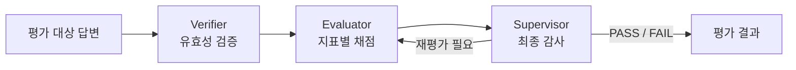
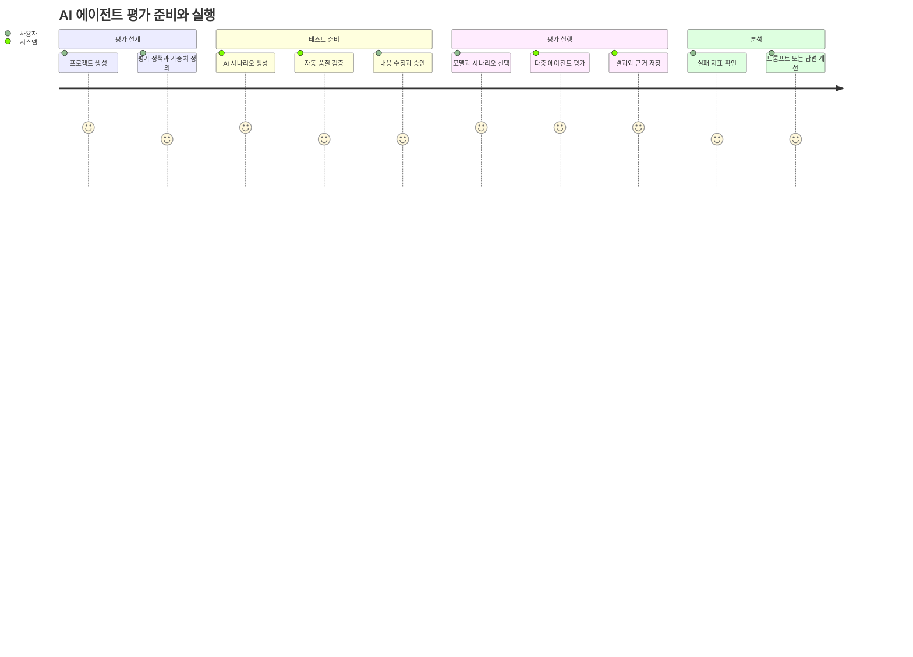

# 프로젝트 개요 및 소개

> **AI 에이전트의 답변을 프로젝트별 정책과 테스트 시나리오에 따라 생성·검증·평가하고, 그 판단 근거와 실행 이력을 관리하는 로컬 AI 품질 평가 플랫폼**

## 프로젝트를 만든 이유

AI 에이전트를 개발할 때 좋은 답변 몇 개를 눈으로 확인하는 것만으로는 품질을 보장하기 어렵다. 같은 모델이라도 프롬프트, 업무 문맥과 질문 유형에 따라 결과가 달라지며, “좋은 답변”의 기준도 서비스마다 다르다.

예를 들어 고객지원 AI에는 다음과 같은 질문이 필요하다.

- 안내한 정보가 실제 업무 정책과 일치하는가?
- 사용자의 질문에 직접 답했는가?
- 반드시 알려야 할 예외 조건을 누락하지 않았는가?
- 확인되지 않은 환불이나 보상을 약속하지 않았는가?
- 표현은 달라도 의미상 같은 답변을 정답으로 인정할 수 있는가?
- 평가 점수가 낮은 이유를 담당자가 확인할 수 있는가?

단일 LLM Judge에게 점수 하나만 요청하면 이러한 조건을 체계적으로 관리하거나 결과를 설명하기 어렵다. 또한 테스트 입력과 기대값을 매번 수동으로 작성하면 평가를 반복하기 어렵고, 자동 생성에만 의존하면 잘못된 테스트가 품질 기준으로 사용될 수 있다.

AIEvalPlatform은 이 문제를 다음 흐름으로 해결한다.

```text
프로젝트 정의
→ 평가 정책 작성
→ AI 테스트 시나리오 생성
→ 자동 검증과 사람 승인
→ 다중 에이전트 평가
→ 결과와 판단 근거 저장
→ 대시보드 분석
```

## 핵심 목표

### 반복 가능한 평가

프로젝트, 평가 정책과 승인된 시나리오를 저장해 같은 기준으로 AI 에이전트를 반복 평가한다.

### 설명 가능한 결과

최종 점수뿐 아니라 유효성 검증, 지표별 평가 근거, 최종 감독 판정과 재시도 내역을 함께 저장한다.

### 도메인별 평가 정책

정확성이나 관련성 같은 공통 지표에 고정하지 않고, 프로젝트별 지표와 가중치, 통과 기준을 정의할 수 있다.

### 자동화와 사람 검토의 결합

LLM이 테스트 시나리오와 루브릭을 생성하고 자동 검증하지만, 사람이 승인한 시나리오만 실제 평가에 사용한다.

### 로컬 실행 가능성

Ollama 기반 로컬 모델을 사용해 별도 클라우드 API 키 없이 개발 환경에서 전체 평가 과정을 재현할 수 있다.

## 주요 사용자

### AI 서비스 개발자

- 프롬프트나 모델 변경 전후의 품질을 비교한다.
- 실패한 평가의 단계별 원인을 확인한다.
- 직접 작성한 dataset 또는 승인된 시나리오로 회귀 평가를 수행한다.

### QA 엔지니어

- 업무 도메인에 맞는 정상·경계·실패 테스트를 생성한다.
- 생성된 기대 답변과 평가 루브릭을 검토한다.
- 시나리오를 승인하거나 거절하고 반복 가능한 테스트 자산으로 관리한다.

### 서비스 기획자와 도메인 전문가

- 서비스에서 중요하게 보는 평가 지표와 가중치를 정의한다.
- 반드시 포함해야 할 조건과 즉시 실패 조건을 시나리오에 반영한다.
- 기술적인 모델 로그 대신 대시보드의 점수와 판정 근거를 확인한다.

## 주요 기능

### 프로젝트 관리

> 평가 대상 서비스의 이름, 업무 도메인, 설명과 비즈니스 문맥을 등록한다. 프로젝트 문맥은 AI가 현실적인 테스트 시나리오를 생성할 때 사용한다.


### 평가 정책 관리

다음 항목을 프로젝트별로 설정한다.

- 평가 지표 key, 이름과 설명
- 지표별 가중치
- 필수 지표 여부
- 최종 통과 점수
- 최대 재평가 횟수

가중치 합은 Backend에서 검증해 잘못된 점수 계산을 방지한다.


### AI 테스트 시나리오 생성

> 프로젝트와 평가 정책을 기반으로 정상, 경계와 실패 상황을 포함한 시나리오를 생성한다.


각 시나리오에는 다음 정보가 포함될 수 있다.

- 테스트 프롬프트
- 기대 답변과 기대 행동
- 위험 수준
- 지표별 점수 루브릭
- 필수 포함 조건
- 즉시 실패 조건
- 의미상 허용되는 답변 변형

### 시나리오 자동 검증과 승인

> 별도의 AI Validator가 생성된 시나리오의 도메인 관련성, 명확성, 현실성과 평가 가능성을 확인한다.


자동 검증을 통과해도 바로 실행하지 않는다. 담당자가 내용을 확인하고 `APPROVED`한 시나리오만 평가에 사용할 수 있다. 승인 후 내용을 수정하면 다시 `DRAFT` 상태로 전환된다.


### 다중 에이전트 평가

평가 엔진은 역할을 분리해 답변을 평가한다.
해당 평가의 시스템 프롬프트는 담당자가 도메인에 맞추어 수정 가능하다.



- **Executor**: 출력이 없으면 테스트 대상 답변을 생성한다.
- **Verifier**: 답변이 비어 있거나 깨졌는지, 질문과 무관하거나 유해한지 확인한다.
- **Evaluator**: 정책과 루브릭에 따라 지표별 점수와 근거를 만든다.
- **Supervisor**: 검증과 평가 결과의 일관성을 확인하고 PASS, FAIL 또는 RETRY를 결정한다.


### 도메인별 평가 지표 설정

평가를 어떻게 진행할지, 어떤 부분을 중점적으로 평가할지 등에 대한 평가 지표를 설정할 수 있습니다.


### 평가 결과와 통계


Dashboard에서 다음 정보를 확인할 수 있다.

- 전체 실행 수
- 전체 평가 항목 수
- 평균 점수
- 통과율
- 실행별 상태와 모델
- 개별 답변과 기대값
- 지표별 점수와 평가 이유
- 검증 결과와 최종 감독 판정
- 재평가 횟수와 실행 시간

## 대표 사용 흐름



1. 사용자가 평가 프로젝트를 만든다.
2. 프로젝트에 평가 지표와 통과 기준을 등록한다.
3. AI가 프로젝트 문맥에 맞는 시나리오와 루브릭을 생성한다.
4. 자동 검증 결과를 참고해 사람이 시나리오를 수정하고 승인한다.
5. 사용자가 모델과 승인된 시나리오를 선택해 평가를 실행한다.
6. 평가 엔진이 답변 생성, 유효성 검증, 지표별 채점과 최종 감독을 수행한다.
7. Backend가 결과와 정책 스냅샷을 PostgreSQL에 저장한다.
8. 사용자가 Dashboard에서 실패 원인과 개선할 지표를 확인한다.

## 차별점

### 점수 하나가 아닌 판단 과정

단일 점수만 보여주지 않고 검증, 평가와 감독 단계를 분리해 어느 단계에서 실패했는지 확인할 수 있다.

### 정책과 시나리오의 결합

프로젝트 공통 지표와 시나리오별 세부 루브릭을 결합한다. 같은 정확성 지표라도 테스트마다 구체적인 1.0, 0.75, 0.5 점수 기준을 적용할 수 있다.

### LLM 판단과 코드 규칙의 분리

LLM은 문맥 판단과 설명을 담당하지만 가중 평균, 필수·실패 조건과 통과 기준은 코드가 강제한다. Supervisor가 기준 미달 점수를 PASS로 반환해도 최종 결과는 FAIL로 교정된다.

### 자동 생성 결과에 대한 Human-in-the-loop

AI가 생성한 시나리오를 자동 승인하지 않는다. 자동 검증은 검토를 돕는 신호이며 실제 평가 사용 여부는 사람이 결정한다.

### 로컬 모델 기반 개발

기본 모델은 Ollama의 `qwen3.5:4b`다. 작은 로컬 모델의 structured output 실패 가능성을 고려해 파싱 실패와 폴백 처리도 구현했다.

## 기술 구성

| 영역 | 기술 | 역할 |
| --- | --- | --- |
| Frontend | React, TypeScript, Vite | 평가 관리 Dashboard |
| Backend | NestJS, TypeScript | REST API와 실행 상태 관리 |
| ORM | Prisma | PostgreSQL 접근 및 마이그레이션 |
| Database | PostgreSQL 15 | 정책, 시나리오와 결과 저장 |
| Agent API | FastAPI, Pydantic | 모델 평가 API와 구조화 출력 검증 |
| Workflow | LangGraph | 평가 노드와 조건부 재시도 |
| Model Runtime | Ollama | 로컬 LLM 추론 |
| Default Model | qwen3.5:4b | 생성, 검증, 평가와 감독 |

## 현재 제공 범위

- 로컬 단일 사용자 실행
- 프로젝트와 평가 정책 관리
- AI 시나리오 생성과 자동 검증
- 시나리오 수정, 승인과 거절
- 직접 dataset 또는 Scenario 기반 평가
- LangGraph 기반 다단계 평가
- 별도 Adapter를 통한 고객 AI 답변 자동 수집
- ADAPTER 및 PROVIDED_OUTPUT 비동기 자동 평가
- JudgeJob 재시도와 실행별 진행률 집계
- 평가 실행과 결과 이력 저장
- 평가 요약 및 상세 Dashboard

## 현재 한계

- 인증, 사용자와 프로젝트별 권한이 없다.
- 자동 Run 생성은 아직 Dashboard 입력 화면이 아니라 API를 사용한다.
- Judge Worker가 Backend 프로세스와 함께 실행되며 독립 배포와 수평 확장은 아직 제공하지 않는다.
- 대규모 dataset을 위한 동시성 제어, rate limit와 실행 취소가 없다.
- 역할별 모델, 프롬프트와 Ollama 모델 digest가 완전한 스냅샷으로 저장되지 않는다.
- 다중 Judge 합의나 평가 결과 분산 분석은 아직 제공하지 않는다.
- 외부 SaaS 모델 연결보다 로컬 Ollama 실행을 중심으로 구현되어 있다.

## 향후 발전 방향

1. 자동 Run 생성 Dashboard와 JSONL/CSV 업로드
2. Judge Worker 독립 배포, 병렬 처리와 rate limit
3. 역할별 모델 선택과 모델 버전 스냅샷
4. 다중 Judge 합의 및 평가 신뢰구간
5. Golden dataset을 이용한 Judge 보정
6. 평가 실행 간 회귀 비교와 변경 추세
7. 사용자 인증, 프로젝트 권한과 감사 로그
8. OpenAPI 기반 Backend·Python·Frontend 계약 공유
9. CI 파이프라인에서 평가 기준 미달 시 배포 차단

## 관련 문서

- [자동 평가 사용 방법](./docs/Automated-Evaluation-Usage.md)
- [평가 실행 자동화 설계](./docs/Evaluation-Run-Automation-Design.md)
- [Docker Compose 통합 실행 및 고객사 배포 계획](./docs/Docker-Compose-Deployment-Plan.md)
- [고객 AI Adapter 연동 가이드](./docs/Customer-Adapter-Integration-Guide.md)
- [대시보드 리소스 추가·삭제 가이드](./docs/Dashboard-Resource-Management.md)
- [평가 어댑터 MVP 설계](./docs/Evaluation-Adapter-MVP-Design.md)
- [SDK 실행 프로토콜](./docs/SDK-Execution-Protocol.md)
- [전체 시스템 구조](https://github.com/hjyoon99/AIEvalPlatform/wiki/System-Architecture)
- [데이터 파이프라인 및 흐름](https://github.com/hjyoon99/AIEvalPlatform/wiki/Data-Pipeline)
- [AI 평가 엔진 설계](https://github.com/hjyoon99/AIEvalPlatform/wiki/AI-Evaluation-Engine)
- [API 명세서](https://github.com/hjyoon99/AIEvalPlatform/wiki/API-Reference)
- [데이터베이스 ERD](https://github.com/hjyoon99/AIEvalPlatform/wiki/Database-Schema)
- [설치 및 실행 방법](https://github.com/hjyoon99/AIEvalPlatform/wiki/Getting-Started)
