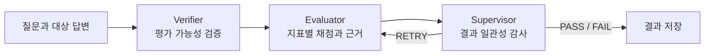
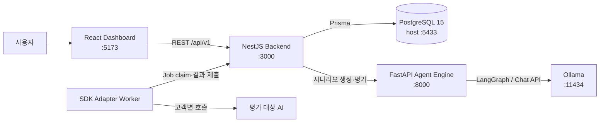

# AIEvalPlatform

> 프로젝트별 정책과 테스트 시나리오로 AI 에이전트의 답변을 생성·검증·평가하고, 판단 근거와 실행 이력을 관리하는 로컬 AI 품질 평가 플랫폼

AIEvalPlatform은 “이 답변이 좋은가?”라는 한 번의 주관적 판단을, 반복 가능하고 설명 가능한 평가 과정으로 바꿉니다. 평가 기준과 테스트 시나리오를 프로젝트 자산으로 관리하고, AI가 만든 테스트는 자동 검증과 사람의 승인을 거친 뒤 실제 평가에 사용합니다. 평가 결과에는 최종 점수뿐 아니라 검증, 지표별 채점, 감독 판정과 재시도 내역이 함께 남습니다.


## 어떤 의문에서 시작했나요?

AI 에이전트의 답변 몇 개를 사람이 읽어 보는 것만으로 품질을 보장할 수 있을까요?

같은 모델도 프롬프트와 업무 문맥에 따라 결과가 달라지고, 좋은 답변의 기준도 서비스마다 다릅니다. 특히 운영 환경에서는 단순한 정확도 외에도 다음 질문에 답할 수 있어야 합니다.

- 답변이 실제 업무 정책과 일치하는가?
- 질문에 직접 답하고 반드시 안내할 조건을 포함했는가?
- 환불이나 보상처럼 확인되지 않은 약속을 만들지 않았는가?
- 문장은 달라도 의미가 같다면 정답으로 인정할 수 있는가?
- 평가 점수가 낮다면 어느 기준에서 왜 실패했는가?
- 정책이 바뀐 뒤에도 과거 평가 결과를 설명할 수 있는가?
- AI가 자동 생성한 테스트 자체가 잘못되었다면 어떻게 걸러낼 것인가?

단일 LLM Judge에게 점수 하나만 요청하면 이 질문들을 체계적으로 관리하기 어렵습니다. 반대로 모든 테스트와 기대값을 사람이 작성하면 반복 평가에 드는 비용이 커집니다. 이 프로젝트는 자동화의 속도와 사람 검토의 신뢰성을 함께 가져가는 데서 출발했습니다.

## 해결하는 문제

```text
프로젝트와 업무 문맥 정의
→ 평가 정책과 가중치 작성
→ AI 테스트 시나리오·루브릭 생성
→ 자동 검증과 사람 승인
→ 대상 AI 답변 수집
→ 다단계 Judge 평가
→ 결과·근거·정책 스냅샷 저장
→ 대시보드 분석
```

- **평가 기준의 파편화**: 지표, 가중치, 필수 조건과 통과 기준을 프로젝트별 정책으로 관리합니다.
- **테스트 작성 비용**: AI가 정상·경계·실패 시나리오와 루브릭 초안을 생성합니다.
- **잘못된 자동 생성 테스트**: 별도 Validator와 사람의 승인을 모두 거친 시나리오만 실행 자산으로 사용합니다.
- **설명하기 어려운 점수**: Verifier, Evaluator, Supervisor의 판단과 사유를 단계별로 저장합니다.
- **LLM 판정의 비결정성**: LLM은 의미 판단을 맡고, 가중 평균·필수 조건·실패 조건·통과선은 코드가 강제합니다.
- **외부 AI 연결 비용**: 이미 수집된 답변을 평가하거나, SDK Adapter로 고객 AI를 호출하는 두 방식을 제공합니다.
- **평가 재현성 부족**: 실행 당시의 정책 스냅샷과 개별 결과를 PostgreSQL에 보존합니다.

## 주요 기능

### 프로젝트와 평가 정책 관리

평가 대상 서비스의 도메인과 비즈니스 문맥을 프로젝트로 등록합니다. 프로젝트마다 평가 지표, 설명, 가중치, 필수 여부, 통과 점수와 최대 재평가 횟수를 설정할 수 있습니다. Backend는 가중치 합과 입력 범위를 검증합니다.

### AI 시나리오 생성, 검증과 승인

프로젝트 문맥과 정책을 바탕으로 테스트 프롬프트, 기대 답변, 위험 수준, 지표별 루브릭, 필수·즉시 실패 조건과 허용 가능한 답변 변형을 생성합니다. 자동 검증을 통과해도 바로 사용하지 않으며, 담당자가 `APPROVED`한 시나리오만 평가할 수 있습니다. 승인된 내용을 수정하면 다시 `DRAFT`가 됩니다.

### 다단계 평가



- **Executor**: 대상 답변이 제공되지 않은 경우 답변을 생성합니다.
- **Verifier**: 빈 답변, 손상된 출력, 질문과 무관하거나 유해한 답변을 걸러냅니다.
- **Evaluator**: 정책과 시나리오 루브릭에 따라 지표별 점수와 사유를 만듭니다.
- **Supervisor**: 앞선 결과의 일관성을 확인하고 `PASS`, `FAIL`, `RETRY`를 결정합니다.

재시도는 원본 답변을 다시 생성하는 과정이 아니라, Supervisor의 피드백으로 동일 답변의 채점을 재검토하는 과정입니다.

### 두 가지 자동 평가 방식

| 방식 | 사용 상황 | 답변 준비 방식 |
| --- | --- | --- |
| `PROVIDED_OUTPUT` | 로그, JSON 또는 CSV 등에 답변이 이미 있음 | Run 생성 시 `output`을 함께 전달 |
| `ADAPTER` | 실제 고객 AI를 호출해 새 답변을 평가 | `@aieval/sdk` Worker가 Job을 받아 고객 AI 호출 |

두 방식 모두 답변이 준비된 뒤에는 `JudgeJob → Agent Engine → EvalResult` 흐름을 공유합니다. 현재 Dashboard는 실행 진행률과 결과를 표시하지만 자동 Run 생성은 Backend API를 사용합니다.

### 결과와 실행 이력

Dashboard에서 전체 실행 수, 평균 점수, 통과율과 실행 상태를 확인할 수 있습니다. 개별 결과에는 질문과 답변, 기대값, 지표별 점수와 이유, 검증 결과, 최종 감독 판정, 재평가 횟수와 실행 시간이 포함됩니다.


## 빠른 시작

### 준비 사항

- Docker와 Docker Compose
- [Ollama](https://ollama.com/)와 기본 Judge 모델 `qwen3.5:4b`
- 로컬에서 개별 실행할 경우 Node.js 22+, pnpm 11.18.0, Python 3.11+

### 1. 모델 준비

```bash
ollama pull qwen3.5:4b
ollama serve
```

Ollama가 이미 실행 중이면 `ollama serve`를 다시 실행하지 않아도 됩니다.

### 2. 전체 서비스 실행

```bash
cp .env.example .env
docker compose up -d --build
docker compose ps
```

모든 서비스가 `healthy`가 되면 `http://localhost:5173`에서 Dashboard를 엽니다. Backend 컨테이너 시작 시 Prisma migration과 Judge Worker도 함께 실행됩니다.


```bash
docker compose logs -f
```

종료할 때는 다음 명령을 사용합니다. PostgreSQL 데이터 볼륨은 유지됩니다.

```bash
docker compose down
```

### 3. 기본 사용 순서

1. Dashboard에서 평가할 프로젝트와 업무 문맥을 등록합니다.
2. 지표, 가중치, 필수 여부와 통과 점수로 평가 정책을 만듭니다.
3. 정책을 기반으로 AI 시나리오를 생성합니다.
4. 자동 검증 결과와 루브릭을 확인하고 시나리오를 승인합니다.
5. 기존 답변은 `PROVIDED_OUTPUT`, 실제 AI 호출은 `ADAPTER` 방식으로 Run을 생성합니다.
6. Dashboard에서 진행률과 실패 지표, 단계별 판단 근거를 확인합니다.

자동 Run 생성 요청 예제와 Application/SDK Key 발급 절차는 [자동 평가 사용 가이드](./docs/Automated-Evaluation-Usage.md)에 정리되어 있습니다.

### Mock Judge로 구조만 확인하기

Ollama 모델 호출 없이 비동기 평가 파이프라인만 확인할 수 있습니다.

```bash
docker compose --profile mock up -d --build postgres mock-agent-engine
```

Mock Agent Engine에 Backend를 연결하는 전체 절차와 판정 규칙은 [자동 평가 사용 가이드](./docs/Automated-Evaluation-Usage.md#4-ollama-없이-mock-judge로-테스트)를 참고하세요.

## 시스템 구조
평가 엔진은 역할을 분리해 답변을 평가한다.
해당 평가의 시스템 프롬프트는 담당자가 도메인에 맞추어 수정 가능합니다.



| 구성 요소 | 위치 | 책임 |
| --- | --- | --- |
| Dashboard | `apps/dashboard` | 프로젝트·정책·시나리오 관리, 실행 현황과 결과 표시 |
| Backend | `apps/backend` | REST API, 입력 검증, 실행 상태, Job Worker와 DB 영속화 |
| Agent Engine | `apps/agent-engine` | 시나리오 생성, 구조화 출력 검증, LangGraph 평가 흐름 |
| SDK | `packages/sdk` | Adapter Worker와 Backend 사이의 Job 프로토콜 |
| PostgreSQL | Docker service | 정책, 시나리오, Job, 실행과 결과 저장 |
| Ollama | 호스트 runtime | 로컬 LLM 추론 |
- **Executor**: 출력이 없으면 테스트 대상 답변을 생성한다.
- **Verifier**: 답변이 비어 있거나 깨졌는지, 질문과 무관하거나 유해한지 확인한다.
- **Evaluator**: 정책과 루브릭에 따라 지표별 점수와 근거를 만든다.
- **Supervisor**: 검증과 평가 결과의 일관성을 확인하고 PASS, FAIL 또는 RETRY를 결정한다.


### 도메인별 평가 지표 설정

평가를 어떻게 진행할지, 어떤 부분을 중점적으로 평가할지 등에 대한 평가 지표를 설정할 수 있습니다.


### 시나리오 설정

각 평가 시나리오를 직접 Dashboard에서 생성할 수 있고, 필요하다면 AI를 통해 해당 도메인에 맞는 시나리오를 원하는 개수만큼 자동생성할 수 있습니다.


### 평가 결과와 통계


Dashboard에서 다음 정보를 확인할 수 있습니다.

Backend의 Judge Worker는 준비된 답변을 평가 큐에서 가져가 Agent Engine으로 전달합니다. `ADAPTER` 방식에서는 SDK Worker가 먼저 고객 AI의 답변을 수집하고, `PROVIDED_OUTPUT` 방식에서는 Run 생성과 동시에 Judge Job이 준비됩니다.

## 저장소 구조

```text
.
├── apps/
│   ├── dashboard/       # React 기반 운영 Dashboard
│   ├── backend/         # NestJS API, Prisma, Judge Worker
│   └── agent-engine/    # FastAPI, LangGraph, LLM agents
├── packages/
│   └── sdk/             # 고객 Adapter용 TypeScript SDK
├── examples/            # Mock Agent Engine과 Mock Adapter
├── docs/                # 설계, API, 데이터 모델과 연동 가이드
├── docker-compose.yml   # 로컬 통합 실행 구성
└── package.json         # pnpm workspace 실행 스크립트
```

## 기술 스택과 버전

아래 버전은 현재 저장소의 Dockerfile, manifest와 lockfile 기준입니다. Python 라이브러리는 `requirements.txt`에서 하한 버전으로 관리합니다.

### Frontend


### Backend & ORM


### Agent & AI Workflow


### Infrastructure & Environments


프로젝트 전체 표기 버전은 루트 `package.json`의 `1.0.0`이며, 내부 패키지는 Backend `0.0.1`, Dashboard `0.1.0`, SDK `0.0.1`로 각각 관리됩니다. 아직 공식 릴리스 태그나 안정성 보장을 의미하는 버전 체계는 아닙니다.

## 설계 원칙

- Dashboard에서 모델을 직접 호출하지 않고 Backend를 신뢰 경계로 둡니다.
- LLM의 정성 판단과 코드의 정량 규칙을 분리합니다.
- 자동 생성한 테스트는 사람 승인 전까지 평가에 사용하지 않습니다.
- 최종 점수뿐 아니라 판단 근거와 실패 단계도 저장합니다.
- 정책 변경 후에도 과거 실행을 설명할 수 있도록 스냅샷을 남깁니다.
- 로컬 Ollama를 기본으로 사용해 별도 클라우드 API 키 없이 재현할 수 있게 합니다.

## 현재 범위와 한계

현재는 로컬 단일 사용자 환경을 중심으로 프로젝트·정책·시나리오 관리, AI 시나리오 생성과 승인, `ADAPTER`/`PROVIDED_OUTPUT` 비동기 평가, Job 재시도, 진행률 집계와 결과 Dashboard를 제공합니다.

다음 항목은 아직 제공하지 않거나 운영 수준으로 확장되지 않았습니다.

- 사용자 인증, 프로젝트별 권한과 감사 로그
- Dashboard에서 자동 Run을 생성하는 입력 화면
- Judge Worker의 독립 배포와 수평 확장
- 대규모 dataset의 동시성 제어, rate limit와 실행 취소
- 역할별 모델·프롬프트·Ollama digest의 완전한 스냅샷
- 다중 Judge 합의, 점수 분산과 신뢰구간 분석
- 외부 SaaS 모델을 위한 기본 제공 Connector

## 문서

| 문서 | 내용 |
| --- | --- |
| [프로젝트 개요](./docs/Project-Overview.md) | 목표, 사용자, 기능과 발전 방향 |
| [전체 시스템 구조](./docs/System-Architecture.md) | 컴포넌트 책임, 신뢰 경계와 배포 단위 |
| [아키텍처와 기술 선택](./docs/architecture.md) | 서비스 분리와 LangGraph 선택 배경 |
| [설계 변화](./docs/design-evolution.md) | 초기 구조에서 현재 평가 체계까지의 변화 |
| [자동 평가 사용](./docs/Automated-Evaluation-Usage.md) | 실행 환경과 두 평가 방식의 상세 절차 |
| [API Reference](./docs/API-Reference.md) | Backend API 요청과 응답 |
| [데이터 파이프라인](./docs/Data-Pipeline.md) | 생성, 승인, 평가와 저장 흐름 |
| [데이터베이스 설계](./docs/Database-Design.md) | 핵심 엔터티, 상태와 관계 |
| [고객 Adapter 연동](./docs/Customer-Adapter-Integration-Guide.md) | 외부 AI 연결 방법 |
| [트러블슈팅](./docs/troubleshooting.md) | 실행·DB·모델·평가 오류 점검 |

## 개발 명령

Docker 없이 각 서비스를 개발 모드로 실행하려면 의존성을 먼저 설치합니다.

```bash
pnpm install
pnpm dev:backend
pnpm dev:dashboard
```

Agent Engine은 별도 Python 환경에서 실행합니다.

```bash
cd apps/agent-engine
python3 -m venv .venv
source .venv/bin/activate
pip install -r requirements.txt
uvicorn app.main:app --reload --port 8000
```

전체 TypeScript 애플리케이션 빌드:

```bash
pnpm build
```
