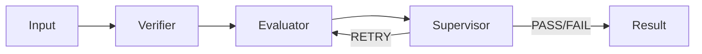
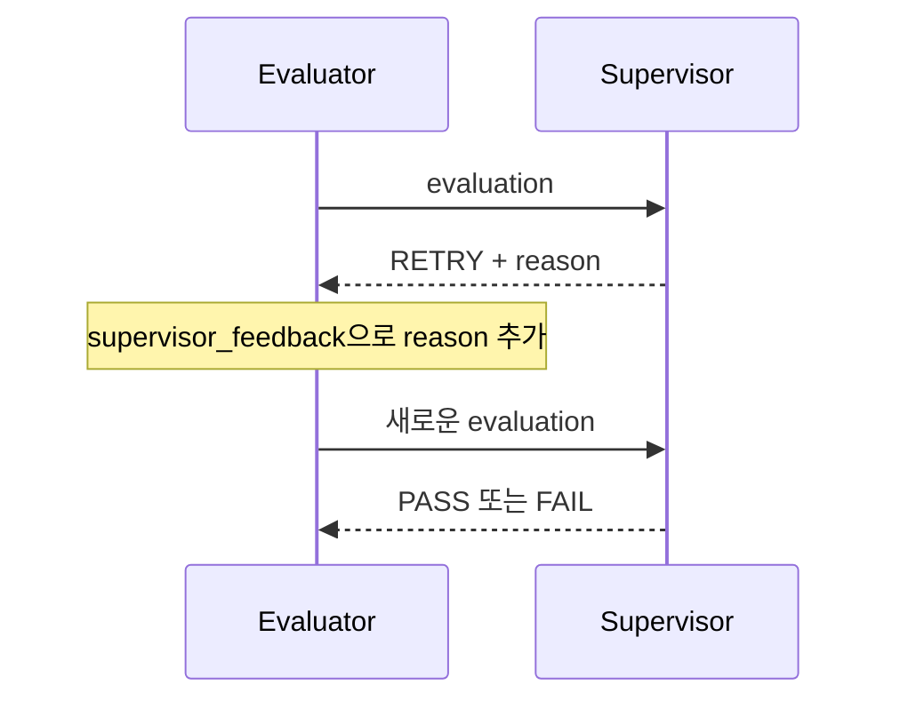

# AI 평가 엔진 설계

> Wiki 경로: `AI-Evaluation-Engine`

## 설계 목표

평가 엔진은 하나의 Judge 호출에 모든 책임을 맡기지 않는다. 답변 유효성, 지표별 점수와 최종 승인을 분리하고 각 단계 결과를 추적할 수 있도록 설계했다.



구현 위치:

```text
apps/agent-engine/app/
├── agents/
│   ├── executor.py
│   ├── verifier.py
│   ├── evaluator.py
│   ├── supervisor.py
│   └── scenario_generator.py
├── workflows/
│   └── evaluation_graph.py
└── main.py
```

## LangGraph 상태

`EvaluationState`는 `TypedDict(total=False)`로 정의된다.

| 상태 | 설명 |
| --- | --- |
| `prompt` | 사용자 또는 테스트 프롬프트 |
| `output` | 평가할 AI 답변 |
| `expected_output` | 선택적 기대 답변 |
| `criteria` | 동적 정책과 시나리오 루브릭 |
| `verification` | Verifier 결과 |
| `evaluation` | Evaluator 점수와 근거 |
| `supervision` | Supervisor 최종 판단 |
| `supervisor_feedback` | 재평가 지시 |
| `retry_count` | 현재 재평가 횟수 |
| `max_retries` | 허용 재평가 횟수 |
| `pass_threshold` | 실행 통과 기준 |

그래프는 `START → verify → evaluate → supervise`로 시작한다. supervise 이후 verdict와 횟수에 따라 evaluate 또는 END로 이동한다.

## Executor

평가 입력에 output이 없는 경우에만 호출된다.

```text
모델: 실행 요청의 model 또는 qwen3.5:4b
temperature: 0.7
structured output: 사용하지 않음
```

기본 시스템 프롬프트는 명확하고 친절한 답변을 요구한다. `metadata.systemPrompt`가 전달되면 대상 에이전트의 성격을 시뮬레이션할 수 있다.

Executor는 평가자가 아니라 평가 대상을 만드는 역할이다.

## Verifier

두 단계의 유효성 검사를 한다.

### 규칙 기반 검사

- 빈 출력: 실패
- 5자 미만 출력: 실패

### LLM 검사

- 질문과 무관한 답변
- 시스템 오류 또는 거절 메시지
- 유해하거나 부적절한 내용
- `null`, `[object Object]` 같은 깨진 출력

```json
{
  "isValid": true,
  "reason": "질문에 직접 답하고 형식상 문제가 없습니다."
}
```

호출 실패는 `error` 필드를 포함한 실패 결과로 반환한다. Supervisor는 이 경우 평가 품질을 보장할 수 없다고 판단한다.

## Evaluator

LLM-as-a-Judge로 동작하지만 점수 합산은 코드가 담당한다.

### 입력 구성

- prompt와 output
- expectedOutput
- 정책 지표와 weight
- 시나리오별 점수 rubric
- requiredConditions
- failConditions
- allowedVariations
- 선택적 supervisor_feedback

### 구조화 출력

```json
{
  "metrics": [
    {
      "key": "accuracy",
      "score": 0.75,
      "reason": "핵심 정책은 맞지만 예외 조건이 누락되었습니다."
    }
  ],
  "reason": "대체로 정확하나 일부 보완이 필요합니다.",
  "triggeredFailConditions": [],
  "missingRequiredConditions": []
}
```

### 계산 규칙

```text
score = round(Σ(score × weight) / Σ(weight), 2)
```

실패 조건 위반 또는 필수 조건 누락이 있으면 score는 0이다. 모델이 반환하지 않은 지표는 0점으로 처리된다.

정책이 없으면 `faithfulness`와 `answerRelevance`를 각각 0.5로 적용한다.

## Supervisor

Supervisor는 원본 입력과 앞 단계 결과가 일관되는지 감사한다.

### 코드 우선 판정

다음 상황은 LLM Supervisor를 호출하기 전에 처리된다.

- Verifier 호출 오류: FAIL
- Verifier 유효성 실패: FAIL
- Evaluator 오류이며 재시도 가능: RETRY

### LLM 판정

```json
{
  "verdict": "PASS",
  "confidence": 0.91,
  "reason": "평가 점수가 기준 이상이고 중대한 문제가 없습니다.",
  "issues": [],
  "recommendedAction": "현재 답변을 사용할 수 있습니다."
}
```

### 정책 가드레일

- 점수가 passThreshold 미만이면 PASS를 허용하지 않는다.
- 최대 재시도에 도달하면 RETRY를 PASS 또는 FAIL로 확정한다.
- Supervisor 호출 실패 시 점수 기준으로 판정하고 confidence 0.5를 기록한다.

LLM은 설명과 종합 판단을 제공하지만 사용자가 설정한 수치 정책을 우회하지 못한다.

## 재평가 설계

재평가는 같은 output을 Evaluator가 다시 채점하는 과정이다.



답변을 다시 생성하지 않는 이유는 평가 대상을 유지해야 재평가 결과를 비교할 수 있기 때문이다.

## 시나리오 생성 엔진

시나리오 생성은 평가 그래프와 별도 흐름이다.

1. Generator가 정상·경계·실패 케이스와 루브릭을 생성한다.
2. Validator가 도메인 관련성, 명확성, 현실성과 평가 가능성을 검사한다.
3. 유효하고 0.7 이상이면 AUTO_VERIFIED, 아니면 DRAFT를 반환한다.
4. 구조화 출력 파싱 실패 시 생성 결과는 보존하되 DRAFT로 내린다.

## 모델 설정

| 역할 | 기본 모델 | temperature |
| --- | --- | ---: |
| Executor | qwen3.5:4b | 0.7 |
| Verifier | qwen3.5:4b | 0.0 |
| Evaluator | qwen3.5:4b | 0.0 |
| Supervisor | qwen3.5:4b | 0.0 |
| Scenario Generator | 요청 model | 0.4 |
| Scenario Validator | 요청 model | 0.0 |

모든 Ollama 호출은 `think=False`를 사용한다.

## 오류 처리 원칙

- 명백한 입력 실패는 모델 호출 전에 처리한다.
- 구조화 출력은 Pydantic으로 검증한다.
- 시나리오 검증 파싱 실패는 데이터 보존 + DRAFT로 처리한다.
- Evaluator 실패는 0점과 error 정보로 변환한다.
- Supervisor 실패는 정량 점수 폴백으로 처리한다.
- FastAPI 경계를 넘는 예외는 Backend에서 EvalRun FAILED로 기록한다.

## 알려진 개선점

- Evaluator 내부 `passed`의 고정 기준 0.7과 실행 passThreshold를 통일해야 한다.
- 역할별 모델을 API 설정으로 분리할 수 있어야 한다.
- 모델 digest와 프롬프트 버전을 실행 스냅샷에 저장해야 한다.
- 다중 Judge 합의, 반복 평가 분산과 golden dataset calibration이 필요하다.
