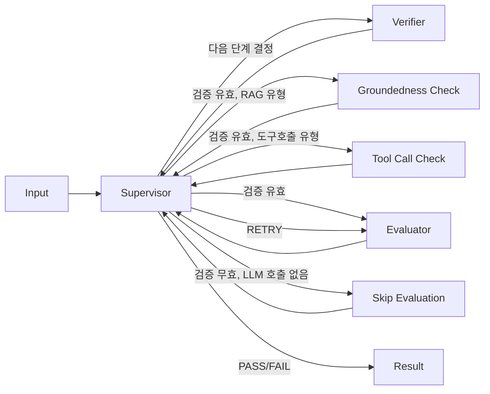
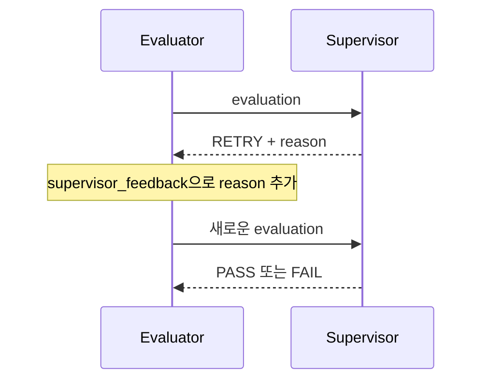

# AI 평가 엔진 설계

> Wiki 경로: `AI-Evaluation-Engine`

## 설계 목표

평가 엔진은 하나의 Judge 호출에 모든 책임을 맡기지 않는다. 답변 유효성, 지표별 점수와 최종 승인을 분리하고 각 단계 결과를 추적할 수 있도록 설계했다.



라우팅 권한은 `supervisor` 노드 하나에 집중되어 있다. 워커(`verify`/`evaluate`/`skip_evaluation`/`groundedness_check`/`tool_call_check`)는 실행이 끝나면 항상 `supervisor`로만 복귀하며 서로를 직접 호출하지 않는다. `supervisor`는 누적된 상태(`verification`/`evaluation`/`supervision`)를 보고 매번 `Command(goto=...)`로 다음 행동을 재판단한다.

검증이 유효하면 `output_metadata`(`retrievedDocuments`/`toolCalls`)만 보는 순수 코드 함수 `classify_answer_type`이 답변 유형을 판별해 RAG면 `groundedness_check`, 도구호출이면 `tool_call_check`를 먼저 거치게 한다(LLM 호출 없음). 메타데이터가 없으면 "일반" 유형으로 처리되어 기존과 동일하게 바로 `evaluate`로 간다. `groundedness_check`는 `GroundednessAgent`로 근거 충실성을, `tool_call_check`는 `ToolCallCheckAgent`로 도구 호출의 파라미터 타당성/필요성을 검증한다.

### GroundednessAgent (근거 충실성 검증)

RAG 유형 답변의 각 주장이 `retrievedDocuments`(검색된 근거 문서)로 실제로 뒷받침되는지 판단한다. 검증은 한 방향으로만 이뤄진다 — 답변이 실제로 말한 내용만 보고 문서와 대조하며, 문서에는 있지만 답변이 언급하지 않은 내용(누락)은 결함으로 보지 않는다. 답변의 완전성이 아니라 "답변이 지어낸 말을 하지 않았는가"를 검증하는 것이 목적이기 때문이다.

```json
{
  "grounded": false,
  "unsupportedClaims": [
    { "claim": "배송비도 저희가 전액 부담해드립니다.", "reason": "문서에 언급 없음" }
  ],
  "confidence": 0.9
}
```

- `unsupportedClaims`는 문자열이 아니라 `{claim, reason}` 객체 목록이다. "문서에 언급 없음"과 "문서 내용과 모순됨"은 심각도가 다른데, 문자열만 반환하면 이 둘을 구분할 수 없어서 사유를 함께 반환하도록 정했다.
- `retrievedDocuments` 항목은 문자열 또는 `{content, source?}` 객체 둘 다 받는다. SDK의 `ExecutionResult.metadata.retrievedDocuments`가 애초에 `unknown[]`로 느슨하게 정의되어 있어(고객사 RAG 구현마다 구조가 다름), 여기서 엄격한 스키마를 강제하지 않는다. 설계 결정과 근거는 [design-evolution.md](./design-evolution.md#10-9단계-근거-충실성-검증을-도입하며-내린-두-가지-결정) 참고.
- `groundedness_result`가 `grounded=False`이면 `evaluate` 단계의 채점 프롬프트에 근거 없는 주장 목록이 감점 참고 신호로 포함된다(`EvaluatorAgent.run`의 `groundedness_result` 파라미터).
- 근거 문서가 없으면 Ollama 호출 없이 즉시 검증 불가로 반환한다.

### ToolCallCheckAgent (도구 호출 정확성 검증)

도구호출 유형 답변에서 실행된 각 `toolCalls` 호출이 사용자 질문 의도에 비춰 타당했는지 판단한다. 이용 가능한 도구의 파라미터 스키마가 계약에 없어 타입 수준의 엄격한 검증은 할 수 없으므로, 대신 두 가지만 본다: 파라미터가 질문 의도와 명백히 어긋나는가(`invalid_parameter`), 질문에 답하는 데 애초에 필요하지 않았는가(`unnecessary_call`).

```json
{
  "valid": false,
  "issues": [
    {
      "toolName": "get_weather",
      "issue": "invalid_parameter",
      "reason": "질문은 서울 날씨인데 도쿄로 조회함"
    }
  ],
  "confidence": 0.9
}
```

- `toolCalls` 항목은 `{name/toolName, arguments/params}` 형태를 가정하되 관대하게 파싱한다. SDK의 `ExecutionResult.metadata.toolCalls`가 `unknown[]`로 느슨하게 정의되어 있어(고객사 에이전트 프레임워크마다 구조가 다름) `retrievedDocuments`와 같은 이유로 엄격한 스키마를 강제하지 않는다. "순서"가 아니라 "파라미터 타당성"과 "필요성"만 검증 대상으로 삼은 이유는 [design-evolution.md](./design-evolution.md#11-10단계-도구-호출-검증에서-정답-스키마-없음을-받아들이다) 참고.
- `tool_call_result`가 `valid=False`이면 `evaluate` 단계의 채점 프롬프트에 발견된 문제 목록이 감점 참고 신호로 포함된다(`EvaluatorAgent.run`의 `tool_call_result` 파라미터).
- 도구 호출 정보가 없으면 Ollama 호출 없이 즉시 검증 불가로 반환한다.

구현 위치:

```text
apps/agent-engine/app/
├── agents/
│   ├── executor.py
│   ├── verifier.py
│   ├── evaluator.py
│   ├── supervisor.py
│   ├── groundedness.py
│   ├── tool_call.py
│   └── scenario_generator.py
├── workflows/
│   └── evaluation_graph.py
└── main.py
```

## LangGraph 상태

`EvaluationState`는 `TypedDict(total=False)`로 정의된다.

| 상태 | 설명 |
| --- | --- |
| `prompt` | 사용자 또는 테스트 프롬프트 |
| `output` | 평가할 AI 답변 |
| `expected_output` | 선택적 기대 답변 |
| `criteria` | 동적 정책과 시나리오 루브릭 |
| `verification` | Verifier 결과 |
| `evaluation` | Evaluator 점수와 근거 |
| `supervision` | Supervisor 최종 판단 |
| `supervisor_feedback` | 재평가 지시 |
| `retry_count` | 현재 재평가 횟수 |
| `max_retries` | 허용 재평가 횟수 |
| `pass_threshold` | 실행 통과 기준 |
| `judge_model` | 각 평가 에이전트(Verifier/Evaluator/Supervisor/Groundedness/ToolCallCheck)가 실제 Ollama 호출에 사용할 모델 |
| `output_metadata` | 답변 유형 분류용 `retrievedDocuments`/`toolCalls`(선택) |
| `groundedness_result` | groundedness_check 결과. RAG 유형이 아니거나 실행 전이면 `None` |
| `tool_call_result` | tool_call_check 결과. 도구호출 유형이 아니거나 실행 전이면 `None` |

그래프는 `START → supervisor`로 시작한다. `supervisor`는 `verification`/`evaluation`/`supervision` 필드가 채워졌는지를 보고 `verify`, `groundedness_check`/`tool_call_check`(검증 유효 시 `classify_answer_type` 판별 결과에 따라), `evaluate`, `skip_evaluation`(검증 무효 시 Evaluator 호출 생략), `END` 중 다음 행동을 결정한다. Supervisor 판정이 RETRY이고 재시도 횟수가 한도 이내면 다시 `evaluate`로 라우팅한다.

## Executor

평가 입력에 output이 없는 경우에만 호출된다.

```text
모델: 실행 요청의 targetModel 또는 qwen3.5:4b
temperature: 0.7
structured output: 사용하지 않음
```

기본 시스템 프롬프트는 명확하고 친절한 답변을 요구한다. `metadata.systemPrompt`가 전달되면 대상 에이전트의 성격을 시뮬레이션할 수 있다.

Executor는 평가자가 아니라 평가 대상을 만드는 역할이다.

## Verifier

두 단계의 유효성 검사를 한다.

### 규칙 기반 검사

- 빈 출력: 실패
- 5자 미만 출력: 실패

### LLM 검사

- 질문과 무관한 답변
- 시스템 오류 또는 거절 메시지
- 유해하거나 부적절한 내용
- `null`, `[object Object]` 같은 깨진 출력

```json
{
  "isValid": true,
  "reason": "질문에 직접 답하고 형식상 문제가 없습니다."
}
```

호출 실패는 `error` 필드를 포함한 실패 결과로 반환한다. Supervisor는 이 경우 평가 품질을 보장할 수 없다고 판단한다.

## Evaluator

LLM-as-a-Judge로 동작하지만 점수 합산은 코드가 담당한다.

### 입력 구성

- prompt와 output
- expectedOutput
- 정책 지표와 weight
- 시나리오별 점수 rubric
- requiredConditions
- failConditions
- allowedVariations
- 선택적 supervisor_feedback

### 구조화 출력

```json
{
  "metrics": [
    {
      "key": "accuracy",
      "score": 0.75,
      "reason": "핵심 정책은 맞지만 예외 조건이 누락되었습니다."
    }
  ],
  "reason": "대체로 정확하나 일부 보완이 필요합니다.",
  "triggeredFailConditions": [],
  "missingRequiredConditions": []
}
```

### 계산 규칙

```text
score = round(Σ(score × weight) / Σ(weight), 2)
```

실패 조건 위반 또는 필수 조건 누락이 있으면 score는 0이다. 모델이 반환하지 않은 지표는 0점으로 처리된다.

정책이 없으면 `faithfulness`와 `answerRelevance`를 각각 0.5로 적용한다.

## Supervisor

Supervisor는 원본 입력과 앞 단계 결과가 일관되는지 감사한다.

### 코드 우선 판정

다음 상황은 LLM Supervisor를 호출하기 전에 처리된다.

- Verifier 호출 오류: FAIL
- Verifier 유효성 실패: FAIL
- Evaluator 오류이며 재시도 가능: RETRY

### LLM 판정

```json
{
  "verdict": "PASS",
  "confidence": 0.91,
  "reason": "평가 점수가 기준 이상이고 중대한 문제가 없습니다.",
  "issues": [],
  "recommendedAction": "현재 답변을 사용할 수 있습니다."
}
```

### 정책 가드레일

- 점수가 passThreshold 미만이면 PASS를 허용하지 않는다.
- 최대 재시도에 도달하면 RETRY를 PASS 또는 FAIL로 확정한다.
- Supervisor 호출 실패 시 점수 기준으로 판정하고 confidence 0.5를 기록한다.

LLM은 설명과 종합 판단을 제공하지만 사용자가 설정한 수치 정책을 우회하지 못한다.

## 재평가 설계

재평가는 같은 output을 Evaluator가 다시 채점하는 과정이다.



답변을 다시 생성하지 않는 이유는 평가 대상을 유지해야 재평가 결과를 비교할 수 있기 때문이다.

## 시나리오 생성 엔진

시나리오 생성은 평가 그래프와 별도 흐름이다.

1. Generator가 정상·경계·실패 케이스와 루브릭을 생성한다.
2. Validator가 도메인 관련성, 명확성, 현실성과 평가 가능성을 검사한다.
3. 유효하고 0.7 이상이면 AUTO_VERIFIED, 아니면 DRAFT를 반환한다.
4. 구조화 출력 파싱 실패 시 생성 결과는 보존하되 DRAFT로 내린다.

## 모델 설정

| 역할 | 기본 모델 | temperature |
| --- | --- | ---: |
| Executor | qwen3.5:4b | 0.7 |
| Verifier | qwen3.5:4b | 0.0 |
| Evaluator | qwen3.5:4b | 0.0 |
| Supervisor | qwen3.5:4b | 0.0 |
| Scenario Generator | 요청 model | 0.4 |
| Scenario Validator | 요청 model | 0.0 |

모든 Ollama 호출은 `think=False`를 사용한다.

## 오류 처리 원칙

- 명백한 입력 실패는 모델 호출 전에 처리한다.
- 구조화 출력은 Pydantic으로 검증한다.
- 시나리오 검증 파싱 실패는 데이터 보존 + DRAFT로 처리한다.
- Evaluator 실패는 0점과 error 정보로 변환한다.
- Supervisor 실패는 정량 점수 폴백으로 처리한다.
- FastAPI 경계를 넘는 예외는 Backend에서 EvalRun FAILED로 기록한다.

## 알려진 개선점

- Evaluator와 Supervisor는 요청의 `passThreshold`를 동일하게 사용한다.
- 역할별 모델을 API 설정으로 분리할 수 있어야 한다.
- 모델 digest와 프롬프트 버전을 실행 스냅샷에 저장해야 한다.
- 다중 Judge 합의, 반복 평가 분산과 golden dataset calibration이 필요하다.
