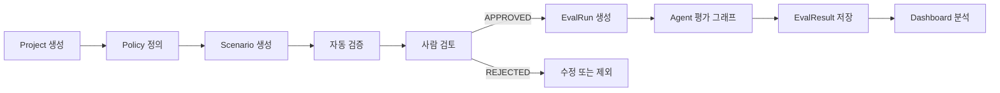
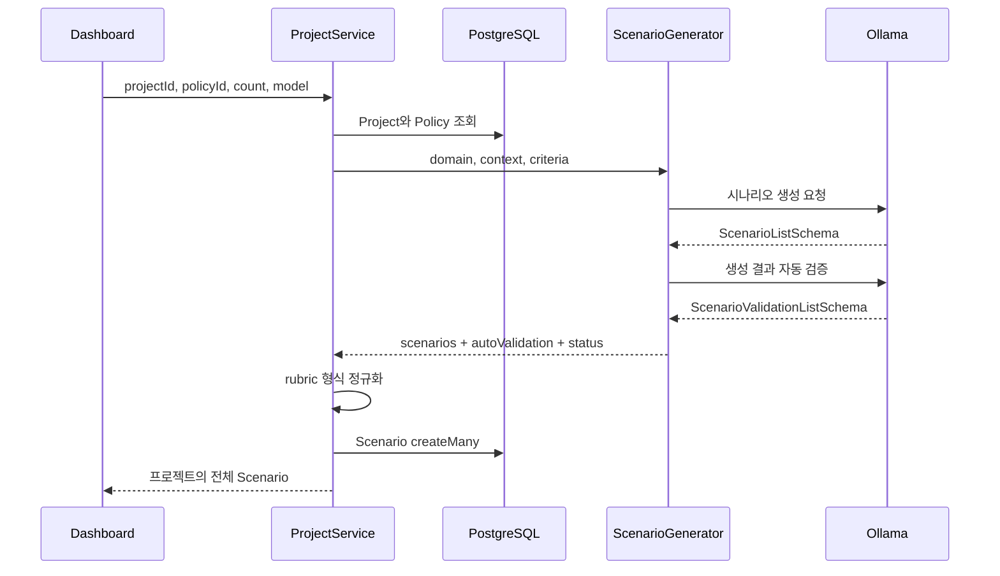
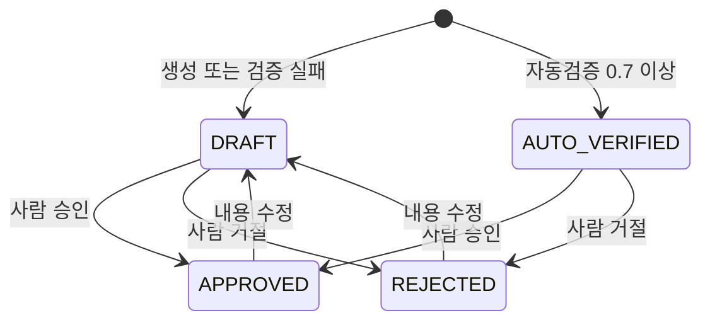
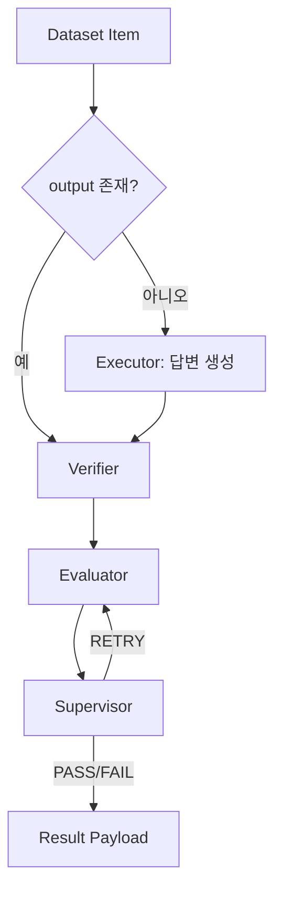
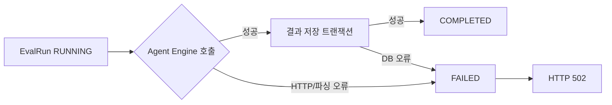

# 데이터 파이프라인 및 흐름

> Wiki 경로: `Data-Pipeline`

## 전체 파이프라인

데이터는 “평가 설계”, “시나리오 준비”, “실행”, “결과 분석”의 네 단계로 흐른다.



## 1. 평가 설계 데이터

### Project

도메인과 업무 문맥을 저장한다. 시나리오 생성 프롬프트의 기반이 된다.

```json
{
  "name": "고객센터 평가",
  "domain": "전자상거래 고객지원",
  "description": "환불 및 배송 문의 응답 품질 평가",
  "context": {
    "refundWindowDays": 7,
    "channels": ["chat", "email"]
  }
}
```

### EvaluationPolicy

통과 기준, 재시도와 가중 지표를 저장한다.

```json
{
  "name": "기본 고객지원 정책",
  "passThreshold": 0.8,
  "maxRetries": 1,
  "metrics": [
    {
      "key": "accuracy",
      "name": "정확성",
      "description": "업무 정책과 사실에 맞는가",
      "weight": 0.6,
      "required": true
    },
    {
      "key": "tone",
      "name": "응대 품질",
      "description": "명확하고 친절한가",
      "weight": 0.4
    }
  ]
}
```

Backend는 metrics가 비어 있지 않고 weight의 합이 `1 ± 0.001`인지 확인한다.

## 2. 시나리오 생성 파이프라인



시나리오 루브릭은 다음 형태를 목표로 한다.

```json
{
  "metrics": [
    {
      "key": "accuracy",
      "name": "정확성",
      "levels": [
        { "score": 1.0, "criteria": "정책을 정확히 설명한다" },
        { "score": 0.5, "criteria": "핵심은 맞지만 일부가 누락된다" },
        { "score": 0.0, "criteria": "잘못된 정책을 안내한다" }
      ]
    }
  ],
  "requiredConditions": ["환불 가능 기간을 포함한다"],
  "failConditions": ["확인되지 않은 보상을 약속한다"],
  "allowedVariations": ["7일 이내와 일주일 이내를 동등하게 본다"]
}
```

이전 루브릭 형식이 들어오면 Backend의 `normalizeRubric`이 metrics 배열 구조로 변환한다.

## 3. 사람 검토 상태 흐름



평가 실행 쿼리는 `status = APPROVED`인 Scenario만 조회한다. AUTO_VERIFIED는 자동 검증 결과이며 실행 승인 상태가 아니다.

## 4. 평가 실행 입력 구성

평가 실행 요청은 두 방식 중 하나를 사용한다.

### 직접 dataset 방식

호출자가 prompt, output, expectedOutput과 criteria를 직접 보낸다.

### Scenario 방식

`scenarioIds`를 보내면 Backend가 다음을 수행한다.

1. 모든 ID가 존재하는지 확인한다.
2. 선택한 프로젝트에 속하는지 확인한다.
3. 모두 APPROVED 상태인지 확인한다.
4. Policy metrics와 Scenario rubric을 결합한다.
5. `testOutput`이 있으면 평가 대상으로 사용한다.
6. `testOutput`이 없으면 Agent Engine의 Executor가 답변을 생성하게 둔다.

결합된 criterion에는 정책 지표, 해당 지표의 rubric, 공통 required/fail/allowed 조건이 포함된다.

## 5. Agent Engine 내부 흐름



dataset 항목은 순차적으로 처리된다. 각 항목마다 검증, 평가와 감독 결과를 만든 뒤 results 배열에 추가한다.

## 6. 점수 데이터 변환

Evaluator 모델은 지표별 원점수를 반환한다.

```text
weightedScore = Σ(metric score × metric weight)
finalScore = weightedScore / Σ(weight)
```

필수 조건 누락 또는 즉시 실패 조건 위반이 있으면 finalScore는 0이 된다. Supervisor verdict가 최종 PASS/FAIL/RETRY 의미를 갖는다.

## 7. 결과 저장

Backend는 Agent Engine 결과를 다음과 같이 매핑한다.

| Agent Engine | EvalResult |
| --- | --- |
| `prompt` | `inputPrompt` |
| `output` | `outputAnswer` |
| `expectedOutput` | `expectedOutput` |
| `score` | `score` |
| `verdict` | `verdict` |
| `verification` | `verification` JSONB |
| `metrics` + score | `evaluation` JSONB |
| `supervision` | `supervision` JSONB |
| `retryCount` | `retryCount` |

모든 결과 생성과 EvalRun의 COMPLETED 전환은 하나의 Prisma 트랜잭션으로 실행한다.

## 8. 실패 파이프라인



실패한 실행도 EvalRun으로 남기 때문에 Dashboard나 DB에서 시도 이력을 확인할 수 있다.

## 9. 분석 데이터

요약 API는 다음 값을 계산한다.

- `totalRuns`: 전체 EvalRun 수
- `totalEvaluations`: 전체 EvalResult 수
- `averageScore`: EvalResult score 평균
- `passRate`: PASS 결과 수 / 전체 결과 수

목록 API는 최근 실행 30개와 각 결과를 반환한다.
