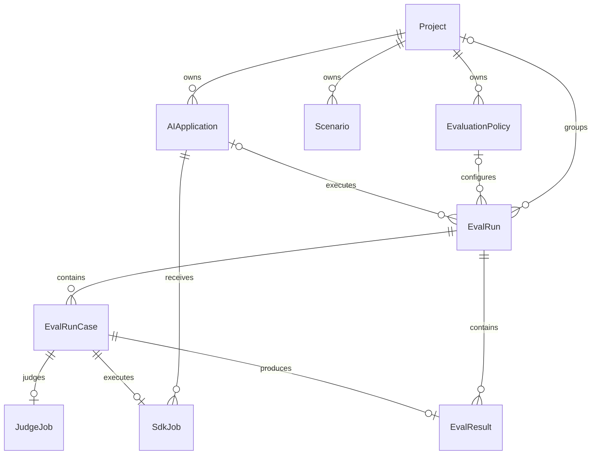

# 데이터베이스 설계

현재 기준은 `apps/backend/prisma/schema.prisma`와 `apps/backend/prisma/migrations`다. DBMS는 PostgreSQL, ORM은 Prisma이며 UUID는 Prisma `String @default(uuid())`, JSON은 PostgreSQL `JSONB`로 생성된다.

## ERD



## enum

| enum | 값 |
| --- | --- |
| `EvalRunExecutionMode` | `ADAPTER`, `PROVIDED_OUTPUT` |
| `EvalRunStatus` | `QUEUED`, `RUNNING`, `COMPLETED`, `COMPLETED_WITH_ERRORS`, `FAILED`, `CANCELLED` |
| `EvalCaseEvaluationMode` | `REFERENCE_BASED`, `RUBRIC_ONLY` |
| `EvalRunCaseStatus` | `WAITING_FOR_EXECUTION`, `EXECUTING`, `ANSWER_COMPLETED`, `WAITING_FOR_JUDGE`, `JUDGING`, `COMPLETED`, `REVIEW_REQUIRED`, `EXECUTION_FAILED`, `JUDGE_FAILED`, `CANCELLED` |
| `JudgeJobStatus` | `PENDING`, `CLAIMED`, `RUNNING`, `COMPLETED`, `FAILED` |

`Scenario.status`, `Scenario.riskLevel`, `SdkJob.status`, `EvalResult.verdict`는 DB enum이 아니라 문자열이다. 애플리케이션이 각각의 허용 상태를 관리한다.

## 테이블

### Project

| 컬럼 | 타입/기본값 | Null | 설명 |
| --- | --- | --- | --- |
| `id` | UUID | N | PK |
| `name` | String | N | 프로젝트명 |
| `domain` | String | N | 평가 도메인 |
| `description` | String | Y | 설명 |
| `context` | JSONB | Y | 업무 문맥 |
| `agentPrompts` | JSONB | Y | verifier/evaluator/supervisor 프롬프트 |
| `createdAt` | DateTime/now | N | 생성 시각 |
| `updatedAt` | DateTime/auto | N | 수정 시각 |

### EvaluationPolicy

| 컬럼 | 타입/기본값 | Null | 설명 |
| --- | --- | --- | --- |
| `id` | UUID | N | PK |
| `projectId` | UUID | N | Project FK |
| `name` | String | N | 정책명 |
| `passThreshold` | Float/0.7 | N | 통과 기준 |
| `maxRetries` | Int/1 | N | Judge 재평가 설정 |
| `metrics` | JSONB | N | 지표와 가중치 |
| `createdAt`, `updatedAt` | DateTime | N | 생성/수정 시각 |

### Scenario

| 컬럼 | 타입/기본값 | Null | 설명 |
| --- | --- | --- | --- |
| `id` | UUID | N | PK |
| `projectId` | UUID | N | Project FK |
| `title` | String | N | 제목 |
| `category` | String | Y | 분류 |
| `prompt` | String | N | 테스트 입력 |
| `testOutput` | String | Y | 이미 준비된 대상 출력 |
| `expectedOutput` | String | Y | 기준 답변 |
| `expectedBehavior` | JSONB | Y | 기대 행동 |
| `evaluationRubric` | JSONB | Y | 지표별 rubric/조건 |
| `riskLevel` | String/`MEDIUM` | N | 위험도 |
| `status` | String/`DRAFT` | N | 검토 상태 |
| `autoValidation` | JSONB | Y | 자동 검증 결과 |
| `rejectionReason` | String | Y | 거절 사유 |
| `reviewedAt` | DateTime | Y | 검토 시각 |
| `createdAt`, `updatedAt` | DateTime | N | 생성/수정 시각 |

### EvalRun

| 컬럼 | 타입/기본값 | Null | 설명 |
| --- | --- | --- | --- |
| `id` | UUID | N | PK |
| `projectId` | UUID | Y | Project FK, 삭제 시 null |
| `policyId` | UUID | Y | Policy FK, 삭제 시 null |
| `applicationId` | UUID | Y | Application FK, 삭제 시 null |
| `policySnapshot` | JSONB | Y | 실행 당시 정책 |
| `name`, `agentName`, `model` | String | N | 실행/대상/Judge 모델 식별 |
| `judgeModel` | String | Y | 실제 Judge 모델 |
| `judgeConfig` | JSONB | Y | agent prompt 등 Judge 설정 |
| `executionMode` | enum/`PROVIDED_OUTPUT` | N | 답변 수집 방식 |
| `status` | enum/`QUEUED` | N | 실행 상태 |
| `passThreshold` | Float/0.7 | N | 확정 통과 기준 |
| `maxRetries` | Int/1 | N | 확정 재시도 수 |
| `totalCases`, `completedCases`, `failedCases`, `reviewCases` | Int/0 | N | 진행 집계 |
| `createdAt`, `updatedAt` | DateTime | N | 생성/수정 시각 |
| `startedAt`, `completedAt` | DateTime | Y | 실행 구간 |

인덱스는 `(applicationId,status)`, `(projectId,createdAt)`이다.

### EvalRunCase

답변 수집부터 Judge 평가까지 한 dataset 항목의 상태를 보존한다.

| 컬럼 | 타입/기본값 | Null | 설명 |
| --- | --- | --- | --- |
| `id` | UUID | N | PK |
| `evalRunId` | UUID | N | EvalRun FK |
| `caseIndex` | Int | N | 실행 내 순서 |
| `externalCaseId` | String | Y | 외부 dataset 식별자 |
| `evaluationMode` | enum | N | 기준 답변/루브릭 평가 |
| `status` | enum/`WAITING_FOR_EXECUTION` | N | case 상태 |
| `input` | JSONB | N | prompt, variables, context |
| `expected` | JSONB | Y | referenceAnswer와 조건 |
| `rubricSnapshot` | JSONB | Y | 실행 당시 criteria |
| `outputAnswer` | String | Y | 수집한 대상 답변 |
| `executionMetadata`, `executionError` | JSONB | Y | 실행 관측/오류 |
| `createdAt`, `updatedAt` | DateTime | N | 생성/수정 시각 |
| `executionStartedAt`, `answerCompletedAt`, `completedAt` | DateTime | Y | 단계별 시각 |

`(evalRunId,caseIndex)`는 unique다. `(evalRunId,status)`, `(status,updatedAt)` 인덱스가 있다.

### EvalResult

| 컬럼 | 타입/기본값 | Null | 설명 |
| --- | --- | --- | --- |
| `id` | UUID | N | PK |
| `evalRunId` | UUID | N | EvalRun FK |
| `evalRunCaseId` | UUID/unique | Y | 자동 실행 case의 1:1 결과 |
| `inputPrompt`, `outputAnswer` | String | N | 평가 입력/출력 |
| `expectedOutput` | String | Y | 기준 답변 |
| `score` | Float | N | 0~1 점수(앱 검증) |
| `verdict` | String | N | `PASS|FAIL|RETRY` |
| `reason` | String | Y | 판정 근거 |
| `verification`, `evaluation`, `supervision` | JSONB | Y | 단계별 결과 |
| `judgeModel`, `judgePromptVersion` | String | Y | Judge 추적 정보 |
| `judgeAttempts` | Int/1 | N | Judge 시도 수 |
| `schemaValid` | Boolean/true | N | 응답 스키마 유효성 |
| `retryCount` | Int/0 | N | 엔진 내부 재평가 수 |
| `durationMs` | Int | Y | 평가 소요시간 |
| `createdAt` | DateTime/now | N | 생성 시각 |

### AIApplication

| 컬럼 | 타입/기본값 | Null | 설명 |
| --- | --- | --- | --- |
| `id` | UUID | N | PK |
| `projectId` | UUID | N | Project FK |
| `name` | String | N | 연결 대상 이름 |
| `environment` | String/`development` | N | 환경 |
| `sdkKeyHash` | String/unique | N | SDK Key SHA-256 |
| `active` | Boolean/true | N | 인증 활성 여부 |
| `createdAt`, `updatedAt` | DateTime | N | 생성/수정 시각 |

`projectId` 인덱스가 있다.

### SdkJob

| 컬럼 | 타입/기본값 | Null | 설명 |
| --- | --- | --- | --- |
| `id` | UUID | N | PK |
| `applicationId` | UUID | N | Application FK |
| `evalRunCaseId` | UUID/unique | Y | 자동 실행 case |
| `testCase` | JSONB | N | SDK 전달 payload |
| `status` | String/`PENDING` | N | Job 상태 |
| `attempt`, `maxAttempts` | Int/0,3 | N | 시도/상한 |
| `timeoutMs` | Int/30000 | N | 고객 호출 timeout |
| `leaseId` | String | Y | claim 소유 token |
| `leaseExpiresAt` | DateTime | Y | lease 만료 |
| `idempotencyKey` | String/unique | Y | complete 중복 방지 |
| `output`, `error` | JSONB | Y | 실행 결과/오류 |
| `startedAt`, `completedAt` | DateTime | Y | 실행 구간 |
| `createdAt`, `updatedAt` | DateTime | N | 생성/수정 시각 |

인덱스는 `(applicationId,status,createdAt)`, `leaseExpiresAt`이다.

### JudgeJob

| 컬럼 | 타입/기본값 | Null | 설명 |
| --- | --- | --- | --- |
| `id` | UUID | N | PK |
| `evalRunCaseId` | UUID/unique | N | EvalRunCase 1:1 FK |
| `status` | enum/`PENDING` | N | Judge 작업 상태 |
| `attempt`, `maxAttempts` | Int/0,3 | N | 시도/상한 |
| `availableAt` | DateTime/now | N | 재시도 가능 시각 |
| `leaseId`, `leaseExpiresAt` | String, DateTime | Y | Worker lease |
| `error` | JSONB | Y | 마지막 오류 |
| `startedAt`, `completedAt` | DateTime | Y | 실행 구간 |
| `createdAt`, `updatedAt` | DateTime | N | 생성/수정 시각 |

인덱스는 `(status,availableAt)`, `leaseExpiresAt`이다.

## 관계와 삭제 정책

| 부모 → 자식 | 카디널리티 | 부모 삭제 시 |
| --- | --- | --- |
| Project → EvaluationPolicy | 1:N | Cascade |
| Project → Scenario | 1:N | Cascade |
| Project → AIApplication | 1:N | Cascade |
| Project → EvalRun | 1:N, optional FK | SetNull |
| EvaluationPolicy → EvalRun | 1:N, optional FK | SetNull |
| AIApplication → EvalRun | 1:N, optional FK | SetNull |
| AIApplication → SdkJob | 1:N | Cascade |
| EvalRun → EvalRunCase | 1:N | Cascade |
| EvalRun → EvalResult | 1:N | Cascade |
| EvalRunCase → SdkJob | 1:0..1 | Cascade |
| EvalRunCase → JudgeJob | 1:0..1 | Cascade |
| EvalRunCase → EvalResult | 1:0..1 | Cascade |

Project 삭제 시 Application과 그 SdkJob은 삭제된다. 같은 실행의 `applicationId`는 SetNull 되지만, Project의 `evalRuns`도 SetNull 된다. 서비스 계층은 활성 실행/Job 삭제를 먼저 막아 진행 중 데이터의 연쇄 삭제를 방지한다.

## 일관성 경계

- Run과 모든 case/초기 Job 생성은 한 트랜잭션이다.
- SDK complete는 Job 완료, case 출력 저장, JudgeJob 생성을 한 트랜잭션으로 처리한다.
- Judge 완료는 EvalResult upsert, case/Job 완료와 Run 집계 갱신을 한 트랜잭션에서 수행한다.
- 정책/루브릭/Judge 설정은 snapshot 컬럼으로 실행 당시 값을 보존한다.
- JSONB 내부 구조, 문자열 상태, score 범위는 DB constraint보다 서비스 검증에 의존한다.

## 마이그레이션

```bash
pnpm --filter backend exec prisma generate
pnpm --filter backend exec prisma migrate deploy
```

개발 마이그레이션:

```bash
cd apps/backend
pnpm exec prisma migrate dev --name change_name
```

운영에서는 schema 파일 직접 동기화보다 커밋된 migration을 순서대로 적용한다.

