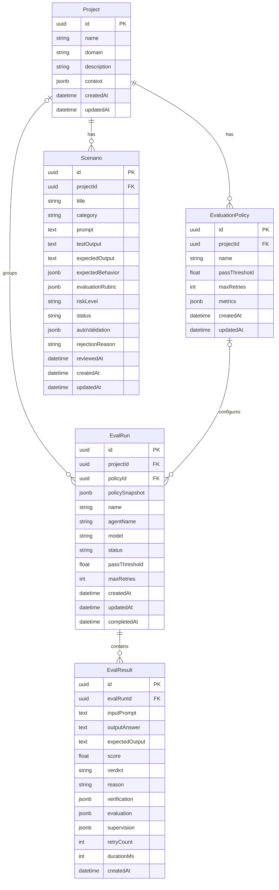

# 데이터베이스 ERD

> Wiki 경로: `Database-Schema`

## 개요

PostgreSQL과 Prisma를 사용한다. 스키마 원본은 `apps/backend/prisma/schema.prisma`, 마이그레이션은 `apps/backend/prisma/migrations`에 있다.

## ERD



Mermaid의 `uuid`, `jsonb`, `text` 표기는 실제 PostgreSQL 의미를 읽기 쉽게 표현한 것이다. Prisma 스키마에서는 UUID가 `String @default(uuid())`, JSONB가 `Json`으로 선언된다.

## Project

평가 업무의 최상위 컨테이너다.

| 컬럼 | Prisma 타입 | 필수 | 설명 |
| --- | --- | --- | --- |
| `id` | String | O | UUID 기본키 |
| `name` | String | O | 프로젝트 이름 |
| `domain` | String | O | 평가 업무 도메인 |
| `description` | String? | X | 프로젝트 설명 |
| `context` | Json? | X | 시나리오 생성에 사용할 업무 문맥 |
| `createdAt` | DateTime | O | 생성 시각 |
| `updatedAt` | DateTime | O | 자동 갱신 시각 |

관계:

- EvaluationPolicy 0..N
- Scenario 0..N
- EvalRun 0..N

Project 삭제 시 Policy와 Scenario는 cascade 삭제된다. EvalRun은 보존되며 projectId만 null로 변경된다.

## EvaluationPolicy

프로젝트별 평가 규칙을 저장한다.

| 컬럼 | 타입 | 기본값 | 설명 |
| --- | --- | --- | --- |
| `id` | String | UUID | 기본키 |
| `projectId` | String | - | Project 외래키 |
| `name` | String | - | 정책 이름 |
| `passThreshold` | Float | 0.7 | 최종 통과 기준 |
| `maxRetries` | Int | 1 | 평가 재시도 횟수 |
| `metrics` | Json | - | 지표, 설명, weight, required |
| `createdAt` | DateTime | now() | 생성 시각 |
| `updatedAt` | DateTime | 자동 | 수정 시각 |

Policy 삭제 시 연결된 EvalRun은 보존되며 policyId가 null이 된다. 실행 당시 정책은 EvalRun.policySnapshot에 남는다.

metrics 예시:

```json
[
  {
    "key": "accuracy",
    "name": "정확성",
    "description": "업무 정책과 사실에 맞는가",
    "weight": 0.7,
    "required": true
  }
]
```

## Scenario

재사용 가능한 평가 케이스다.

| 컬럼 | 설명 |
| --- | --- |
| `prompt` | 테스트 입력 |
| `testOutput` | 직접 평가할 외부 AI 출력. null이면 엔진이 생성 |
| `expectedOutput` | 기대 답변 |
| `expectedBehavior` | 기대 행동 목록 JSON |
| `evaluationRubric` | 지표별 점수 구간과 필수·실패·허용 조건 |
| `riskLevel` | 기본 MEDIUM |
| `status` | DRAFT, AUTO_VERIFIED, APPROVED, REJECTED |
| `autoValidation` | 자동 검증 점수, 이유와 issues |
| `rejectionReason` | 사람 검토 거절 사유 |
| `reviewedAt` | 마지막 승인 또는 거절 시각 |

Project 삭제 시 Scenario도 cascade 삭제된다.

## EvalRun

평가 실행 단위다.

| 컬럼 | 설명 |
| --- | --- |
| `projectId` | 선택적 Project 관계 |
| `policyId` | 선택적 Policy 관계 |
| `policySnapshot` | 실행 당시 정책 복사본 |
| `name` | 실행 표시 이름 |
| `agentName` | 평가 대상 에이전트 식별 이름 |
| `model` | 대상 답변 생성에 사용할 모델 |
| `status` | PENDING, RUNNING, COMPLETED, FAILED |
| `passThreshold` | 실행에 확정된 통과 기준 |
| `maxRetries` | 실행에 확정된 재시도 횟수 |
| `completedAt` | 성공 또는 실패 완료 시각 |

Project나 Policy가 삭제되어도 EvalRun과 EvalResult는 결과 이력으로 보존된다.

## EvalResult

dataset의 각 항목에 대한 결과다.

| 컬럼 | 설명 |
| --- | --- |
| `evalRunId` | 소속 EvalRun |
| `inputPrompt` | 실제 평가 프롬프트 |
| `outputAnswer` | 평가한 답변 |
| `expectedOutput` | 선택적 기대 답변 |
| `score` | 0~1 평가 점수 |
| `verdict` | PASS, FAIL 또는 RETRY 결과 |
| `reason` | Supervisor 또는 Evaluator 요약 사유 |
| `verification` | Verifier 상세 JSON |
| `evaluation` | 점수와 지표별 상세 JSON |
| `supervision` | 최종 판정 상세 JSON |
| `retryCount` | 실제 재평가 횟수 |
| `durationMs` | 평가 요청 경과 시간 |

EvalRun 삭제 시 EvalResult는 cascade 삭제된다.

## 삭제 정책

| 부모 삭제 | 자식 처리 |
| --- | --- |
| Project → EvaluationPolicy | Cascade |
| Project → Scenario | Cascade |
| Project → EvalRun | SetNull |
| EvaluationPolicy → EvalRun | SetNull |
| EvalRun → EvalResult | Cascade |

테스트 설계 자산은 프로젝트와 함께 정리하되, 실행 이력은 최대한 보존하는 정책이다.

## JSON 컬럼을 사용한 이유

평가 지표와 루브릭은 도메인마다 구조가 바뀐다. 이를 모두 관계형 테이블로 분해하면 초기 유연성이 떨어지고 변경마다 마이그레이션이 필요하다.

JSONB를 선택한 영역:

- 프로젝트 업무 context
- 정책 metrics
- 기대 행동
- 시나리오 rubric과 자동 검증
- 검증·평가·감독 상세 결과

대신 다음 대가가 있다.

- DB constraint만으로 내부 구조를 보장하기 어렵다.
- 특정 metric key 기반 집계가 복잡하다.
- TypeScript와 Python의 런타임 검증이 중요해진다.

지표별 장기 분석 요구가 커지면 MetricDefinition과 MetricResult를 별도 테이블로 정규화하는 방안을 검토할 수 있다.

## 마이그레이션 순서

현재 주요 마이그레이션:

1. 초기 EvalRun/EvalResult
2. 평가 Dashboard 필드 추가
3. Project/Policy/Scenario와 관계 추가
4. Scenario evaluationRubric 추가
5. Scenario testOutput 추가

적용:

```bash
pnpm --filter backend exec prisma generate
pnpm --filter backend exec prisma migrate deploy
```

개발 중 새 마이그레이션:

```bash
cd apps/backend
pnpm exec prisma migrate dev --name 변경_이름
```

운영 데이터가 있는 DB에서는 필수 컬럼 추가 마이그레이션의 기본값과 backfill 전략을 먼저 검토해야 한다.
