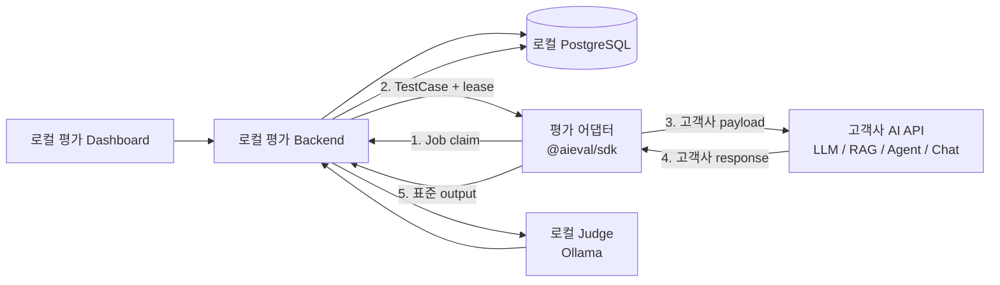
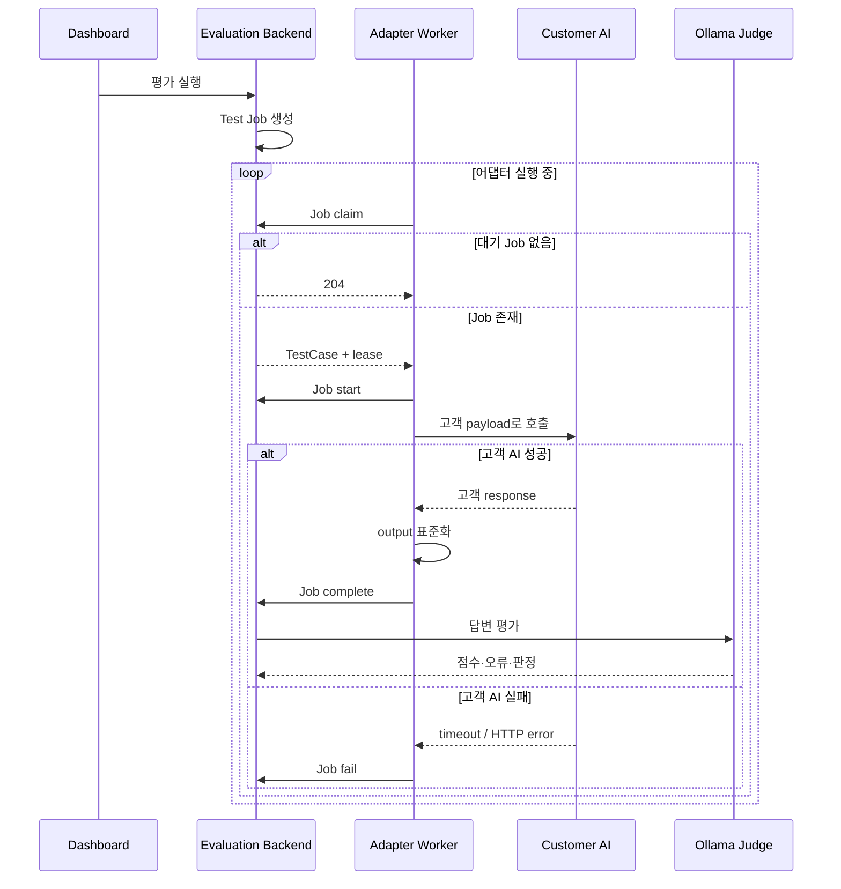

# 평가 어댑터 MVP 설계

> 문서 상태: MVP 설계안  
> 관련 문서: [SDK 실행 프로토콜](./SDK-Execution-Protocol.md), [전체 시스템 구조](./System-Architecture.md)

## 1. 목적

평가 어댑터는 AIEvalPlatform과 고객사의 기존 AI 서비스 사이에서 실행되는 별도 프로세스다.

고객사의 운영 AI 코드에 평가 SDK를 직접 삽입하지 않고, 어댑터가 다음 작업을 담당한다.

1. 로컬 평가 플랫폼에서 Test Job을 가져온다.
2. 플랫폼의 표준 TestCase를 고객사 AI API의 요청 payload로 변환한다.
3. 고객사 내부 인증과 세션 규칙에 따라 AI API를 호출한다.
4. 고객사 AI의 응답 payload에서 최종 답변을 추출한다.
5. 답변과 선택적인 실행 메타데이터를 플랫폼 공통 형식으로 변환해 제출한다.



모든 구성요소는 고객사 내부망에서 실행한다. MVP에서는 평가 원문을 외부 서비스로 전송하지 않는다.

## 2. 핵심 설계 결정

### 2.1 전체 제품과 SDK를 분리한다

전체 제품은 로컬 Dashboard, Backend, DB, Agent Engine, Ollama와 평가 어댑터로 구성된다. SDK는 전체 제품이 아니라 어댑터를 구현하기 위한 라이브러리다.

```text
온프레미스 평가 제품
├── Dashboard / Backend / DB / Judge
├── SDK Job 프로토콜
└── 고객별 평가 어댑터
    └── @aieval/sdk 사용
```

### 2.2 어댑터는 운영 AI와 별도로 실행한다

어댑터는 고객 AI 애플리케이션의 함수 내부에 포함되지 않는다. 독립된 Node.js 프로세스 또는 컨테이너로 실행하고, 고객 AI가 이미 제공하는 내부 HTTP API를 호출한다.

이 구조는 다음 효과가 있다.

- 기존 AI 애플리케이션 코드를 수정하지 않아도 된다.
- 평가 SDK의 장애와 배포 주기를 운영 AI에서 분리한다.
- 평가가 끝나면 어댑터만 중지하거나 제거할 수 있다.
- 고객사별 payload, 인증 및 응답 구조의 차이를 어댑터 내부로 제한한다.

### 2.3 고객별 수정 범위는 `invoke()`로 제한한다

`@aieval/sdk`의 어댑터는 Job polling, lease, timeout, 재시도와 결과 제출을 담당한다. 고객 개발자는 주로 `invoke(testCase, context)`에서 다음 부분만 구현한다.

- 고객 AI endpoint 선택
- 평가 입력을 고객 payload로 변환
- 인증정보와 헤더 설정
- 고객 AI 호출
- 고객 응답에서 답변 추출
- 선택적인 메타데이터 정규화

`invoke()`는 고객 payload 자체가 아니라 **표준 TestCase와 고객 API 사이의 양방향 매핑 함수**다.

## 3. MVP 범위

### 3.1 포함

- TypeScript SDK 기반의 별도 평가 어댑터
- HTTP JSON 방식의 고객 AI 호출
- Bearer SDK Key를 사용한 Worker 인증
- `claim → start → execute → complete/fail` 실행
- 싱글턴 질문과 최종 텍스트 답변
- 고객 AI 호출 timeout과 `AbortSignal` 전달
- 고객사별 요청 payload 및 응답 payload 매핑
- 선택적인 모델, trace, 검색 문서 및 도구 호출 메타데이터
- 환경변수를 통한 endpoint와 secret 설정
- 구조화된 실행 실패 보고
- 동일 Job 완료 요청의 멱등성

### 3.2 제외

- 대시보드에서 만드는 무코드 HTTP 매핑 UI
- YAML만으로 구성하는 범용 HTTP 어댑터
- Python, Java SDK
- streaming 응답
- SDK Job heartbeat와 lease 연장
- 병렬 Job 처리와 동시성 제한
- 멀티턴 세션 오케스트레이션
- 도구 호출 과정의 완전한 trace 수집
- 실시간 운영 로그 수집
- 평가 시나리오 자동 생성
- 외부 SaaS 또는 중앙 관제 서버로의 데이터 전송

제외 항목은 후속 확장 대상으로 두되, MVP의 프로토콜을 불필요하게 복잡하게 만들지 않는다.

## 4. 컴포넌트 책임

| 컴포넌트 | 책임 | 책임지지 않는 것 |
| --- | --- | --- |
| Dashboard | 대상 선택, 평가 실행, 결과와 상태 표시 | 고객 AI 직접 호출 |
| Backend | Job 생성·상태·lease·결과 저장 | 고객별 인증과 payload 변환 |
| SDK Worker | polling, timeout, 재시도, 완료·실패 제출 | 답변 품질 판정 |
| 평가 어댑터 | 고객 API 호출과 양방향 payload 매핑 | LLM Judge 실행 |
| 고객 AI | 실제 답변 생성, RAG, 도구 및 세션 처리 | 평가 작업 상태 관리 |
| Agent Engine/Ollama | 답변 품질 평가와 구조화 출력 | 고객 AI 호출 |

어댑터는 답변을 생성하지도, 답변을 채점하지도 않는다. 고객 AI의 실행 결과를 플랫폼 표준 형식으로 바꾸는 연결 계층이다.

## 5. 배포 구조

### 5.1 권장 MVP 배포

평가 플랫폼과 어댑터를 고객사 내부 서버에서 별도 프로세스 또는 컨테이너로 실행한다.

```text
고객사 내부 서버
├── evaluation-dashboard
├── evaluation-backend
├── evaluation-agent-engine
├── evaluation-db
├── ollama
└── evaluation-adapter
        │
        └── HTTP → 기존 고객 AI API
```

어댑터는 다음 두 주소에 접근할 수 있어야 한다.

1. 로컬 평가 Backend의 SDK Job API
2. 고객사 내부 AI API

외부 인터넷 접근은 MVP 실행 조건이 아니다.

### 5.2 실행 명령 예시

개발 및 검증 환경에서는 다음처럼 실행한다.

```bash
pnpm --filter @aieval/sdk build
AIEVAL_BASE_URL=http://localhost:3000/api/v1 \
AIEVAL_SDK_KEY=aieval_example \
CUSTOMER_AI_URL=http://customer-ai.internal/chat \
node examples/customer-ai-adapter.mjs
```

운영 형태에서는 환경변수를 컨테이너 secret 또는 고객사의 Secret Manager에서 주입한다.

## 6. 어댑터 인터페이스

신규 어댑터 연동의 공개 접점은 `createEvaluationAdapter(options)`다.

```ts
import { createEvaluationAdapter } from '@aieval/sdk';

const adapter = createEvaluationAdapter({
  baseUrl: process.env.AIEVAL_BASE_URL!,
  sdkKey: process.env.AIEVAL_SDK_KEY!,

  async invoke(testCase, context) {
    // 고객사별 호출과 매핑만 구현한다.
    return {
      output: '고객 AI가 생성한 최종 답변',
    };
  },
});

await adapter.start();
```

기존 `createEvaluationWorker({ execute })`는 하위 호환성을 위해 유지한다.

### 6.1 표준 입력

MVP의 `TestCase`는 다음 구조를 사용한다.

```ts
interface TestCase {
  id?: string;
  scenarioId?: string;
  prompt: string;
  variables?: Record<string, unknown>;
  expected?: {
    output?: string;
    behavior?: string[];
    requiredConditions?: string[];
    failConditions?: string[];
    allowedVariations?: string[];
  };
  metadata?: Record<string, unknown>;
}
```

고객 AI 호출에는 주로 다음 필드를 사용한다.

- `prompt`: 사용자 질문
- `variables`: 고객 ID, 테스트 주문 ID, 세션 초기값 등 fixture
- `metadata`: 평가 분류와 위험도 등 실행 보조 정보

`expected`는 평가 기준이며 기본적으로 고객 AI 요청에 보내지 않는다. 정답이나 실패 조건이 답변 생성 모델에 노출되면 평가가 오염되기 때문이다.

### 6.2 표준 출력

```ts
interface ExecutionResult {
  output: string;
  metadata?: {
    model?: string;
    modelVersion?: string;
    latencyMs?: number;
    tokenUsage?: {
      input?: number;
      output?: number;
    };
    retrievedDocuments?: unknown[];
    toolCalls?: unknown[];
    traceId?: string;
    [key: string]: unknown;
  };
}
```

`output`은 비어 있지 않은 최종 답변 문자열이어야 한다. 나머지 항목은 선택 사항이다.

## 7. 고객 payload 매핑 예시

평가 플랫폼이 다음 TestCase를 전달한다고 가정한다.

```json
{
  "id": "case-001",
  "prompt": "주문을 취소할 수 있나요?",
  "variables": {
    "customerId": "eval-customer-001",
    "orderId": "eval-order-001"
  }
}
```

고객 AI API의 요청 규격이 다음과 같다면:

```json
{
  "message": "주문을 취소할 수 있나요?",
  "conversationId": "eval-job-id",
  "customer": {
    "id": "eval-customer-001"
  },
  "orderId": "eval-order-001"
}
```

어댑터는 다음처럼 구현한다.

```ts
import { createEvaluationAdapter } from '@aieval/sdk';

const adapter = createEvaluationAdapter({
  baseUrl: process.env.AIEVAL_BASE_URL!,
  sdkKey: process.env.AIEVAL_SDK_KEY!,

  async invoke(testCase, context) {
    const response = await fetch(process.env.CUSTOMER_AI_URL!, {
      method: 'POST',
      signal: context.signal,
      headers: {
        'Content-Type': 'application/json',
        Authorization: `Bearer ${process.env.CUSTOMER_AI_TOKEN}`,
      },
      body: JSON.stringify({
        message: testCase.prompt,
        conversationId: context.jobId,
        customer: {
          id: testCase.variables?.customerId,
        },
        orderId: testCase.variables?.orderId,
      }),
    });

    if (!response.ok) {
      throw {
        code: response.status >= 500
          ? 'TARGET_UNAVAILABLE'
          : 'EXECUTION_ERROR',
        message: `Customer AI returned HTTP ${response.status}`,
        retryable: response.status >= 500,
      };
    }

    const data = await response.json();

    return {
      output: data.result.content,
      metadata: {
        model: data.model,
        modelVersion: data.modelVersion,
        traceId: data.traceId,
        retrievedDocuments: data.documents,
        toolCalls: data.toolCalls,
      },
    };
  },
});

await adapter.start();
```

이 코드에서 고객사별로 달라지는 부분은 다음과 같다.

```text
CUSTOMER_AI_URL
CUSTOMER_AI_TOKEN 및 인증 방식
TestCase → 요청 body 매핑
고객 API 호출 방식
응답 body → ExecutionResult 매핑
고객 오류 → ExecutionError 매핑
```

Job polling, lease와 플랫폼 결과 제출 코드는 수정하지 않는다.

## 8. 실행 흐름



현재 SDK 실행 프로토콜의 상태와 lease 규칙은 [SDK 실행 프로토콜](./SDK-Execution-Protocol.md)을 그대로 따른다.

## 9. 오류 처리

어댑터는 고객 AI 오류를 플랫폼의 `ExecutionError`로 정규화한다.

| 고객 AI 상황 | 권장 코드 | retryable |
| --- | --- | --- |
| 연결 실패 또는 HTTP 502/503 | `TARGET_UNAVAILABLE` | true |
| 제한 시간 초과 | `TARGET_TIMEOUT` | true |
| 내부 인증 실패, HTTP 401/403 | `AUTHENTICATION_FAILED` | false |
| 응답 JSON 파싱 실패 | `INVALID_RESPONSE` | false |
| 답변 필드가 없거나 빈 문자열 | `INVALID_RESPONSE` | false |
| 고객별 변환 코드 오류 | `EXECUTION_ERROR` | 상황별 |

다음 원칙을 적용한다.

- 4xx 오류를 무조건 재시도하지 않는다.
- 429와 일시적인 5xx만 제한적으로 재시도한다.
- 고객 AI의 전체 응답을 오류 메시지에 넣지 않는다.
- token, cookie와 개인정보를 로그 및 `details`에 기록하지 않는다.
- timeout 시 고객 HTTP 클라이언트에 `context.signal`을 전달한다.

## 10. 보안과 데이터 경계

### 10.1 데이터 위치

- 질문, 변수, 고객 AI 응답과 Judge 결과는 고객사 내부에만 저장한다.
- 어댑터는 외부 telemetry를 기본 활성화하지 않는다.
- 외부 모델 API 연결은 Strict Local MVP 범위에서 허용하지 않는다.
- Judge는 로컬 Ollama를 사용한다.

### 10.2 Secret

- `AIEVAL_SDK_KEY`와 고객 AI token을 소스 코드에 저장하지 않는다.
- `.env`는 개발 예시에만 사용하고 Git에 실제 값을 커밋하지 않는다.
- 운영에서는 container secret 또는 고객사 Secret Manager를 사용한다.
- SDK Key는 애플리케이션별 최소 권한으로 발급한다.

### 10.3 테스트 fixture

운영 고객 ID나 실제 주문 ID 대신 평가 전용 fixture를 권장한다. 어댑터는 기본적으로 운영 데이터 변경 권한이 없는 평가용 계정을 사용해야 한다.

도구를 호출하는 AI를 평가할 때는 주문 취소, 결제 및 메시지 발송과 같은 부작용을 방지하기 위해 sandbox 계정이나 dry-run 기능이 필요하다.

## 11. 운영과 관측성

MVP 어댑터는 다음 운영 정보를 남긴다.

- Worker 시작과 종료
- Job ID, attempt와 상태
- 고객 AI 호출 성공·실패와 latency
- 정규화된 오류 코드
- 플랫폼 결과 제출 성공·실패

기본 로그에 다음 내용은 남기지 않는다.

- 전체 질문과 답변
- 원문 RAG 문서
- 인증 token 또는 cookie
- 개인정보가 포함될 수 있는 고객 응답 body

로그에는 `jobId`와 `traceId`를 사용해 Backend 기록과 고객 AI trace를 연결한다.

## 12. MVP 사용자 흐름

1. 관리자가 로컬 평가 플랫폼을 실행한다.
2. Dashboard에서 AI Application을 등록하고 SDK Key를 한 번 발급받는다.
3. 고객 개발자가 어댑터 예제의 `invoke()`를 고객 API에 맞게 수정한다.
4. endpoint, SDK Key와 고객 인증정보를 환경변수로 설정한다.
5. 별도 프로세스 또는 컨테이너로 어댑터를 시작한다.
6. Dashboard에서 Test Job을 생성한다.
7. 어댑터가 Job을 가져와 고객 AI를 호출하고 output을 제출한다.
8. 플랫폼이 Ollama Judge로 답변을 평가하고 로컬 DB에 저장한다.
9. 평가 담당자가 Dashboard에서 실행 결과와 오류를 확인한다.

## 13. 완료 기준

MVP는 다음 조건을 모두 만족하면 완료로 본다.

- 기존 고객 AI 애플리케이션 코드를 수정하지 않고 평가할 수 있다.
- 고객 개발자가 하나의 `invoke()` 함수만 수정해 연동할 수 있다.
- 어댑터가 로컬 Backend에서 Job을 claim하고 상태를 정상 전이한다.
- 고객 API 요청 payload와 응답 payload를 양방향 매핑할 수 있다.
- 최종 답변이 `ExecutionResult.output`으로 저장된다.
- timeout, 인증 실패, 일시 장애와 잘못된 응답이 구분되어 기록된다.
- 동일 완료 요청이 중복 결과를 만들지 않는다.
- 질문, 답변과 secret이 고객사 외부로 전송되지 않는다.
- 어댑터 장애가 기존 고객 AI 서비스의 가용성에 영향을 주지 않는다.
- Mock 고객 API와 실제 내부 API 예제로 end-to-end 실행을 검증한다.

## 14. 후속 확장

MVP 검증 이후 다음 순서로 확장한다.

1. 대시보드 또는 YAML 기반의 무코드 HTTP 어댑터
2. 응답 매핑을 위한 JSONPath와 요청 template
3. 멀티턴 session setup/teardown hook
4. tool call과 RAG trace의 표준 스키마
5. 병렬 실행, rate limit와 heartbeat
6. Python SDK와 one-shot CI runner
7. 운영 JSON 로그 import
8. 시나리오 자동 생성과 사람 승인 workflow

무코드 어댑터가 추가되더라도 복잡한 사내 인증, 여러 API의 순차 호출 또는 전용 SDK가 필요한 고객을 위해 코드 기반 `invoke()` 방식은 유지한다.
