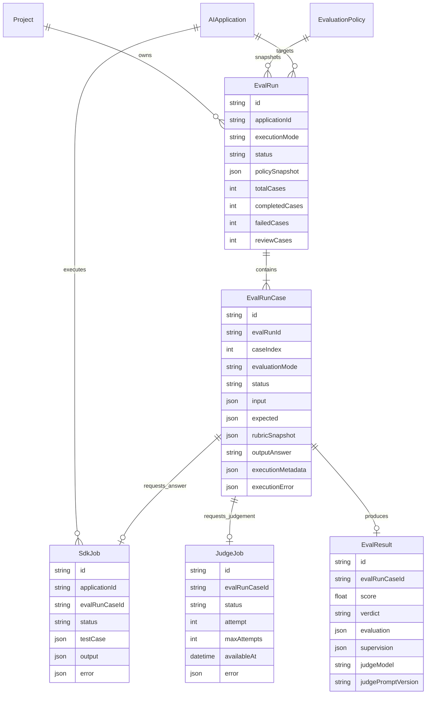
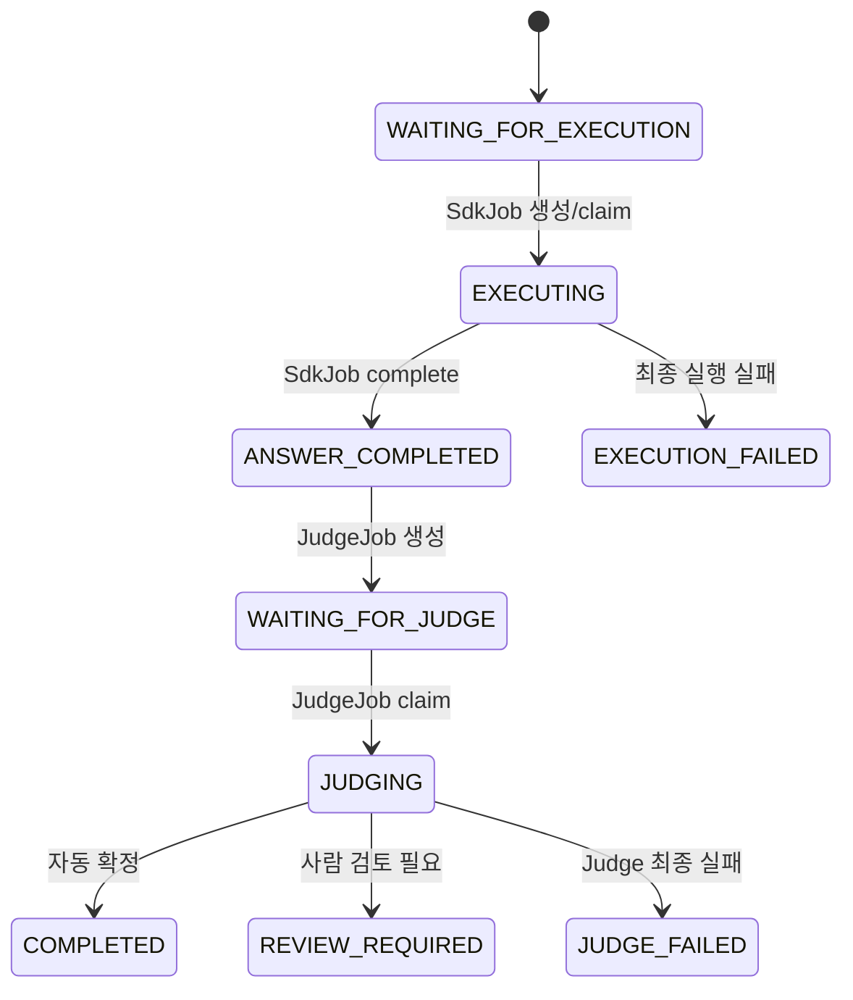

# 평가 실행 자동화 데이터 및 오케스트레이션 설계

> 문서 상태: 설계 결정 완료, 작업 A·B·C 구현 완료
> 대상 버전: SDK v1 다음 단계
> 관련 문서: [평가 어댑터 MVP 설계](./Evaluation-Adapter-MVP-Design.md), [SDK 실행 프로토콜](./SDK-Execution-Protocol.md)

## 1. 배경

현재 구현은 평가 담당자가 대시보드에서 질문 하나를 입력하면 `SdkJob` 하나를 생성하고, 별도 평가 어댑터가 Mock 또는 고객 AI의 답변을 수집하는 연결 테스트까지 지원한다.

```text
질문 수동 입력
→ SdkJob 생성
→ Adapter 실행
→ 답변 수집
→ Job 결과 표시
```

이 흐름은 어댑터 연결과 실행 프로토콜을 검증할 수 있지만 데이터셋 일괄 실행, Judge 자동 평가와 실행 단위 집계는 제공하지 않는다.

목표 흐름은 다음과 같다.

```text
평가 담당자가 대상·데이터셋·루브릭 선택
→ EvalRun 1개 생성
→ 데이터셋 항목별 EvalRunCase 생성
→ 필요한 Case에 SdkJob 자동 생성
→ Adapter가 고객 AI 답변 수집
→ Case별 JudgeJob 자동 생성
→ 로컬 Judge 평가
→ EvalResult 저장
→ 실행 전체 상태 및 결과 집계
```

## 2. 확정된 설계 결정

### 2.1 하나의 EvalRun은 하나의 어댑터만 평가한다

`ADAPTER` 실행 방식의 `EvalRun`은 하나의 `AIApplication`을 평가 대상으로 갖는다.

모델 A/B 비교는 하나의 Run 안에서 두 대상을 실행하지 않고, 동일한 데이터셋과 정책으로 생성한 두 EvalRun을 비교하는 방식으로 시작한다.

이 결정은 다음 장점이 있다.

- Run의 책임과 결과 해석이 명확하다.
- SDK Key, Job과 평가 대상의 관계가 단순하다.
- 대상별 성공률, 지연 시간과 품질 점수를 독립적으로 집계할 수 있다.
- 한쪽 대상의 실행 장애가 다른 대상의 Run 상태에 영향을 주지 않는다.

### 2.2 EvalRun과 Job 사이에 EvalRunCase를 둔다

직접 관계:

```text
EvalRun → SdkJob → EvalResult
```

채택 관계:

```text
EvalRun
└─ EvalRunCase
   ├─ SdkJob 0..1
   ├─ JudgeJob 0..1
   └─ EvalResult 0..1
```

`EvalRunCase`는 데이터셋의 질문 하나를 나타내며, 답변 생성과 Judge 평가를 연결하는 중심 엔티티다.

직접 연결을 채택하지 않은 이유:

- 고객 AI 실행 전에 평가 Case가 먼저 존재해야 한다.
- 고객 AI 실행 실패 시에도 입력과 실패 이유를 보존해야 한다.
- 이미 답변이 있는 로그 평가에서는 `SdkJob`이 필요하지 않다.
- 답변 생성 성공과 Judge 평가 성공을 서로 다른 상태로 관리해야 한다.
- 실행 당시의 기준 답변과 루브릭을 Case별 스냅샷으로 보존해야 한다.

### 2.3 실행 방식은 Run 단위로 고정한다

`EvalRun.executionMode`은 다음 중 하나다.

| 실행 방식 | 의미 | SdkJob |
| --- | --- | --- |
| `ADAPTER` | 고객 AI를 호출해 답변을 생성 | Case별 생성 |
| `PROVIDED_OUTPUT` | JSON 로그나 CSV에 답변이 이미 존재 | 생성하지 않음 |

하나의 EvalRun 안에서 두 방식을 섞지 않는다.

`ADAPTER` 실행에는 `applicationId`가 필수다. `PROVIDED_OUTPUT` 실행에는 모든 Case의 `outputAnswer`가 필수다.

### 2.4 평가 방식은 Case별로 기록한다

`EvalRunCase.evaluationMode`은 다음 중 하나다.

| 평가 방식 | 입력 | 용도 |
| --- | --- | --- |
| `REFERENCE_BASED` | 질문, 답변, 기준 답변, 루브릭 | 기준 답변이 존재하는 평가 |
| `RUBRIC_ONLY` | 질문, 답변, 기대 행동, 금지 조건, 루브릭 | 기준 답변이 없는 평가 |

Case 생성 시 `referenceAnswer` 존재 여부로 초기 모드를 결정하되, 결정된 값을 명시적으로 저장한다.

두 평가 방식은 객관성 조건이 다르므로 대시보드에서 점수와 사람 일치도를 분리해 집계한다.

### 2.5 일부 Case 실패는 전체 Run 실패가 아니다

최종 Run 상태 규칙:

| 조건 | EvalRun 상태 |
| --- | --- |
| 모든 Case에서 실행 가능한 답변을 수집하지 못함 | `FAILED` |
| 답변을 하나 이상 수집했지만 일부 실행 또는 Judge 실패 | `COMPLETED_WITH_ERRORS` |
| 모든 Case가 평가 또는 사람 검토 대기 상태로 정상 종결 | `COMPLETED` |
| 사용자가 실행을 취소 | `CANCELLED` |

`REVIEW_REQUIRED`는 시스템 오류가 아니다. 검토 대상 수는 별도 집계하고 Run은 `COMPLETED`가 될 수 있다.

### 2.6 답변 수집과 Judge 실행을 동기 결합하지 않는다

`SdkJob.complete` 요청 안에서 Ollama Judge를 직접 호출하지 않는다.

```text
SdkJob.complete
→ 답변과 Case 상태 저장
→ JudgeJob 생성
→ 즉시 Adapter에 성공 응답

별도 Judge Worker
→ JudgeJob claim
→ Ollama 호출
→ EvalResult 저장
```

이유:

- Ollama 지연이나 장애가 SDK 완료 요청에 전파되지 않는다.
- Adapter는 고객 AI 답변 제출까지만 책임진다.
- Judge 실패를 독립적으로 재시도할 수 있다.
- Backend 재시작 후에도 대기 중인 평가를 복구할 수 있다.

## 3. 논리 데이터 관계



## 4. 모델별 책임

### 4.1 EvalRun

평가 담당자가 실행 버튼을 한 번 누른 전체 실행 단위다.

저장 대상:

- 프로젝트와 평가 정책
- 평가 대상 `AIApplication`
- `ADAPTER` 또는 `PROVIDED_OUTPUT` 실행 방식
- Judge 모델과 설정
- 실행 시점의 정책 스냅샷
- Case 전체 개수와 상태별 집계
- 실행 시작 및 완료 시각

데이터셋에 항목이 100개 있으면 `EvalRun`은 1개, `EvalRunCase`는 100개가 생성된다.

### 4.2 EvalRunCase

데이터셋 항목 하나의 전체 생명주기를 관리한다.

저장 대상:

- 질문, context, variables
- 기준 답변과 기대 행동
- 필수 조건과 즉시 실패 조건
- Case별 루브릭 스냅샷
- `REFERENCE_BASED` 또는 `RUBRIC_ONLY` 평가 방식
- 정규화된 고객 AI 답변
- 답변 실행 메타데이터와 오류
- 현재 처리 상태

`EvalRunCase`를 조회하면 고객 AI 실행 전부터 Judge 완료까지 한 Case의 상태를 설명할 수 있어야 한다.

### 4.3 SdkJob

고객 AI 답변을 수집하기 위한 기술적 실행 Job이다.

저장 대상:

- 실행할 `AIApplication`
- 연결된 `EvalRunCase`
- Adapter에 전달할 TestCase 스냅샷
- claim, lease, timeout과 재시도 정보
- 고객 AI의 원본 실행 결과와 오류

대시보드의 단일 연결 테스트 Job은 자동 평가 Run에 속하지 않으므로 `evalRunCaseId`가 없을 수 있다.

### 4.4 JudgeJob

답변이 수집된 Case를 로컬 Judge로 평가하기 위한 비동기 Job이다.

저장 대상:

- 평가할 `EvalRunCase`
- 상태와 시도 횟수
- 다음 재시도 가능 시각
- lease 또는 lock 정보
- 정규화된 Judge 오류
- 생성·시작·완료 시각

Judge 입력은 Job에 원문을 중복 저장하지 않고 실행 시 `EvalRunCase`와 `EvalRun.policySnapshot`에서 조합한다. 대신 Judge 모델과 프롬프트 버전은 `EvalResult`에 반드시 기록한다.

### 4.5 EvalResult

Judge가 정상적으로 완료한 평가 결과다.

저장 대상:

- 기준별 점수와 가중 종합 점수
- PASS, FAIL 또는 REVIEW 판정
- 오류 유형과 판정 근거
- 구조화 출력 검증 결과
- Judge 모델, 프롬프트 및 루브릭 버전
- Judge 재시도 횟수와 실행 시간

고객 AI 실행이나 Judge 실행이 기술적으로 실패한 경우 0점짜리 `EvalResult`를 만들지 않는다. 기술 실패와 품질 실패를 분리한다.

## 5. 권장 Prisma 모델 초안

현재 코드와의 단계적 마이그레이션을 고려한 목표 구조다. 실제 마이그레이션에서는 기존 `EvalRun`, `EvalResult` 데이터를 보존하기 위해 새 관계를 처음에는 nullable로 추가할 수 있다.

```prisma
enum EvalRunExecutionMode {
  ADAPTER
  PROVIDED_OUTPUT
}

enum EvalRunStatus {
  QUEUED
  RUNNING
  COMPLETED
  COMPLETED_WITH_ERRORS
  FAILED
  CANCELLED
}

enum EvalCaseEvaluationMode {
  REFERENCE_BASED
  RUBRIC_ONLY
}

enum EvalRunCaseStatus {
  WAITING_FOR_EXECUTION
  EXECUTING
  ANSWER_COMPLETED
  WAITING_FOR_JUDGE
  JUDGING
  COMPLETED
  REVIEW_REQUIRED
  EXECUTION_FAILED
  JUDGE_FAILED
  CANCELLED
}

enum JudgeJobStatus {
  PENDING
  CLAIMED
  RUNNING
  COMPLETED
  FAILED
}

model EvalRun {
  id              String               @id @default(uuid())
  projectId       String?
  policyId        String?
  applicationId   String?
  name            String
  executionMode   EvalRunExecutionMode
  status          EvalRunStatus        @default(QUEUED)
  judgeModel      String
  judgeConfig     Json?
  policySnapshot  Json?
  totalCases      Int                  @default(0)
  completedCases  Int                  @default(0)
  failedCases     Int                  @default(0)
  reviewCases     Int                  @default(0)
  createdAt       DateTime             @default(now())
  updatedAt       DateTime             @updatedAt
  startedAt       DateTime?
  completedAt     DateTime?
  cases           EvalRunCase[]
  results         EvalResult[]
}

model EvalRunCase {
  id                 String                 @id @default(uuid())
  evalRunId          String
  evalRun            EvalRun                @relation(fields: [evalRunId], references: [id], onDelete: Cascade)
  caseIndex          Int
  externalCaseId     String?
  evaluationMode     EvalCaseEvaluationMode
  status             EvalRunCaseStatus      @default(WAITING_FOR_EXECUTION)
  input              Json
  expected           Json?
  rubricSnapshot     Json?
  outputAnswer       String?
  executionMetadata  Json?
  executionError     Json?
  createdAt          DateTime               @default(now())
  updatedAt          DateTime               @updatedAt
  executionStartedAt DateTime?
  answerCompletedAt  DateTime?
  completedAt        DateTime?
  sdkJob             SdkJob?
  judgeJob           JudgeJob?
  result             EvalResult?

  @@unique([evalRunId, caseIndex])
  @@index([evalRunId, status])
}

model JudgeJob {
  id            String         @id @default(uuid())
  evalRunCaseId String         @unique
  evalRunCase   EvalRunCase    @relation(fields: [evalRunCaseId], references: [id], onDelete: Cascade)
  status        JudgeJobStatus @default(PENDING)
  attempt       Int            @default(0)
  maxAttempts   Int            @default(3)
  availableAt   DateTime       @default(now())
  leaseId       String?
  leaseExpiresAt DateTime?
  error         Json?
  startedAt     DateTime?
  completedAt   DateTime?
  createdAt     DateTime       @default(now())
  updatedAt     DateTime       @updatedAt

  @@index([status, availableAt])
  @@index([leaseExpiresAt])
}
```

기존 `SdkJob`에는 다음 관계를 추가한다.

```prisma
evalRunCaseId String?      @unique
evalRunCase   EvalRunCase? @relation(fields: [evalRunCaseId], references: [id], onDelete: Cascade)
```

기존 `EvalResult`에는 다음 관계와 Judge 재현 정보를 추가한다.

```prisma
evalRunCaseId      String?      @unique
evalRunCase        EvalRunCase? @relation(fields: [evalRunCaseId], references: [id], onDelete: Cascade)
judgeModel         String?
judgePromptVersion String?
judgeAttempts      Int          @default(1)
schemaValid        Boolean      @default(true)
```

마이그레이션 완료 후 새 결과에 대해서는 `evalRunCaseId`를 필수로 강제한다.

## 6. 상태 전이

### 6.1 ADAPTER 실행



### 6.2 PROVIDED_OUTPUT 실행

```text
EvalRunCase 생성 + outputAnswer 저장
→ ANSWER_COMPLETED
→ JudgeJob 생성
→ WAITING_FOR_JUDGE
→ JUDGING
→ COMPLETED / REVIEW_REQUIRED / JUDGE_FAILED
```

`WAITING_FOR_EXECUTION`, `EXECUTING`과 `SdkJob` 단계를 건너뛴다.

## 7. 트랜잭션 경계와 멱등성

### 7.1 EvalRun 생성

하나의 DB 트랜잭션에서 다음을 수행한다.

1. EvalRun 생성
2. 데이터셋 항목별 EvalRunCase 생성
3. `ADAPTER` 방식이면 Case별 SdkJob 생성
4. `PROVIDED_OUTPUT` 방식이면 Case별 JudgeJob 생성
5. EvalRun의 `totalCases` 저장

중간 실패 시 Run과 일부 Case만 남지 않도록 전체를 rollback한다.

### 7.2 SdkJob 완료

하나의 DB 트랜잭션에서 다음을 수행한다.

1. SdkJob을 `COMPLETED`로 변경
2. `EvalRunCase.outputAnswer`와 `executionMetadata` 저장
3. Case 상태를 `ANSWER_COMPLETED`로 변경
4. 연결된 JudgeJob을 `PENDING`으로 생성
5. Case 상태를 `WAITING_FOR_JUDGE`로 변경

`JudgeJob.evalRunCaseId`의 unique 제약으로 같은 완료 요청이 JudgeJob을 중복 생성하지 않게 한다.

### 7.3 Judge 완료

하나의 DB 트랜잭션에서 다음을 수행한다.

1. Judge 출력 JSON Schema 검증
2. EvalResult 생성 또는 멱등 update
3. Case를 `COMPLETED` 또는 `REVIEW_REQUIRED`로 변경
4. JudgeJob을 `COMPLETED`로 변경
5. EvalRun 집계와 최종 상태 재계산

## 8. 정합성 규칙

Backend는 다음 조건을 검증한다.

```text
ADAPTER Run
→ applicationId 필수
→ 각 Case에 SdkJob 정확히 1개

PROVIDED_OUTPUT Run
→ 각 Case에 outputAnswer 필수
→ SdkJob 생성 금지

REFERENCE_BASED Case
→ expected.referenceAnswer 필수

RUBRIC_ONLY Case
→ rubricSnapshot 또는 기대 행동/금지 조건 필수

JudgeJob
→ outputAnswer가 있는 Case에만 생성 가능

EvalResult
→ Judge가 정상 완료된 Case에만 생성 가능

한 Case
→ SdkJob 최대 1개
→ JudgeJob 최대 1개
→ EvalResult 최대 1개
```

## 9. API 초안

### 자동 평가 실행 생성

```http
POST /api/v1/eval-runs
Content-Type: application/json
```

```json
{
  "name": "환불 정책 회귀 평가",
  "projectId": "project-id",
  "policyId": "policy-id",
  "applicationId": "application-id",
  "executionMode": "ADAPTER",
  "judgeModel": "qwen3.5:4b",
  "dataset": [
    {
      "id": "case-001",
      "prompt": "발송 전 주문을 취소할 수 있나요?",
      "variables": {
        "orderId": "eval-order-001"
      },
      "referenceAnswer": "발송 전에는 취소할 수 있습니다."
    }
  ]
}
```

응답은 Judge 완료까지 기다리지 않고 생성된 Run을 반환한다.

```json
{
  "id": "run-id",
  "status": "QUEUED",
  "executionMode": "ADAPTER",
  "totalCases": 1
}
```

### 실행 진행률 조회

```http
GET /api/v1/eval-runs/{runId}
```

```json
{
  "id": "run-id",
  "status": "RUNNING",
  "progress": {
    "total": 100,
    "waitingForExecution": 20,
    "executing": 5,
    "waitingForJudge": 15,
    "judging": 3,
    "completed": 45,
    "reviewRequired": 7,
    "failed": 5
  }
}
```

## 10. 사용자에게 설명하는 서비스 흐름

### 한 문장 설명

> 고객사 내부 AI를 안전하게 연결한 뒤, 평가 데이터셋을 자동 실행하고 로컬 LLM Judge가 동일한 기준으로 답변을 평가해 결과와 근거를 한곳에 정리하는 온프레미스 AI 품질 평가 플랫폼이다.

### 쉬운 설명

평가 담당자는 AI 답변을 하나씩 복사해 채점하지 않는다.

1. 평가할 AI와 데이터셋, 평가 기준을 선택한다.
2. 플랫폼이 데이터셋의 모든 질문을 고객 AI에 자동으로 전달한다.
3. 고객 AI가 실제 RAG, 인증, 도구와 세션 환경에서 답변한다.
4. 플랫폼이 답변을 자동으로 수집한다.
5. 고객사가 선택한 로컬 Judge가 답변을 동일한 루브릭으로 평가한다.
6. 확실한 결과는 자동 확정하고, 애매하거나 위험한 결과만 사람에게 검토 요청한다.
7. 평가 담당자는 대시보드에서 전체 성공률과 실패 이유를 확인한다.

```text
평가 대상 + 데이터셋 + 루브릭 선택
               ↓
        실행 버튼 한 번
               ↓
      고객 AI 답변 자동 수집
               ↓
        LLM Judge 자동 평가
               ↓
 자동 확정 / 사람 검토 / 기술 실패 분류
               ↓
       대시보드 결과와 근거
```

## 11. 사용자 관점의 장점

### 11.1 반복 작업을 자동화한다

질문을 하나씩 입력하고 답변을 복사해 별도로 평가할 필요가 없다. 데이터셋 단위로 실행하면 질문별 Job 생성, 답변 수집과 Judge 평가가 자동으로 이어진다.

### 11.2 실제 서비스 환경을 평가한다

단순히 LLM 모델만 호출하는 것이 아니라 고객 AI의 기존 API를 통해 실제 RAG, 도구 호출, 자체 인증과 세션 문맥이 적용된 답변을 수집할 수 있다.

### 11.3 고객사 데이터가 내부망 밖으로 나가지 않는다

Dashboard, Backend, DB, Adapter와 Ollama Judge가 모두 고객사 내부에서 실행된다. 질문, 문서 context, 답변과 평가 근거를 외부 평가 SaaS로 전송하지 않는다.

### 11.4 고객 AI 코드를 크게 수정하지 않는다

별도 어댑터가 고객 API payload와 플랫폼 표준 형식을 변환한다. 기존 운영 AI에 평가 SDK를 직접 삽입하거나 외부 접근용 endpoint를 새로 열 필요가 없다.

### 11.5 기술 장애와 답변 품질 실패를 구분한다

다음 두 상황을 같은 0점으로 처리하지 않는다.

```text
고객 AI timeout
→ EXECUTION_FAILED

답변은 생성됐지만 정책 위반
→ EvalResult FAIL
```

평가 담당자는 문제의 원인이 시스템 연결인지 답변 품질인지 빠르게 판단할 수 있다.

### 11.6 기준 답변이 없어도 평가할 수 있다

기준 답변이 있는 Case는 `REFERENCE_BASED`, 없는 Case는 `RUBRIC_ONLY`로 평가한다. 고객별 정책, 기대 행동과 금지 조건을 이용해 개방형 답변도 평가할 수 있다.

### 11.7 사람은 애매한 사례에 집중한다

모든 답변을 사람이 읽는 대신 자동 확정하기 어려운 Case만 `REVIEW_REQUIRED`로 분류한다. 자동화의 속도와 사람 판단의 신뢰성을 결합한다.

### 11.8 실행 결과를 재현하고 비교할 수 있다

실행 당시의 정책, 루브릭, Judge 모델과 프롬프트 버전을 스냅샷으로 저장한다. 모델 또는 프롬프트 변경 전후 결과를 동일한 조건으로 비교할 수 있다.

## 12. 구현 순서

완료:

1. Prisma에 `EvalRunCase`, `JudgeJob`과 enum 추가
2. 기존 `EvalRun`, `EvalResult`, `SdkJob`, `AIApplication` 관계 확장
3. 기존 데이터 보존을 위한 단계적 마이그레이션 작성
4. EvalRun 생성 시 Case와 SdkJob/JudgeJob 일괄 생성
5. SdkJob 시작·완료·실패 시 Case 상태 갱신
6. SdkJob 완료 트랜잭션에서 JudgeJob 생성
7. Judge Worker claim, lease와 지수 backoff 재시도
8. Agent Engine 결과의 EvalResult 저장과 Schema 기본 검증
9. EvalRun 최종 상태 및 Case 진행률 집계
10. 대시보드 자동 진행률 표시와 실행 중 polling

후속 작업:

1. 대시보드 평가 생성 화면에 실행 모드와 어댑터 선택 연결
2. `REFERENCE_BASED`와 `RUBRIC_ONLY` 결과 분리 통계
3. 사람 검토 승인·수정과 여러 평가자 합의 workflow
4. Judge 결과 JSON Schema 버전 관리 고도화

### 현재 API 호환 정책

`POST /api/v1/eval-runs` 요청에 `executionMode`이 있으면 새 비동기 자동 실행 경로를 사용한다.

```text
executionMode = ADAPTER
→ EvalRunCase와 SdkJob 생성

executionMode = PROVIDED_OUTPUT
→ EvalRunCase와 JudgeJob 생성
```

`executionMode`이 없는 기존 대시보드 요청은 현재 동기 Agent Engine 평가 경로를 유지한다. 자동 실행 생성 화면 전환이 완료되면 기존 경로의 제거 여부를 별도로 결정한다.

### Judge Worker 운영 설정

Judge Worker는 Backend 프로세스에서 기본 활성화되고 `JudgeJob`을 순차 처리한다.

| 환경변수 | 기본값 | 의미 |
| --- | --- | --- |
| `AGENT_ENGINE_URL` | `http://127.0.0.1:8000` | 로컬 Agent Engine 주소 |
| `JUDGE_WORKER_ENABLED` | `true` | `false`이면 Worker 비활성화 |
| `JUDGE_WORKER_POLL_INTERVAL_MS` | `1000` | 대기 Job 조회 간격 |
| `JUDGE_JOB_LEASE_MS` | `300000` | JudgeJob 실행 lease |
| `JUDGE_PROMPT_VERSION` | `agent-engine-v0.2.0` | EvalResult에 기록할 프롬프트 버전 |

여러 Backend 인스턴스가 동시에 실행되어도 조건부 claim에 성공한 Worker 하나만 Job을 처리한다. Worker가 중단되어 lease가 만료되면 Job과 Case를 다시 대기 상태로 복구한다.

로컬 Ollama 없이 실행 상태를 검증하려면 다음 Mock을 사용할 수 있다.

```bash
node examples/mock-agent-engine.mjs

AGENT_ENGINE_URL=http://127.0.0.1:18000 \
JUDGE_WORKER_POLL_INTERVAL_MS=100 \
./node_modules/.bin/nest start
```

## 13. MVP 이후 고려사항

- 어댑터 heartbeat와 온라인 상태
- 장시간 고객 AI 실행을 위한 SdkJob lease 연장
- Judge Worker 병렬 처리와 rate limit
- 실행 취소와 대기 Job 취소 전파
- 데이터셋 버전 모델과 Run의 dataset snapshot
- 여러 사람의 블라인드 평가와 합의 판정
- A/B 비교 전용 화면
- 실패 Case에서 회귀 시나리오를 자동 생성하는 feedback loop
