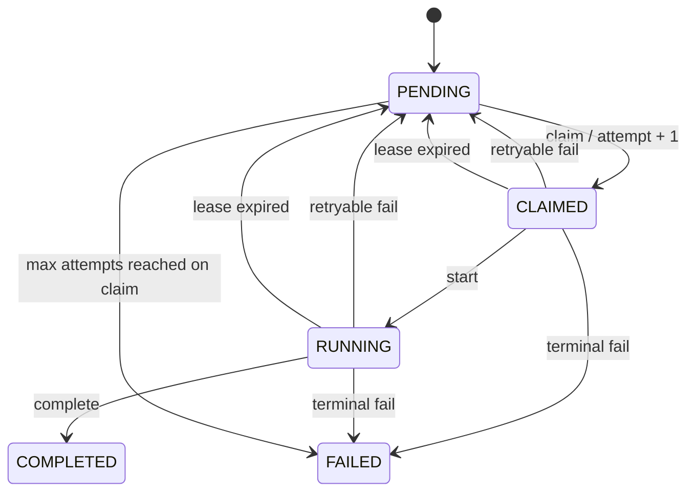

# TypeScript SDK API 명세

이 문서는 `packages/sdk` 버전 `0.0.1`의 공개 TypeScript API와 Backend SDK 실행 프로토콜을 정의한다.

## 패키지

```bash
pnpm --filter @aieval/sdk build
```

ESM 전용 패키지이며 진입점은 `@aieval/sdk`다. 런타임은 전역 `fetch`, `AbortController`를 제공해야 한다.

## 권장 API: EvaluationAdapter

```ts
import {
    createEvaluationAdapter,
    type TestCase,
    type ExecutionContext,
} from '@aieval/sdk';

const adapter = createEvaluationAdapter({
    baseUrl: 'http://localhost:3000/api/v1',
    sdkKey: process.env.AIEVAL_SDK_KEY!,
    pollIntervalMs: 1_000,
    async invoke(testCase: TestCase, context: ExecutionContext) {
        const response = await callCustomerAI(testCase.prompt, {
            signal: context.signal,
            variables: testCase.variables,
        });
        return {
            output: response.answer,
            metadata: { model: response.model, traceId: response.traceId },
        };
    },
    onError(error) {
        console.error(error);
    },
});

await adapter.start();
```

### EvaluationAdapterOptions

| 필드             | 타입                                              | 필수 | 설명                                                |
| ---------------- | ------------------------------------------------- | ---- | --------------------------------------------------- |
| `baseUrl`        | `string`                                          | O    | `/api/v1`까지 포함한 Backend URL. 뒤쪽 `/`는 제거됨 |
| `sdkKey`         | `string`                                          | O    | Application 생성 시 한 번 발급되는 Key              |
| `invoke`         | `(testCase, context) => Promise<ExecutionResult>` | O    | 고객 AI 호출 함수                                   |
| `pollIntervalMs` | `number`                                          | X    | 빈 queue 또는 오류 후 polling 간격, 기본 1,000ms    |
| `onError`        | `(error: unknown) => void`                        | X    | polling/protocol 오류 callback                      |

생성자는 `baseUrl` 또는 `sdkKey`가 비어 있으면 오류를 던진다.

### 메서드

| 메서드      | 반환               | 동작                                                                   |
| ----------- | ------------------ | ---------------------------------------------------------------------- |
| `start()`   | `Promise<void>`    | stop될 때까지 단일 직렬 polling loop 실행. 이미 실행 중이면 즉시 반환  |
| `stop()`    | `void`             | 새 polling 반복을 중지. 진행 중인 고객 AI 호출을 즉시 abort하지는 않음 |
| `runOnce()` | `Promise<boolean>` | Job 하나를 claim·처리하면 `true`, 대기 Job이 없으면 `false`            |

`EvaluationWorker`와 `createEvaluationWorker()`도 같은 동작을 제공한다. Worker options의 callback 이름은 `execute`이며, 새 연동에서는 `EvaluationAdapter`와 `invoke`가 권장된다.

## 공개 타입

```ts
interface TestCase {
    id?: string;
    scenarioId?: string;
    prompt: string;
    variables?: Record<string, unknown>;
    expected?: {
        output?: string;
        behavior?: string[];
        requiredConditions?: string[];
        failConditions?: string[];
        allowedVariations?: string[];
    };
    metadata?: {
        category?: string;
        riskLevel?: 'LOW' | 'MEDIUM' | 'HIGH';
        [key: string]: unknown;
    };
}

interface ExecutionContext {
    jobId: string;
    attempt: number;
    timeoutMs: number;
    signal: AbortSignal;
}

interface ExecutionResult {
    output: string;
    metadata?: {
        model?: string;
        modelVersion?: string;
        latencyMs?: number;
        tokenUsage?: { input?: number; output?: number };
        retrievedDocuments?: unknown[];
        toolCalls?: unknown[];
        traceId?: string;
        [key: string]: unknown;
    };
}

interface ExecutionError {
    code: string;
    message: string;
    retryable?: boolean;
    details?: Record<string, unknown>;
}
```

`invoke`는 공백이 아닌 `output`을 반환해야 한다. SDK가 실제 측정한 `latencyMs`를 metadata에 추가하며, 사용자가 같은 이름을 반환하면 사용자 값이 우선한다.

## 오류와 timeout

Job의 `timeoutMs`가 지나면 `context.signal`이 abort된다. `invoke`가 이 signal을 고객 HTTP 호출에 전달해야 실질적인 취소가 가능하다.

| 상황                         | 서버로 제출되는 오류                                     |
| ---------------------------- | -------------------------------------------------------- |
| AbortError                   | `TARGET_TIMEOUT`, retryable `true`                       |
| 일반 Error                   | `EXECUTION_ERROR`, retryable은 기본 `false`              |
| 잘못된 결과                  | `INVALID_RESPONSE`, retryable `false`                    |
| 사용자가 던진 ExecutionError | 해당 code/message/retryable/details 유지                 |
| 알 수 없는 값                | `EXECUTION_ERROR`, `Unknown application execution error` |

Job 처리 중 고객 AI 오류는 `/fail`로 제출한 후 `runOnce()`가 `true`를 반환한다. Claim/start/complete/fail 자체의 HTTP 오류는 `onError`로 전달되며 `AIEval protocol request failed ({status}): ...` 형태다.

## Backend 프로토콜

모든 경로의 기준 URL은 `{baseUrl}`이며, 요청에는 아래 헤더가 붙는다.

```http
Authorization: Bearer aieval_...
Content-Type: application/json
```

### 1. Claim

```http
POST /sdk/v1/jobs/claim
```

Job이 없으면 `204 No Content`, 있으면:

```json
{
    "job": {
        "id": "job-uuid",
        "attempt": 1,
        "timeoutMs": 30000,
        "leaseId": "lease-uuid",
        "leaseExpiresAt": "2026-08-06T01:00:00.000Z",
        "testCase": { "id": "case-1", "prompt": "질문" }
    }
}
```

가장 오래된 `PENDING` Job을 `CLAIMED`로 바꾸고 attempt를 1 증가시킨다. lease 시간은 `max(60초, timeoutMs + 30초)`다. 같은 Application의 만료된 lease는 다음 claim에서 회수된다.

### 2. Start

```http
POST /sdk/v1/jobs/{jobId}/start

{ "leaseId": "lease-uuid" }
```

`CLAIMED → RUNNING`이다. 이미 `RUNNING`이면 성공으로 취급한다.

### 3. Complete

```http
POST /sdk/v1/jobs/{jobId}/complete
Idempotency-Key: {jobId}-attempt-{attempt}

{
  "leaseId": "lease-uuid",
  "output": "고객 AI 답변",
  "metadata": { "model": "customer-model", "latencyMs": 120 }
}
```

공백이 아닌 `Idempotency-Key`와 문자열 `output`이 필수다. `RUNNING → COMPLETED`가 되며 자동 평가 case에 연결된 Job이면 case를 `WAITING_FOR_JUDGE`로 바꾸고 JudgeJob을 생성한다. 같은 key와 같은 Job의 재요청은 기존 완료 결과를 반환하고, 다른 Job에서 같은 key를 쓰면 `409`다.

### 4. Fail

```http
POST /sdk/v1/jobs/{jobId}/fail

{
  "leaseId": "lease-uuid",
  "error": {
    "code": "TARGET_TIMEOUT",
    "message": "고객 AI 응답 시간 초과",
    "retryable": true,
    "details": {}
  }
}
```

현재 상태가 `CLAIMED|RUNNING`이어야 한다. `retryable=true`이고 `attempt < maxAttempts`이면 `PENDING`, 아니면 `FAILED`가 된다.

## 상태 전이



프로토콜에는 현재 heartbeat, lease 연장, streaming, 병렬 처리, 취소, SDK key 회전 API가 없다. Adapter 인스턴스 하나는 Job을 직렬 처리한다.

## 운영 권고

- `sdkKey`는 로그·이미지·소스에 넣지 말고 Secret으로 주입한다.
- `baseUrl`에는 `/api/v1`을 포함한다.
- 고객 HTTP client에 반드시 `context.signal`을 전달한다.
- `invoke`는 Job 재시도를 고려해 외부 쓰기를 멱등하게 설계한다.
- `onError`에 구조화 로깅과 알림을 연결한다.
