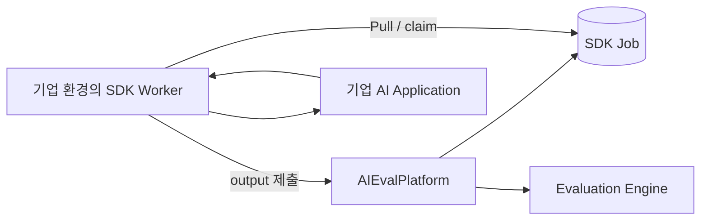
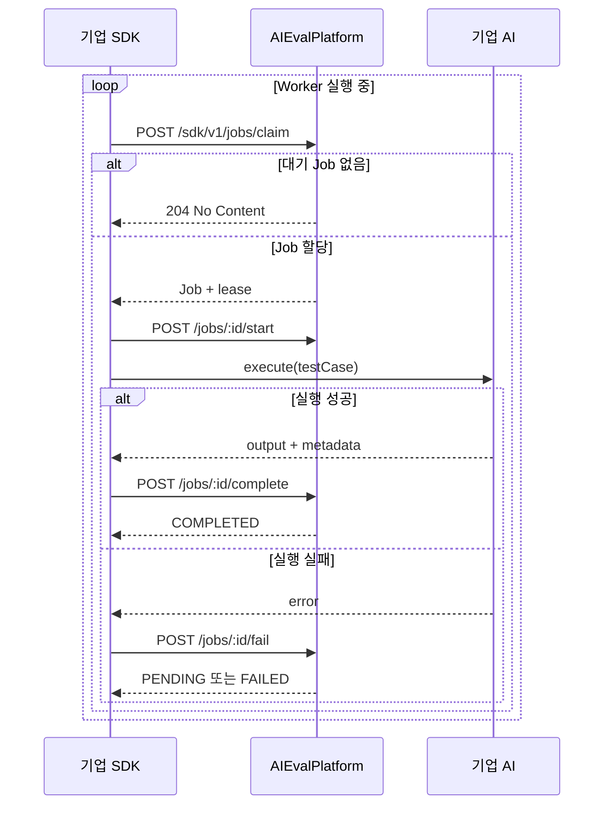
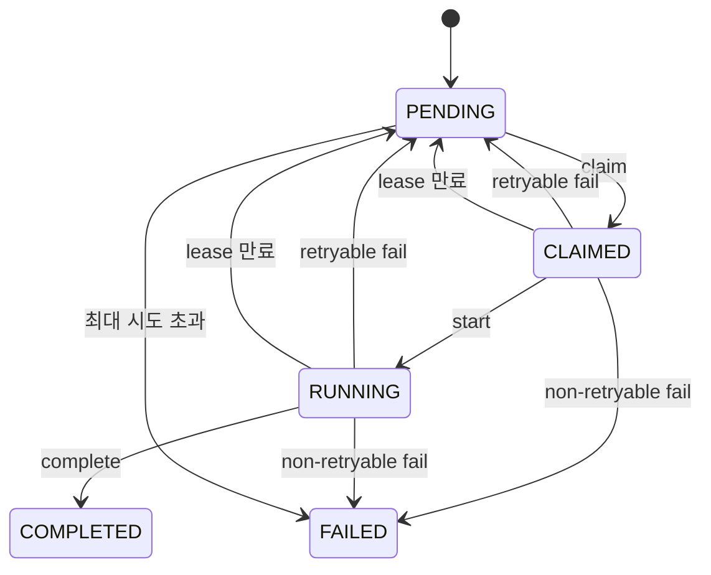

# SDK 실행 프로토콜

> Wiki 권장 경로: `SDK-Execution-Protocol`

## 프로토콜이란 무엇인가

SDK 실행 프로토콜은 AIEvalPlatform과 기업 환경의 SDK Worker가 테스트 작업을 안전하게 주고받기 위한 전체 통신 계약이다.

HTTP와 JSON 중 하나만을 의미하지 않는다.

- **HTTP**: 어느 주소에 어떤 메서드와 헤더로 요청할지 정하는 전송 방식
- **JSON**: 요청과 응답 본문에 어떤 데이터를 담을지 정하는 메시지 형식
- **실행 프로토콜**: HTTP, JSON, 인증, 상태, lease, timeout, 멱등성과 재시도 규칙을 합친 약속

```text
SDK 실행 프로토콜
├── HTTP endpoint와 method
├── Authorization 및 Idempotency-Key header
├── JSON request/response schema
├── Job 상태 전이
├── lease와 만료 규칙
├── timeout 및 재시도 규칙
└── 오류 코드와 처리 방법
```

## 설계 목적

기업의 AI 애플리케이션은 사내망, 자체 인증, RAG, 도구 호출과 세션 문맥을 사용할 수 있다. 평가 플랫폼이 기업별 내부 API를 직접 호출하게 만들면 방화벽 설정과 매번 다른 커스텀 연동이 필요하다.

SDK Worker는 기업 환경에서 실행되고 플랫폼으로 outbound 요청을 보낸다.



기업은 외부에서 접근 가능한 테스트 endpoint를 별도로 열지 않아도 된다.

## 현재 MVP 범위

구현된 범위:

- AI Application 등록과 SDK Key 1회 발급
- Test Job 생성
- Bearer SDK Key 인증
- Job timeout에 맞춘 lease
- 실행 시작
- 결과 완료 또는 구조화된 실패 제출
- 재시도 가능한 오류의 PENDING 복귀
- 최대 시도 횟수
- Idempotency-Key 기반 완료 중복 방지
- 만료된 lease의 작업 회수
- TypeScript 평가 어댑터 polling과 `invoke()` 호출

후속 범위:

- heartbeat와 lease 연장
- 실행 취소
- TestRun에서 Job 자동 생성
- 완료 output의 평가 엔진 자동 전달
- SDK Key 회전과 폐기
- 병렬 실행, streaming과 Python SDK

## 전체 실행 순서



## AI Application 등록

```http
POST /api/v1/projects/{projectId}/applications
Content-Type: application/json
```

```json
{
  "name": "운영 고객지원 챗봇",
  "environment": "production"
}
```

응답:

```json
{
  "application": {
    "id": "application-uuid",
    "projectId": "project-uuid",
    "name": "운영 고객지원 챗봇",
    "environment": "production",
    "active": true
  },
  "sdkKey": "aieval_..."
}
```

`sdkKey` 원문은 이 응답에서 한 번만 반환한다. DB에는 SHA-256 hash만 저장한다.

## Job 생성

현재 MVP에서는 관리 API로 Job을 직접 만든다.

```http
POST /api/v1/applications/{applicationId}/jobs
Content-Type: application/json
```

```json
{
  "testCase": {
    "id": "case-001",
    "scenarioId": "refund-expired",
    "prompt": "구매한 지 10일이 지났는데 미개봉이면 환불되나요?",
    "variables": {
      "customerId": "test-customer-001",
      "orderId": "expired-refund-fixture"
    },
    "expected": {
      "requiredConditions": [
        "기본 환불 기간을 설명한다"
      ],
      "failConditions": [
        "무조건 환불된다고 약속한다"
      ]
    }
  },
  "timeoutMs": 30000,
  "maxAttempts": 3
}
```

제약:

- timeoutMs: 1,000~300,000
- maxAttempts: 1~5
- 초기 상태: PENDING

향후 TestRun을 시작하면 승인된 TestCase마다 Job을 자동 생성하도록 연결한다.

## SDK 인증

모든 `/api/v1/sdk/v1/*` 요청은 Bearer SDK Key가 필요하다.

```http
Authorization: Bearer aieval_...
```

Key는 하나의 AIApplication과 연결된다. SDK는 자신의 애플리케이션에 할당된 Job만 claim하거나 변경할 수 있다.

```env
AIEVAL_BASE_URL=http://localhost:3000/api/v1
AIEVAL_SDK_KEY=aieval_...
```

## Claim

```http
POST /api/v1/sdk/v1/jobs/claim
Authorization: Bearer {sdkKey}
```

대기 작업이 없으면 `204 No Content`를 반환한다.

작업이 있으면:

```json
{
  "job": {
    "id": "job-uuid",
    "attempt": 1,
    "timeoutMs": 30000,
    "leaseId": "lease-uuid",
    "leaseExpiresAt": "2026-07-31T01:00:00.000Z",
    "testCase": {
      "prompt": "배송이 늦는데 언제 도착하나요?"
    }
  }
}
```

Claim은 가장 오래된 PENDING Job의 상태를 CLAIMED로 바꾸고 attempt를 증가시킨 뒤 lease를 발급한다. 여러 Worker가 동시에 claim해도 조건부 update에 성공한 Worker만 해당 Job을 처리한다.

## Lease

Lease는 일정 시간 동안 해당 Worker가 Job을 처리할 권리다. Start, Complete와 Fail 요청은 claim 응답의 `leaseId`를 보내야 한다.

다음 경우 요청을 거부한다.

- 다른 AIApplication의 Job
- leaseId 불일치
- lease 만료
- 허용되지 않은 현재 상태

Worker가 종료되어 lease가 만료되면 다음 claim 시 Job을 PENDING으로 되돌린다. attempt가 maxAttempts에 도달한 Job은 FAILED로 확정한다.

Lease 기간은 `max(60초, timeoutMs + 30초)`로 계산한다. 기업 AI timeout보다 lease가 먼저 만료되는 것을 막기 위한 여유 시간이다. 다만 네트워크 정지나 예상하지 못한 장기 작업을 안전하게 연장하려면 다음 버전에서 heartbeat가 필요하다.

## Start

```http
POST /api/v1/sdk/v1/jobs/{jobId}/start
Authorization: Bearer {sdkKey}
Content-Type: application/json
```

```json
{
  "leaseId": "lease-uuid"
}
```

상태는 `CLAIMED → RUNNING`으로 변경된다.

## Complete

```http
POST /api/v1/sdk/v1/jobs/{jobId}/complete
Authorization: Bearer {sdkKey}
Idempotency-Key: {jobId}-attempt-{attempt}
Content-Type: application/json
```

```json
{
  "leaseId": "lease-uuid",
  "output": "기본 배송 예정일을 확인한 뒤 안내드리겠습니다.",
  "metadata": {
    "model": "company-support-v3",
    "modelVersion": "2026-07-31",
    "latencyMs": 1250,
    "traceId": "trace-123",
    "tokenUsage": {
      "input": 210,
      "output": 52
    },
    "retrievedDocuments": [],
    "toolCalls": []
  }
}
```

상태는 `RUNNING → COMPLETED`로 변경된다.

`Idempotency-Key`는 네트워크 문제로 같은 완료 요청을 다시 보내도 결과를 중복 저장하지 않게 한다. 같은 key를 다른 Job에 사용하면 409를 반환한다.

## Fail

```http
POST /api/v1/sdk/v1/jobs/{jobId}/fail
Authorization: Bearer {sdkKey}
Content-Type: application/json
```

```json
{
  "leaseId": "lease-uuid",
  "error": {
    "code": "TARGET_TIMEOUT",
    "message": "기업 AI가 제한 시간 내 응답하지 않았습니다.",
    "retryable": true,
    "details": {
      "timeoutMs": 30000
    }
  }
}
```

재시도 가능한 오류이고 attempt가 maxAttempts보다 작으면 PENDING으로 돌아간다. 그 외에는 FAILED로 종료된다.

권장 오류 코드:

| 코드 | 의미 | 일반적인 retryable |
| --- | --- | --- |
| `TARGET_TIMEOUT` | 기업 AI 응답 시간 초과 | true |
| `TARGET_UNAVAILABLE` | 기업 AI 연결 실패 | true |
| `AUTHENTICATION_FAILED` | 기업 AI 인증 실패 | false |
| `INVALID_RESPONSE` | output 추출 또는 형식 실패 | false |
| `EXECUTION_ERROR` | 기업 코드 실행 오류 | 상황별 |
| `JOB_CANCELLED` | 사용자 취소 | false |

## 상태 모델



## TypeScript 평가 어댑터 사용

```ts
import { createEvaluationAdapter } from '@aieval/sdk';

const adapter = createEvaluationAdapter({
  baseUrl: process.env.AIEVAL_BASE_URL!,
  sdkKey: process.env.AIEVAL_SDK_KEY!,
  pollIntervalMs: 1000,

  async invoke(testCase, context) {
    const response = await customerSupportAgent.invoke(
      {
        message: testCase.prompt,
        customerId: testCase.variables?.customerId,
        orderId: testCase.variables?.orderId,
      },
      {
        signal: context.signal,
      },
    );

    return {
      output: response.answer,
      metadata: {
        model: response.model,
        traceId: response.traceId,
      },
    };
  },

  onError(error) {
    console.error('AIEval Worker error', error);
  },
});

await adapter.start();
```

어댑터는 내부적으로 `claim → start → invoke → complete/fail → polling`을 처리한다. 기업 개발자는 `invoke()`에서 자신의 AI 애플리케이션을 호출하고 output을 반환하면 된다.

기존 `createEvaluationWorker({ execute })` API도 하위 호환성을 위해 유지하지만, 새 연동에서는 별도 프로세스라는 역할이 명확한 `createEvaluationAdapter({ invoke })`를 사용한다.

한 번만 처리하려면:

```ts
const handled = await adapter.runOnce();
```

종료:

```ts
adapter.stop();
```

## timeout 주의사항

SDK는 `AbortSignal`을 실행 context로 전달한다.

```ts
async invoke(testCase, context) {
  return myAgent.invoke(testCase.prompt, {
    signal: context.signal,
  });
}
```

기업 AI 클라이언트가 signal을 사용하지 않으면 SDK가 해당 함수 실행 자체를 강제로 중단할 수 없다.

## 보안 원칙

- SDK Key를 소스 코드와 Git에 저장하지 않는다.
- DB에는 SDK Key 원문이 아닌 hash만 저장한다.
- 운영에서는 HTTPS만 사용한다.
- Application별 Key와 최소 권한을 사용한다.
- prompt, output과 trace에는 개인정보가 포함될 수 있으므로 마스킹 정책이 필요하다.
- 향후 Key 만료, 회전, 폐기와 감사 로그를 추가한다.

## 다음 구현 단계

1. TestScenario와 TestCase 데이터 모델 분리
2. TestSuite/TestRun 생성 시 SdkJob 자동 생성
3. Job 완료 output을 Agent Engine 평가로 자동 전달
4. heartbeat와 lease 연장
5. 실행 취소와 동시 실행 수 제한
6. SDK Key 회전과 폐기
7. Python SDK와 CI one-shot runner
