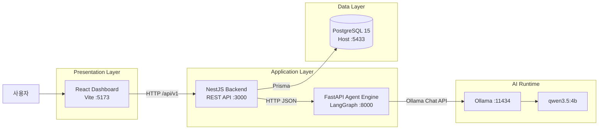
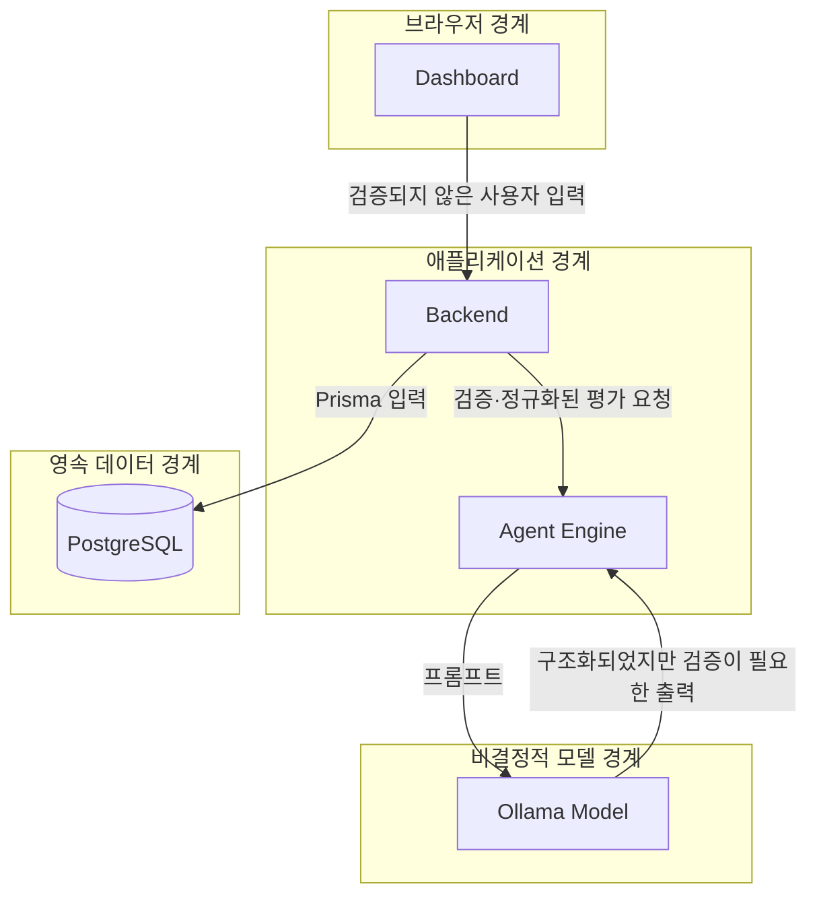

# 전체 시스템 구조

> Wiki 경로: `System-Architecture`

## 시스템 목표

AIEvalPlatform은 AI 답변을 한 번 채점하는 도구가 아니라, 프로젝트별 평가 정책과 테스트 시나리오를 관리하고 반복 실행한 결과를 추적하는 로컬 평가 플랫폼이다.

시스템은 다음 책임을 분리한다.

- 사용자는 Dashboard에서 프로젝트, 정책과 시나리오를 관리한다.
- Backend는 입력 검증, 상태 관리와 데이터 영속화를 담당한다.
- Agent Engine은 시나리오 생성과 다단계 LLM 평가를 담당한다.
- PostgreSQL은 테스트 자산과 실행 결과를 보존한다.
- Ollama는 로컬 모델 추론을 제공한다.

## 논리 아키텍처

## 컴포넌트 책임

### Dashboard

위치: `apps/dashboard`

- 평가 실행 현황과 요약 통계를 표시한다.
- 프로젝트 및 평가 정책 생성 화면을 제공한다.
- 시나리오 생성, 수정, 승인과 거절 흐름을 제공한다.
- 평가 결과의 검증, 지표별 점수와 감독 판정을 표시한다.
- 모델 호출이나 최종 점수 계산은 수행하지 않는다.

### Backend

위치: `apps/backend`

- 모든 외부 관리 API에 `/api/v1` prefix를 적용한다.
- Prisma를 통해 PostgreSQL에 접근한다.
- 프로젝트 존재 여부, 정책 가중치 합과 입력 범위를 검증한다.
- 승인된 시나리오만 평가 실행 데이터로 변환한다.
- 실행을 `RUNNING`, `COMPLETED`, `FAILED` 상태로 관리한다.
- Agent Engine의 응답을 EvalResult로 저장한다.

### Agent Engine

위치: `apps/agent-engine`

- FastAPI로 동기·비동기 평가 엔드포인트를 제공한다.
- LangGraph로 Verifier → Evaluator → Supervisor 흐름을 제어한다.
- 출력이 없으면 Executor를 이용해 테스트 답변을 만든다.
- 프로젝트 문맥과 정책을 이용해 테스트 시나리오를 생성한다.
- Pydantic 스키마를 Ollama structured output 형식으로 전달한다.

### PostgreSQL

- Project, EvaluationPolicy와 Scenario를 테스트 설계 자산으로 저장한다.
- EvalRun과 EvalResult를 실행 이력으로 저장한다.
- 검증·평가·감독 상세 데이터를 JSONB로 보존한다.
- 정책 변경 이후에도 과거 실행을 설명할 수 있도록 policySnapshot을 저장한다.

### Ollama

- 기본 모델 `qwen3.5:4b`를 로컬에서 제공한다.
- API 키 없이 로컬 재현이 가능하다.
- 생성과 판단 역할에 따라 서로 다른 시스템 프롬프트와 온도를 적용한다.

## 배포 단위와 포트

| 단위 | 기본 주소 | 시작 명령 |
| --- | --- | --- |
| Dashboard | `http://localhost:5173` | `pnpm dev:dashboard` |
| Backend | `http://localhost:3000/api/v1` | `pnpm dev:backend` |
| Agent Engine | `http://localhost:8000` | `uvicorn app.main:app --reload --port 8000` |
| PostgreSQL | `localhost:5433` | `docker compose up -d postgres` |
| Ollama | `http://localhost:11434` | `ollama serve` |

## 신뢰 경계

모델 출력은 JSON Schema를 요청했더라도 신뢰된 데이터로 간주하지 않는다. Pydantic 파싱, 타입 확인, 점수 범위와 코드 기반 정책 규칙을 추가로 적용한다.

## 주요 아키텍처 원칙

1. UI와 모델 런타임을 직접 연결하지 않는다.
2. LLM의 정성 판단과 코드의 정량 불변 조건을 분리한다.
3. 자동 생성한 테스트는 사람 승인 전까지 실행 자산으로 사용하지 않는다.
4. 실행 결과뿐 아니라 판단 근거를 함께 저장한다.
5. 모델 호출 실패를 데이터 상태로 남기고 HTTP 오류로 전파한다.

## 현재 제약과 확장 방향

- 평가 실행이 동기식이므로 대규모 dataset에서는 Queue와 Worker가 필요하다.
- 인증과 프로젝트별 권한이 아직 없다.
- Agent Engine과 Backend의 계약이 코드로 중복되어 OpenAPI 기반 타입 생성 여지가 있다.
- 역할별 모델 버전과 프롬프트 버전이 완전한 스냅샷으로 저장되지 않는다.
- 운영 배포에서는 CORS allowlist, secret 관리, rate limit와 관측성 도구가 필요하다.

더 자세한 선택 배경은 [아키텍처와 기술 선택](./architecture.md)을 참고한다.
