# 사용자 관점 전체 실행 흐름

이 문서는 사용자가 Dashboard에 들어온 순간부터 화면, Backend, PostgreSQL, SDK, 고객 AI, Agent Engine, Ollama 사이에서 어떤 메서드가 호출되고 어떤 데이터가 이동하는지 실제 코드 기준으로 설명한다.

## 1. 먼저 알아야 할 전체 구조

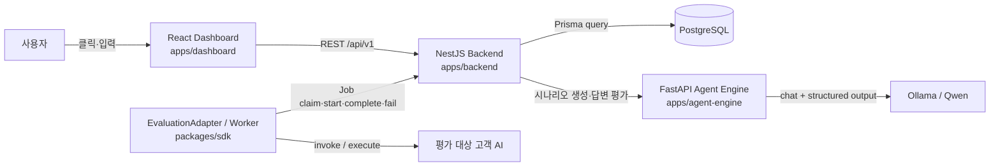

각 컴포넌트의 책임은 다음과 같다.

| 컴포넌트 | 주요 진입점 | 책임 |
| --- | --- | --- |
| Dashboard | `main.tsx → App()` | 사용자 입력, 화면 상태, Backend API 호출, 결과 표시 |
| Backend Controller | `ProjectController`, `EvalController`, `SdkProtocolController` | HTTP 경로와 Service 메서드 연결 |
| Backend Service | `ProjectService`, `EvalService`, `SdkProtocolService` | 입력 검증과 유스케이스 조정; DB에 직접 접근하지 않음 |
| Backend Repository | `ProjectRepository`, `EvalRepository`, `SdkProtocolRepository`, `JudgeWorkerRepository` | Prisma 조회·저장과 트랜잭션 캡슐화 |
| Judge Worker | `JudgeWorkerService` | 평가할 답변을 비동기로 Agent Engine에 전달하고 결과 저장 |
| SDK | `EvaluationAdapter`, `EvaluationWorker` | Backend Job을 가져와 고객 AI를 호출하고 답변 제출 |
| Agent Engine | `main.py`, `EvaluationWorkflow` | Verifier → Evaluator → Supervisor 평가 실행 |
| Ollama | `AsyncClient.chat()` | 시나리오 생성과 의미 기반 AI 평가 수행 |
| PostgreSQL | Prisma models | 프로젝트, 정책, 시나리오, 실행, Job, 결과 보존 |

이 문서의 일부 그림에서 Service와 DB 사이 화살표는 읽기 편하도록 축약한 것이다. 실제 코드는 항상 `Service → Repository → PrismaService → PostgreSQL` 순서로 접근한다.

## 2. 사용자가 처음 Dashboard에 들어왔을 때

### 호출 순서

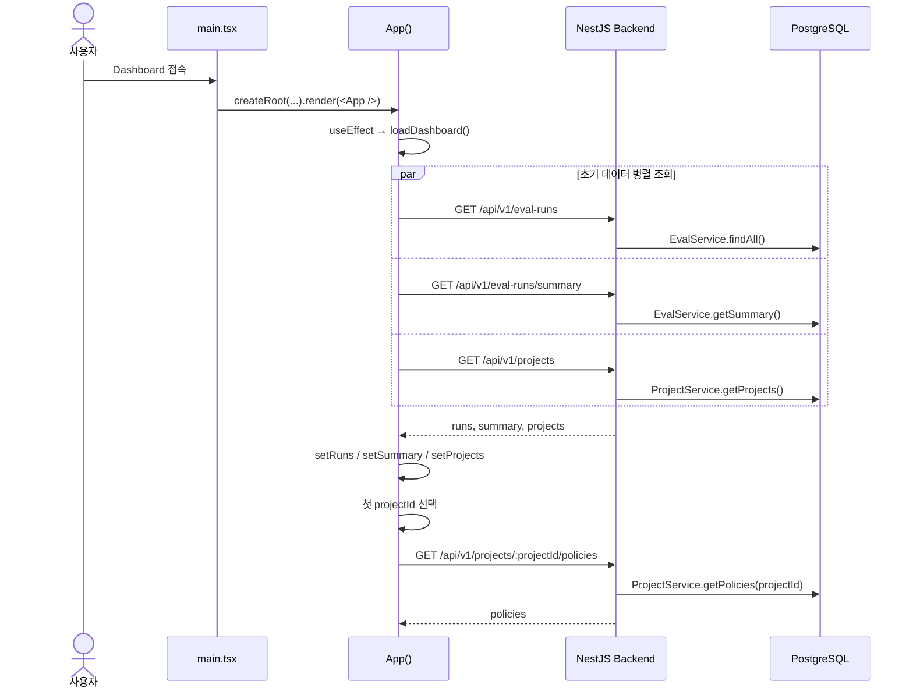

### 실제 메서드와 데이터

1. `main.tsx`가 DOM의 `#root`에 `<App />`을 렌더링한다.
2. `App()`의 첫 번째 `useEffect`가 `loadDashboard()`를 호출한다.
3. `loadDashboard()`는 세 요청을 `Promise.all()`로 동시에 보낸다.

| Frontend 요청 | Controller 메서드 | Service 메서드 | DB에서 읽는 데이터 | Frontend 저장 위치 |
| --- | --- | --- | --- | --- |
| `GET /eval-runs` | `EvalController.findAll()` | `EvalService.findAll()` | `EvalRun`, `EvalRunCase`, `EvalResult` | `runs` |
| `GET /eval-runs/summary` | `EvalController.getSummary()` | `EvalService.getSummary()` | 실행·결과 개수와 평균 점수 | `summary` |
| `GET /projects` | `ProjectController.getProjects()` | `ProjectService.getProjects()` | `Project`와 정책·시나리오·실행 개수 | `projects` |
| `GET /projects/:id/policies` | `ProjectController.getPolicies()` | `ProjectService.getPolicies()` | 선택 프로젝트의 `EvaluationPolicy` | `policies` |

`runs` 중 `QUEUED` 또는 `RUNNING`인 자동 평가가 있으면 `App()`은 2초마다 `loadDashboard()`를 다시 호출한다. 따라서 화면의 진행률은 WebSocket이 아니라 주기적인 HTTP 조회로 갱신된다.

## 3. 프로젝트를 만들 때

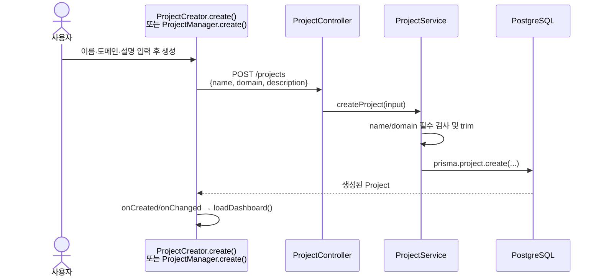

전달되는 대표 데이터는 다음과 같다.

```json
{
  "name": "고객상담 AI",
  "domain": "e-commerce customer support",
  "description": "배송, 교환, 환불 문의에 답변하는 고객상담 챗봇"
}
```

- Frontend: `ProjectCreator.create()` 또는 `ProjectManager.create(event)`
- Controller: `ProjectController.createProject(input)`
- Service: `ProjectService.createProject(input)`
- 저장 테이블: `Project`
- 반환: 생성된 프로젝트 전체 레코드

프로젝트 삭제는 `ProjectManager.remove(project)` → `DELETE /projects/:projectId` → `ProjectController.deleteProject()` → `ProjectService.deleteProject()` 순서다. Service는 `QUEUED`, `RUNNING` 평가가 있으면 삭제를 거부한다.

## 4. 평가 정책과 Agent 프롬프트를 설정할 때

사용자가 정책 화면으로 이동하면 `PolicyWorkspace.load()`가 실행된다.

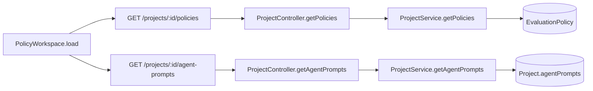

### 정책 저장

`PolicyWorkspace.save()`가 다음 데이터를 전송한다.

```json
{
  "name": "고객상담 품질 정책",
  "passThreshold": 0.8,
  "maxRetries": 1,
  "metrics": [
    {
      "key": "accuracy",
      "name": "정책 정확성",
      "description": "도메인 정책과 사실이 일치하는지 평가",
      "weight": 0.5,
      "required": true
    }
  ]
}
```

호출은 `POST /projects/:projectId/policies` → `ProjectController.createPolicy()` → `ProjectService.createPolicy()` 순서다. `validatePolicy()`는 이름과 지표 존재 여부, 모든 `weight` 합이 약 1인지 검사한 뒤 `EvaluationPolicy`에 저장한다.

### Agent 프롬프트 저장

`PolicyWorkspace.saveAgentPrompts()`는 아래 데이터를 `PATCH /projects/:projectId/agent-prompts`로 보낸다.

```json
{
  "verifier": "답변 유효성과 안전성을 검사하는 지시문",
  "evaluator": "지표별 품질을 채점하는 지시문",
  "supervisor": "최종 판정을 감사하는 지시문"
}
```

Backend 흐름은 `ProjectController.updateAgentPrompts()` → `ProjectService.updateAgentPrompts()` → `validateAgentPrompts()` → `Project.agentPrompts` 저장이다. 이 값은 이후 평가 실행 생성 시 `EvalRun.judgeConfig.agentPrompts`로 스냅샷되고 Agent Engine의 각 에이전트에 전달된다.

## 5. AI 시나리오를 생성할 때

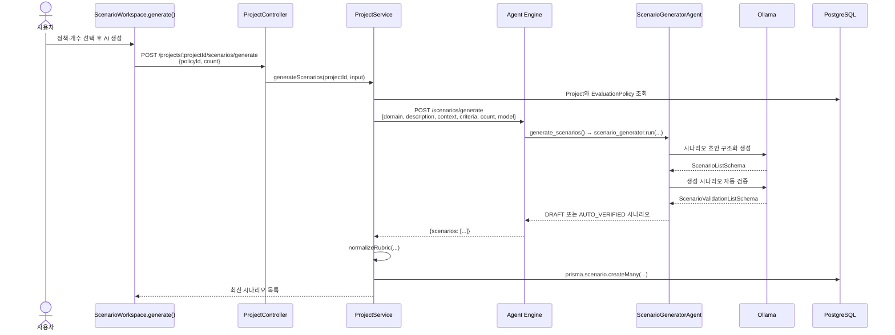

Agent Engine의 `ScenarioGeneratorAgent.run()`은 Ollama를 두 번 호출한다.

1. 첫 호출은 질문, 기대 답변, 위험도, 지표별 루브릭을 생성한다.
2. 두 번째 호출은 생성 결과의 도메인 관련성, 명확성, 현실성, 평가 가능성을 검사한다.
3. 자동 검증 점수가 0.7 이상이고 `valid=true`이면 `AUTO_VERIFIED`, 아니면 `DRAFT`가 된다.
4. 자동 검증을 통과해도 실제 평가에 바로 사용되지는 않는다.

사람이 승인 버튼을 누르면 `ScenarioWorkspace.review()` → `PATCH /scenarios/:scenarioId/review` → `ProjectController.reviewScenario()` → `ProjectService.reviewScenario()`이 호출되어 상태가 `APPROVED`로 변경된다. 평가 실행에서는 승인된 시나리오만 허용한다.

시나리오 내용을 수정하는 `ScenarioRubricModal.save()`는 `PATCH /scenarios/:scenarioId`를 호출한다. `ProjectService.updateScenario()`은 수정 후 상태를 다시 `DRAFT`로 바꿔 재승인을 요구한다.

## 6. 평가 실행은 두 경로로 나뉜다

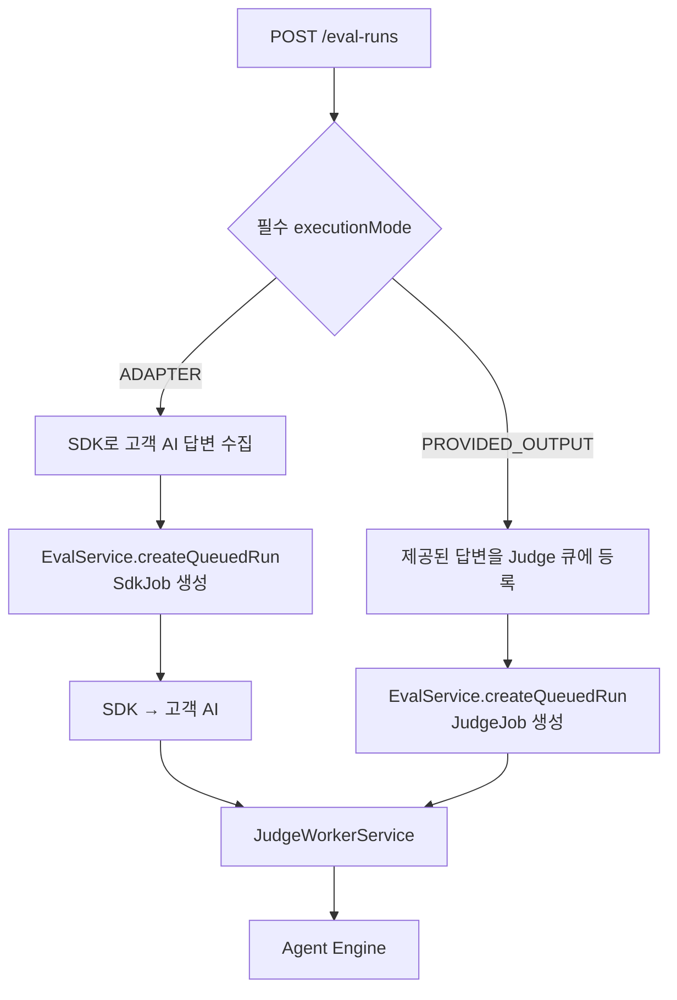

중요한 차이는 다음과 같다.

| 경로 | `executionMode` | 답변 출처 | Agent Engine 호출 주체 | 응답 시점 |
| --- | --- | --- | --- | --- |
| 기본 Dashboard 평가 | `PROVIDED_OUTPUT` | 사용자가 입력한 `output` | `JudgeWorkerService` | Run과 JudgeJob 생성 직후 |
| SDK Adapter 평가 | `ADAPTER` | 외부 프로세스의 고객 AI | 답변 수집 후 `JudgeWorkerService` | Run과 Job 생성 직후 |
| 제공 답변 자동 평가 | `PROVIDED_OUTPUT` | 요청 dataset의 `output` | `JudgeWorkerService` | Run과 JudgeJob 생성 직후 |

## 7. 기본 Dashboard 제공 답변 평가 흐름

평가 실행 화면에서 사용자가 실행 버튼을 누르면 `App.submitRun(event)`이 호출된다. 모든 데이터셋 항목에 실제 답변이 있는지 확인한 뒤 `executionMode: PROVIDED_OUTPUT`으로 비동기 평가를 생성한다.

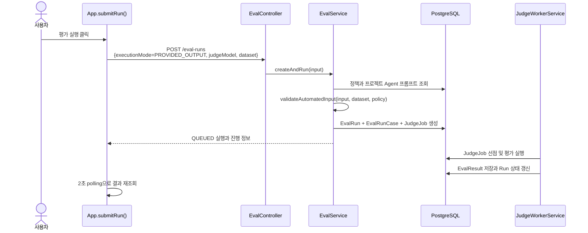

Frontend가 보내는 데이터 형태는 다음과 같다.

```json
{
  "name": "기본 품질 점검",
  "executionMode": "PROVIDED_OUTPUT",
  "projectId": "project-uuid",
  "policyId": "policy-uuid",
  "agentName": "customer-support-agent",
  "judgeModel": "qwen3.5:4b",
  "dataset": [
    {
      "prompt": "배송은 언제 도착하나요?",
      "output": "내일 도착합니다.",
      "expectedOutput": "주문 조회 후 예상 배송일을 안내합니다."
    }
  ]
}
```

Backend는 요청 즉시 케이스와 Judge Job을 만든다. 이후 Judge Worker가 Agent Engine용 `EvalRequest`로 바꾼다.

```json
{
  "runId": "생성된 EvalRun.id",
  "agentName": "customer-support-agent",
  "judgeModel": "qwen3.5:4b",
  "maxRetries": 1,
  "passThreshold": 0.8,
  "agentPrompts": {
    "verifier": "...",
    "evaluator": "...",
    "supervisor": "..."
  },
  "criteria": ["정책 metrics 전체"],
  "dataset": ["Frontend dataset"]
}
```

## 8. SDK Adapter 비동기 평가 흐름

이 경로는 실제 고객 AI를 호출해서 새 답변을 받은 뒤 평가한다.

### 8.1 애플리케이션 등록과 SDK Key 발급

`AdapterWorkspace.createApplication(event)`이 `POST /projects/:projectId/applications`를 호출한다.

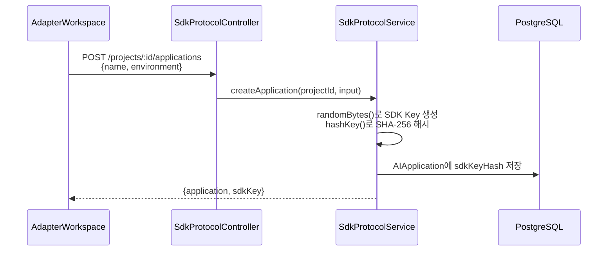

원본 `sdkKey`는 생성 응답에서만 Dashboard에 전달되고 DB에는 해시만 저장된다.

### 8.2 Adapter 평가 Run 생성

`AdapterWorkspace.createEvaluation(event)` 또는 `ScenarioWorkspace.runApprovedScenarios()`가 다음 요청을 보낸다.

```json
{
  "name": "어댑터 전체 품질 평가",
  "projectId": "project-uuid",
  "applicationId": "application-uuid",
  "executionMode": "ADAPTER",
  "judgeModel": "qwen3.5:4b",
  "timeoutMs": 30000,
  "maxAttempts": 3,
  "dataset": [
    {
      "id": "dashboard-adapter-...",
      "prompt": "주문을 취소할 수 있나요?",
      "variables": {},
      "expectedOutput": "주문 상태 확인 후 취소 가능 여부를 안내합니다.",
      "criteria": ["화면에서 작성한 평가 지표"]
    }
  ]
}
```

승인 시나리오 실행에서는 `dataset` 대신 `scenarioIds`를 보낸다. `EvalService.createAndRun()`은 DB에서 `APPROVED` 시나리오를 조회해 `prompt`, `expectedOutput`, 정책 지표와 시나리오 루브릭이 결합된 dataset으로 변환한다.

`EvalService.createQueuedRun()`은 하나의 트랜잭션 안에서 다음 레코드를 만든다.

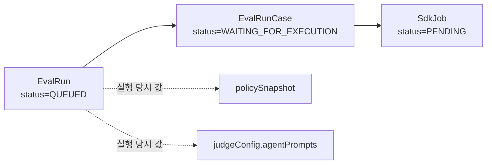

### 8.3 외부 SDK가 답변을 수집하는 과정

고객 측 코드는 보통 다음처럼 `EvaluationAdapter`를 실행한다.

```ts
const adapter = createEvaluationAdapter({
  baseUrl: 'http://localhost:3000/api/v1',
  sdkKey: '발급받은-key',
  async invoke(testCase, context) {
    const output = await customerAi.ask(testCase.prompt, testCase.variables);
    return { output, metadata: { model: 'customer-model' } };
  },
});

await adapter.start();
```

실제 호출 흐름은 다음과 같다.

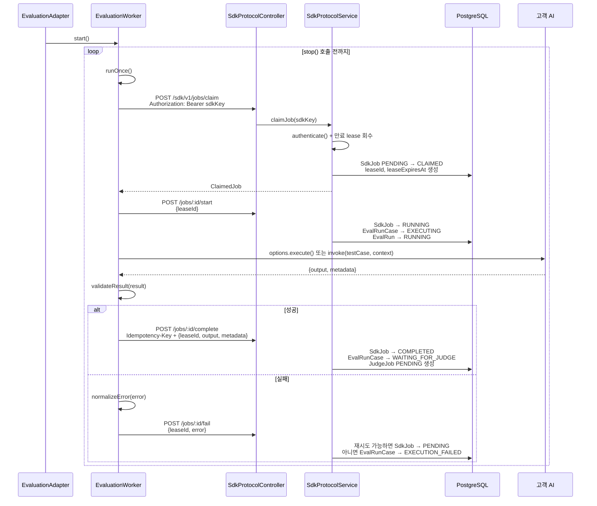

`ExecutionContext.signal`은 `job.timeoutMs`가 지나면 `AbortController`가 중단 신호를 보내도록 구성된다. 고객의 `invoke()` 구현이 이 signal을 실제 네트워크 호출에 연결해야 취소가 제대로 전파된다.

## 9. PROVIDED_OUTPUT 비동기 평가 흐름

이 경로는 답변이 이미 로그나 파일에 있을 때 사용한다. 현재 Dashboard의 기본 평가 폼이 아니라 Backend API를 직접 호출할 때 명시적으로 선택한다.

```json
{
  "name": "운영 로그 평가",
  "projectId": "project-uuid",
  "executionMode": "PROVIDED_OUTPUT",
  "dataset": [
    {
      "prompt": "환불할 수 있나요?",
      "output": "상품 수령 후 7일 이내 가능합니다.",
      "expectedOutput": "정책 확인 후 환불 가능 기간을 안내합니다.",
      "criteria": []
    }
  ]
}
```

`EvalService.createQueuedRun()`은 `EvalRunCase.status=WAITING_FOR_JUDGE`로 만들고 `outputAnswer`를 즉시 저장한다. 고객 AI 실행이 필요 없으므로 `SdkJob`은 만들지 않고 `JudgeJob(status=PENDING)`을 바로 생성한다.

## 10. Judge Worker와 AI 평가의 상세 흐름

ADAPTER가 답변을 제출했거나 PROVIDED_OUTPUT Run이 생성되면 두 방식 모두 여기서 합쳐진다.

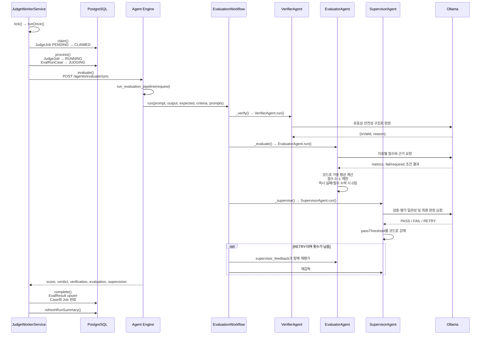

### 각 AI 에이전트가 받는 데이터

| 단계 | 메서드 | 주요 입력 | 주요 출력 | 비고 |
| --- | --- | --- | --- | --- |
| 선택적 답변 생성 | `TaskExecutorAgent.run()` | `prompt`, `targetModel`, `metadata` | 문자열 답변 | Agent Engine API를 직접 호출하면서 `output`을 생략한 경우만 사용 |
| 1차 검증 | `VerifierAgent.run()` | `prompt`, `output`, verifier system prompt | `{isValid, reason}` | 빈 값·5자 미만은 Ollama 호출 전에 코드로 실패 |
| 지표 평가 | `EvaluatorAgent.run()` | 질문, 실제 답변, 기대 답변, criteria, supervisor feedback | `{score, passed, metrics}` | 가중 평균과 강제 실패 조건은 코드가 적용 |
| 최종 감독 | `SupervisorAgent.run()` | 원본 데이터, verification, evaluation, threshold, retry 상태 | `{verdict, confidence, reason, issues, recommendedAction}` | 점수가 threshold보다 낮은 PASS는 코드가 FAIL로 변경 |
| 그래프 실행 | `EvaluationWorkflow.run()` | 위 모든 평가 문맥 | 최종 `EvaluationState` | `verify → evaluate → supervise → retry/end` |

### RETRY의 의미

`RETRY`는 고객 AI에게 답변을 다시 생성시키는 것이 아니다. 같은 원본 답변을 `SupervisorAgent`의 피드백과 함께 `EvaluatorAgent`가 다시 채점하는 과정이다.

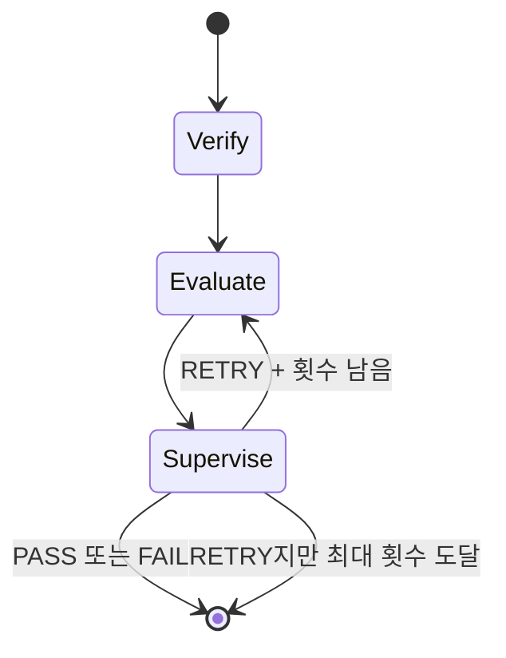

## 11. 평가 결과가 저장되는 위치

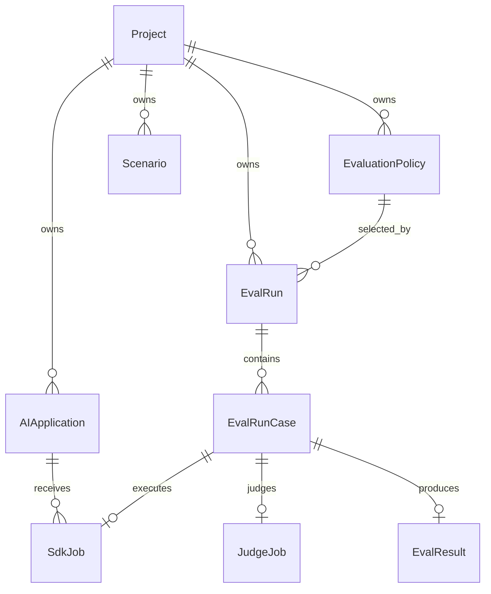

| 모델 | 저장 내용 |
| --- | --- |
| `Project` | 평가 대상 서비스, 도메인, 문맥, Agent 프롬프트 |
| `EvaluationPolicy` | 통과선, 재평가 횟수, 지표와 가중치 |
| `Scenario` | 질문, 기대 답변, 루브릭, 자동 검증과 사람 승인 상태 |
| `EvalRun` | 전체 평가 실행 상태, 정책 스냅샷, Judge 설정, 집계 값 |
| `EvalRunCase` | 케이스별 입력, 기대값, 실제 답변, 실행 및 Judge 상태 |
| `AIApplication` | SDK 연결 정보와 SDK Key 해시 |
| `SdkJob` | 고객 AI 실행 작업, lease, 출력 또는 오류 |
| `JudgeJob` | Agent Engine 평가 작업, 시도 횟수, lease, 오류 |
| `EvalResult` | 점수, 판정, 검증·평가·감독 근거, 처리 시간 |

정책과 프롬프트는 Run 생성 시 `policySnapshot`, `judgeConfig`에 복사한다. 나중에 프로젝트 정책이 바뀌어도 과거 실행이 어떤 기준으로 평가되었는지 설명하기 위해서다.

## 12. 평가 상태가 어떻게 바뀌는가

### EvalRunCase 상태

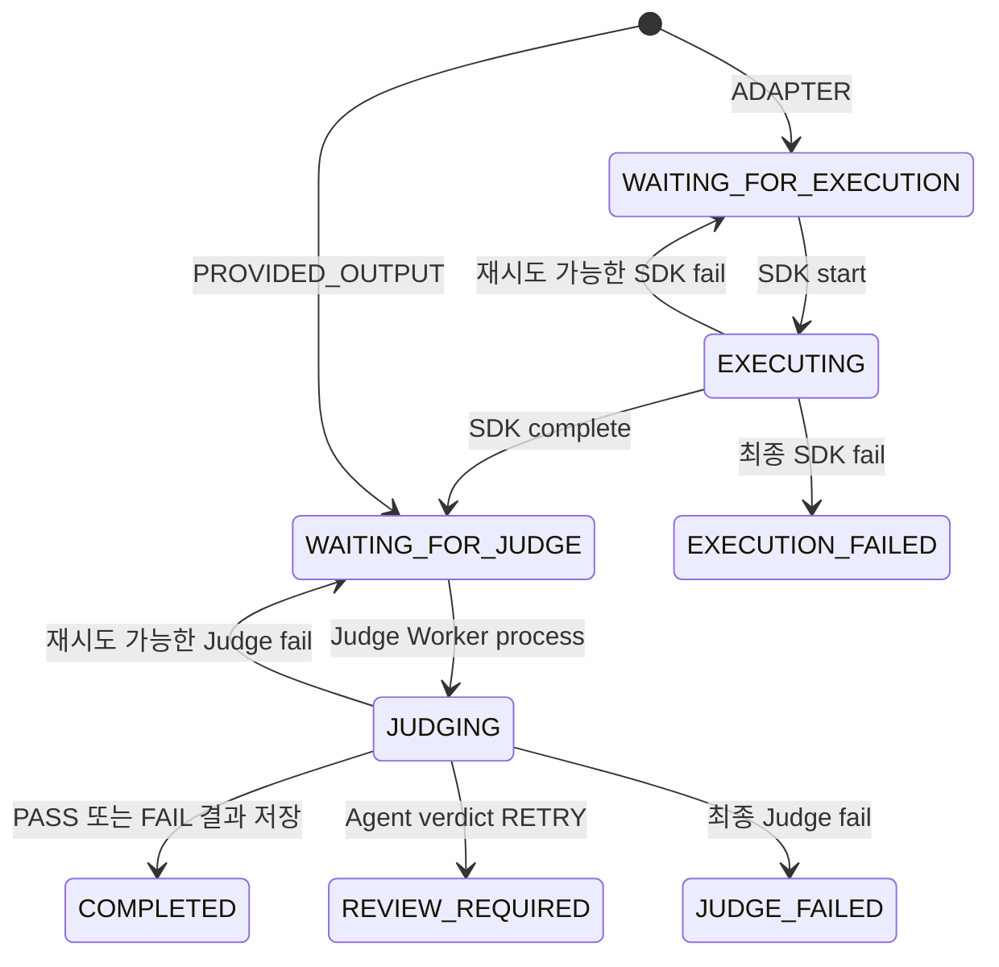

### EvalRun 최종 상태

- 케이스가 처리되기 시작하면 `RUNNING`이다.
- 모든 케이스가 정상 종결되면 `COMPLETED`이다.
- 일부 케이스가 실패했지만 성공 결과도 있으면 `COMPLETED_WITH_ERRORS`다.
- 모든 케이스가 실행 또는 Judge 실패하면 `FAILED`다.
- `JudgeWorkerService.refreshRunSummary()`와 `SdkProtocolService.refreshExecutionFailureSummary()`가 케이스 상태를 집계해 Run 상태를 갱신한다.

## 13. 결과가 다시 화면에 보이는 과정

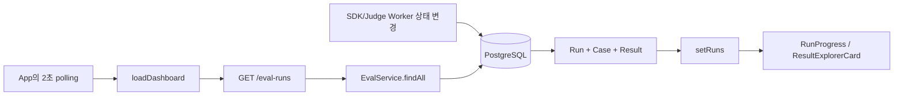

`EvalService.findAll()`과 `findOne()`은 `buildProgress()`로 케이스 상태를 다음 화면용 숫자로 바꾼다.

- `waitingForExecution`
- `executing`
- `waitingForJudge`
- `judging`
- `completed`
- `reviewRequired`
- `failed`
- `cancelled`

`ResultExplorerCard`는 저장된 `verification`, `evaluation`, `supervision`을 단계별 카드로 표시한다. 따라서 화면의 점수만 보는 것이 아니라 어떤 지표 때문에 실패했고 Supervisor가 어떤 근거로 최종 판정했는지 확인할 수 있다.

## 14. 화면 동작별 메서드 빠른 찾기

| 사용자 동작 | Frontend 메서드 | Backend Controller | Backend Service | 외부 호출/저장 |
| --- | --- | --- | --- | --- |
| Dashboard 접속 | `App.loadDashboard()` | `findAll`, `getSummary`, `getProjects` | `EvalService`, `ProjectService` 조회 메서드 | PostgreSQL 조회 |
| 프로젝트 생성 | `ProjectCreator.create()` / `ProjectManager.create()` | `createProject()` | `ProjectService.createProject()` | `Project` 저장 |
| 정책 저장 | `PolicyWorkspace.save()` | `createPolicy()` | `ProjectService.createPolicy()` | `EvaluationPolicy` 저장 |
| Agent 프롬프트 저장 | `saveAgentPrompts()` | `updateAgentPrompts()` | 같은 이름의 Service 메서드 | `Project.agentPrompts` 저장 |
| AI 시나리오 생성 | `ScenarioWorkspace.generate()` | `generateScenarios()` | 같은 이름의 Service 메서드 | Agent Engine → Ollama → `Scenario` 저장 |
| 시나리오 승인 | `ScenarioWorkspace.review()` | `reviewScenario()` | 같은 이름의 Service 메서드 | `Scenario.status=APPROVED` |
| 기본 평가 실행 | `App.submitRun()` | `EvalController.create()` | `EvalService.createAndRun()` | Agent Engine 동기 호출 → `EvalResult` 저장 |
| Adapter 등록 | `createApplication()` | `SdkProtocolController.createApplication()` | 같은 이름의 Service 메서드 | `AIApplication` 저장, SDK Key 반환 |
| Adapter 평가 생성 | `createEvaluation()` / `runApprovedScenarios()` | `EvalController.create()` | `createAndRun()` → `createQueuedRun()` | `EvalRunCase`, `SdkJob` 생성 |
| SDK 작업 실행 | `EvaluationWorker.runOnce()` | `claimJob`, `startJob`, `completeJob` | `SdkProtocolService`의 같은 메서드 | 고객 AI 호출, 답변 저장, `JudgeJob` 생성 |
| Judge 평가 | 자동 실행 | 해당 없음 | `JudgeWorkerService.tick()` → `process()` → `evaluate()` | Agent Engine 호출, `EvalResult` 저장 |
| 결과 새로고침 | `loadDashboard()` | `EvalController.findAll()` | `EvalService.findAll()` | DB 결과 조회 |

## 15. 한 문장으로 다시 정리

사용자는 Dashboard에서 평가 기준과 질문을 만들고, Backend는 이를 DB의 실행 및 Job으로 바꾸며, SDK는 필요할 때 고객 AI의 실제 답변을 수집하고, Judge Worker는 준비된 답변을 Agent Engine의 `Verifier → Evaluator → Supervisor`에 전달한 뒤 모든 점수와 근거를 DB에 저장하며, Dashboard는 그 상태를 2초마다 다시 읽어 화면에 보여준다.
