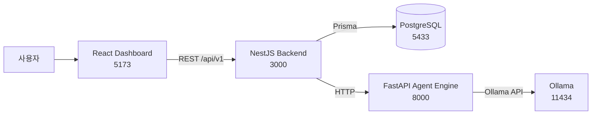
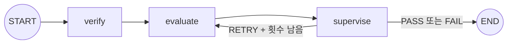

# 아키텍처와 기술 선택

## 1. 출발점: 무엇을 평가해야 하는가

이 프로젝트의 핵심 질문은 단순히 “LLM의 답변이 좋은가?”가 아니다. 실제 운영에서는 다음 질문에 함께 답해야 한다.

- 어느 프로젝트와 업무 도메인에서 나온 답변인가?
- 조직이 정한 평가 지표와 가중치는 무엇인가?
- 정답 문구가 조금 달라도 의미가 같으면 허용할 것인가?
- 반드시 포함해야 하는 조건이나 즉시 실패 조건이 있는가?
- 모델의 점수와 최종 통과 판정이 충돌하면 누가 결정하는가?
- 자동 생성한 테스트 자체가 잘못되었으면 어떻게 막는가?
- 평가 당시 정책이 나중에 변경되어도 과거 결과를 설명할 수 있는가?

따라서 필요한 것은 단일 프롬프트 호출기가 아니라, 테스트 자산 관리와 평가 오케스트레이션, 결과 추적을 함께 제공하는 시스템이었다.

## 2. 검토한 시스템 배치

### 선택지 A: React가 Ollama를 직접 호출하는 단일 화면

가장 빠른 데모 방식이다. 사용자가 입력한 프롬프트를 브라우저에서 Ollama로 보내고 결과를 화면에 표시할 수 있다.

장점:

- 구현 파일과 실행 프로세스가 적다.
- 처음 데모를 만드는 속도가 빠르다.

탈락 이유:

- 브라우저가 평가 프롬프트와 모델 호출 규칙을 모두 알아야 한다.
- 평가 정책과 결과를 신뢰성 있게 저장하기 어렵다.
- CORS와 로컬 모델 접근 권한이 화면 코드에 노출된다.
- 재시도와 다단계 평가 로직이 UI 상태에 섞인다.

### 선택지 B: NestJS 하나에 모든 기능 통합

NestJS가 CRUD, Ollama 호출, 평가 흐름, 결과 저장을 모두 담당하는 구조다.

장점:

- 배포 단위가 줄어든다.
- 트랜잭션과 요청 처리를 한 언어에서 구현할 수 있다.

탈락 이유:

- LangGraph, Pydantic, Ollama Python 생태계를 활용하기 어렵다.
- 장시간 모델 호출이 일반 CRUD 요청 처리와 같은 프로세스를 점유한다.
- 평가 알고리즘 실험이 API 서버 변경과 강하게 결합된다.

### 선택지 C: 모든 것을 Python 서비스로 통합

FastAPI가 CRUD와 평가 실행을 모두 담당하고 React가 이를 호출하는 구조다.

장점:

- 모델 및 에이전트 코드를 한 생태계에서 관리할 수 있다.
- 서비스 수가 두 개로 줄어든다.

탈락 이유:

- 프로젝트·정책·시나리오 관리와 데이터 검증 계층까지 평가 실험 코드에 섞인다.
- 평가 엔진을 교체 가능한 계산 서비스로 유지하기 어렵다.
- 기존 NestJS/Prisma 기반 백엔드 골격을 활용하지 못한다.

### 선택지 D: 대시보드, 관리 API, 평가 엔진 분리

현재 선택한 구조다.

선택 이유:

- React는 사용자 흐름과 결과 표현에 집중한다.
- NestJS는 데이터 무결성, 상태, 정책 스냅샷과 API 경계를 담당한다.
- FastAPI는 모델 호출과 평가 그래프 실험을 담당한다.
- PostgreSQL에는 관리 데이터와 재현 가능한 평가 결과를 남긴다.
- Ollama를 별도 런타임으로 두어 모델 교체와 로컬 실행을 가능하게 한다.

대가도 있다. 처음 실행할 때 다섯 개 프로세스 또는 런타임을 준비해야 하고, 동기 HTTP 호출이 길어질 수 있다. 현재는 로컬 평가 플랫폼과 명확한 역할 분리를 우선한 선택이다.

## 3. 왜 LangGraph인가: AutoGen과의 비교

평가 파이프라인을 만들 때 두 프레임워크가 자연스럽게 후보가 된다.

### AutoGen이 잘 맞는 문제

AutoGen은 여러 에이전트가 메시지를 주고받으며 해결 방법을 탐색하는 구조에 강하다. 예를 들어 작성자, 비평가, 검색 담당자가 대화하면서 답을 개선하는 작업이라면 자연스럽다.

이 프로젝트에 적용한다면 Verifier, Evaluator, Supervisor를 각각 대화 참여자로 두고, 종료 조건까지 메시지 기반으로 협의하게 만들 수 있다.

하지만 현재 평가 흐름에는 다음 특성이 있다.

- 순서가 `검증 → 채점 → 감독`으로 명확하다.
- Supervisor만 재평가 여부를 결정해야 한다.
- 재시도 횟수는 최대 0~2회로 제한되어야 한다.
- 매 단계 결과가 `verification`, `evaluation`, `supervision` 필드에 들어가야 한다.
- 자유로운 토론보다 동일 입력의 재현성과 상태 추적이 중요하다.

AutoGen의 자유도는 이 문제에서는 장점인 동시에 통제해야 할 변수가 된다. 누가 다음 발언을 하는지, 대화가 언제 끝나는지, 메시지에서 구조화 상태를 어떻게 복원하는지까지 별도 규칙이 필요하다.

### LangGraph가 잘 맞는 문제

LangGraph는 공유 상태와 노드, 조건부 간선을 명시한다. 현재 그래프는 아래처럼 작고 결정적이다.

`EvaluationState`에는 원본 프롬프트, 출력, 기대값, 정책 기준, 각 에이전트 결과, 재시도 횟수와 Supervisor 피드백이 함께 저장된다. 따라서 어느 단계에서 어떤 값이 바뀌었는지 코드로 읽을 수 있다.

### 최종 판단

현재 요구사항에서는 LangGraph를 선택하는 편이 타당했다.

| 판단 기준 | LangGraph | AutoGen |
| --- | --- | --- |
| 고정된 단계 표현 | 강함 | 가능하지만 대화 규칙 필요 |
| 조건부 재시도 | 명시적 간선 | 대화 종료 조건으로 구현 |
| 공유 상태 추적 | TypedDict 상태 | 메시지 또는 별도 상태 필요 |
| 자유로운 협업 | 제한적 | 강함 |
| 평가 재현성 | 상대적으로 높음 | 대화 설정에 더 민감 |
| 현재 파이프라인 적합도 | 높음 | 요구보다 자유도가 큼 |

AutoGen이 나쁜 선택이라는 뜻은 아니다. 향후 “평가기준 자체를 여러 심사위원이 토론해 합의”하거나 “공격자와 방어자가 반복 대화로 취약점을 탐색”하는 기능이 핵심이 된다면 AutoGen 또는 별도의 토론 그래프를 다시 검토할 가치가 있다.

## 4. 계층별 책임

### Dashboard

- 프로젝트, 정책, 시나리오와 실행 결과를 보여준다.
- 사용자의 입력과 승인·거절 결정을 API에 전달한다.
- 모델을 직접 호출하거나 점수를 계산하지 않는다.

### Backend

- 요청의 필수값과 점수 범위를 검증한다.
- 정책 가중치 합이 1인지 확인한다.
- 승인된 시나리오만 평가 데이터셋으로 만든다.
- 실행 시작 전에 `RUNNING`, 성공 시 `COMPLETED`, 실패 시 `FAILED`를 기록한다.
- 정책 변경에 대비해 `policySnapshot`을 실행에 저장한다.

### Agent Engine

- 출력이 없으면 테스트 대상 답변을 생성한다.
- 답변 유효성 검증, 기준별 채점, 최종 감독을 수행한다.
- Pydantic 스키마로 모델 출력을 구조화한다.
- 재평가가 필요한 경우 Supervisor 피드백을 Evaluator에 전달한다.

### PostgreSQL

- Project → EvaluationPolicy/Scenario/EvalRun 관계를 보존한다.
- EvalRun → EvalResult의 실행 단위와 개별 결과를 분리한다.
- 검증·평가·감독 원문을 JSON으로 저장해 사후 설명 가능성을 유지한다.

## 5. 현재 구조가 고려한 평가 케이스

1. 사용자가 외부 AI 답변을 직접 제공하는 케이스
   - `testOutput` 또는 dataset의 `output`을 그대로 평가한다.
2. 답변을 플랫폼이 생성해야 하는 케이스
   - 출력이 없으면 Executor가 선택된 모델로 생성한다.
3. 정답이 명확한 케이스
   - `expectedOutput`을 Judge 입력에 포함한다.
4. 표현의 다양성을 허용해야 하는 케이스
   - `allowedVariations`를 루브릭에 전달한다.
5. 한 조건만 위반해도 실패해야 하는 케이스
   - `failConditions`와 `requiredConditions` 위반 시 점수를 0으로 만든다.
6. 모델 호출 또는 평가가 일시적으로 실패하는 케이스
   - Supervisor가 제한된 횟수 안에서 `RETRY`를 선택한다.
7. 자동 생성한 시나리오가 잘못된 케이스
   - 자동 검증 후에도 사람이 승인해야 실제 평가에 사용된다.

## 6. 의도적으로 남겨둔 확장 지점

- 현재 백엔드 호출은 동기식이다. 대규모 배치에서는 큐와 Worker로 분리해야 한다.
- 모든 에이전트가 기본적으로 같은 모델을 사용한다. 역할별 모델 라우팅이 가능하다.
- 단일 Supervisor 판정이므로 다중 Judge 합의나 통계적 분산 측정은 아직 없다.
- 인증과 프로젝트별 권한 모델은 아직 구현하지 않았다.
- 프롬프트 및 모델 버전은 결과에 완전한 형태로 저장되지 않는다. 운영 재현성을 위해 추가가 필요하다.
