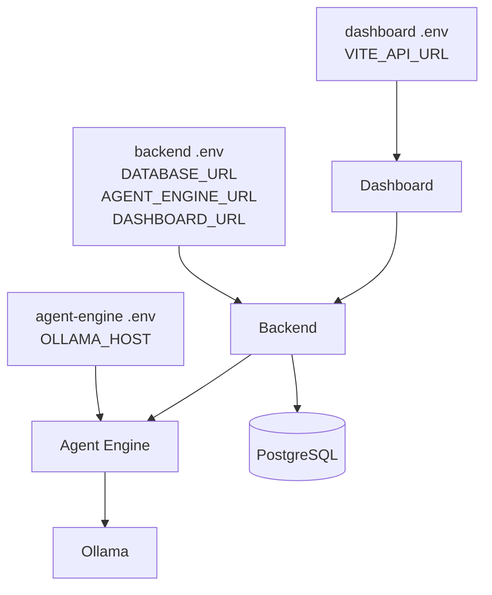
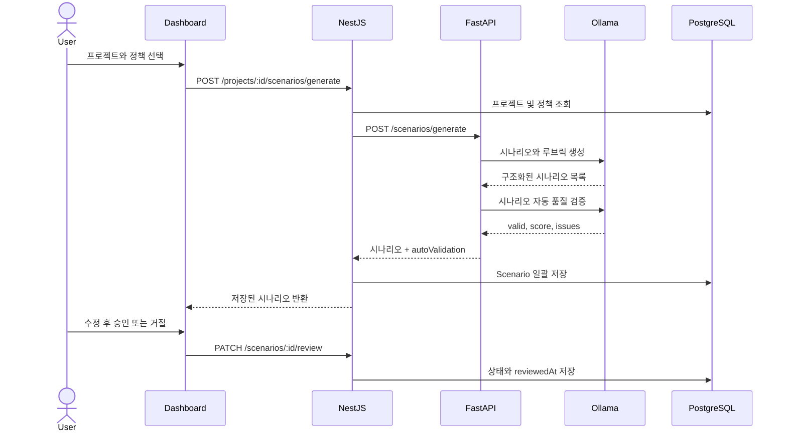
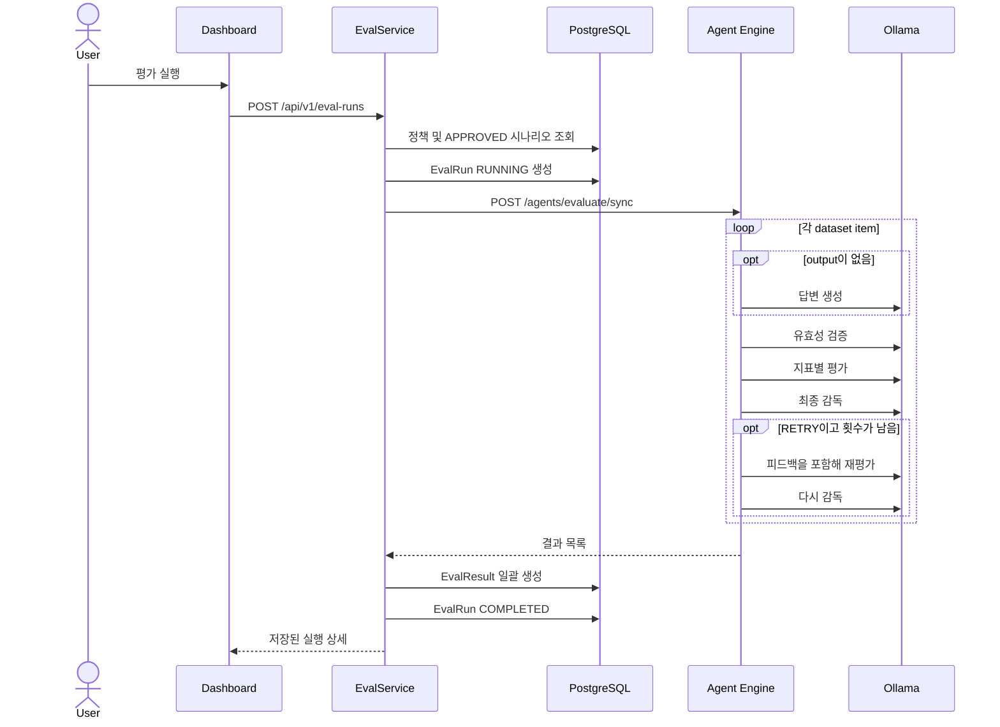
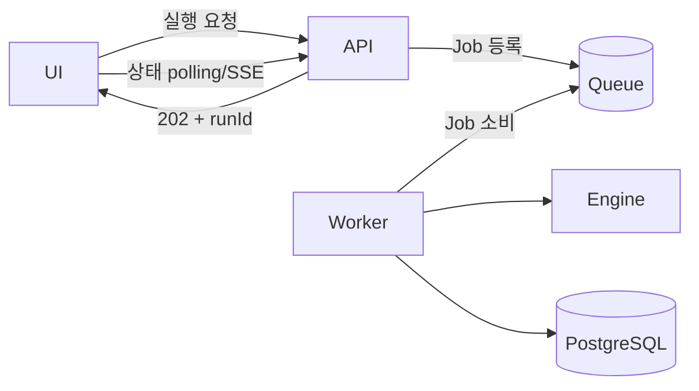

# 실행 구조와 데이터 흐름

## 1. 런타임 구성

| 구성요소 | 기술 | 기본 포트 | 역할 |
| --- | --- | --- | --- |
| Dashboard | React, Vite | 5173 | 사용자 입력과 결과 시각화 |
| Backend | NestJS, Prisma | 3000 | 관리 API, 유효성 검증, 상태와 결과 저장 |
| Agent Engine | FastAPI, LangGraph | 8000 | 시나리오 생성과 다단계 평가 |
| PostgreSQL | PostgreSQL 15 | 5433 | 영속 데이터 |
| Model Runtime | Ollama | 11434 | 로컬 LLM 추론 |

프로세스 시작 순서는 `PostgreSQL/Ollama → Agent Engine → Backend → Dashboard`가 가장 이해하기 쉽다. Backend는 시작할 때 DB 연결이 필요하고, 실제 평가 시 Agent Engine과 Ollama가 필요하다.

## 2. 설정 전달



환경변수가 없을 때 애플리케이션 기본값은 로컬 주소를 사용하지만, `DATABASE_URL`은 필수다.

## 3. 프로젝트와 정책 생성 흐름

1. Dashboard가 `POST /api/v1/projects`를 호출한다.
2. Backend는 이름과 도메인이 비어 있지 않은지 검사한다.
3. Project를 저장한다.
4. 정책 생성 시 `POST /api/v1/projects/:projectId/policies`를 호출한다.
5. Backend는 프로젝트 존재 여부, 지표 존재 여부, 가중치 합이 1인지 검사한다.
6. 통과 기준, 최대 재시도, 지표 JSON을 EvaluationPolicy로 저장한다.

정책 지표는 고정된 DB 컬럼이 아니라 JSON이다. 도메인마다 정확성, 정책 준수, 금칙어, 친절도처럼 다른 지표를 만들 수 있기 때문이다.

## 4. 시나리오 생성과 사람 검토



자동 검증 점수가 0.7 이상이면 `AUTO_VERIFIED`, 아니면 `DRAFT`가 된다. 그러나 평가 실행에서 사용하는 조건은 `APPROVED`다. 즉 자동 검증은 사람에게 우선순위를 제공하지만 최종 승인 권한을 대신하지 않는다.

시나리오 내용을 수정하면 상태를 다시 `DRAFT`로 내리고 `reviewedAt`을 비운다. 승인된 테스트가 수정 후에도 승인 상태로 남는 문제를 막기 위한 규칙이다.

## 5. 평가 실행 흐름



## 6. 평가 그래프의 상태

`EvaluationState`의 주요 필드는 다음과 같다.

| 필드 | 생산자 | 의미 |
| --- | --- | --- |
| `prompt`, `output` | API 입력/Executor | 평가 대상 |
| `expected_output` | Scenario 또는 dataset | 기대 답변 |
| `criteria` | Policy + Scenario rubric | 동적 평가 기준 |
| `verification` | Verifier | 형식·유효성·안전성 결과 |
| `evaluation` | Evaluator | 점수, 지표별 근거, 실패 조건 |
| `supervision` | Supervisor | PASS/FAIL/RETRY 최종 판단 |
| `supervisor_feedback` | Supervisor | 재평가 시 Evaluator에게 줄 지시 |
| `retry_count`, `max_retries` | Graph | 재평가 제어 |
| `pass_threshold` | Policy/Run | 최종 통과 기준 |

재시도는 답변을 다시 생성하는 것이 아니라 같은 답변을 다시 평가하는 흐름이다. Supervisor 피드백이 Evaluator 프롬프트에 추가되어 상충하거나 불충분했던 채점을 재검토한다.

## 7. 점수와 판정

Evaluator는 지표 점수에 가중치를 곱해 합산하고 전체 가중치로 나눈다.

```text
score = Σ(metricScore × weight) / Σ(weight)
```

`triggeredFailConditions` 또는 `missingRequiredConditions`가 하나라도 있으면 계산 점수를 0으로 내린다. 이후 Supervisor가 최종 판정을 내리지만, 점수가 사용자 통과 기준보다 낮은데 PASS를 반환하면 코드가 FAIL로 교정한다.

따라서 LLM은 설명과 종합 판단을 담당하지만 정량 정책을 우회할 수 없다.

## 8. 저장 트랜잭션과 실패 상태

평가 결과 저장과 실행 상태 변경은 Prisma 트랜잭션으로 묶인다.

- 성공: 여러 EvalResult 생성 + EvalRun을 `COMPLETED`로 변경
- 실패: catch 블록에서 EvalRun을 `FAILED`로 변경하고 HTTP 502 반환

평가 정책은 `policySnapshot`에도 저장된다. 이후 원본 정책이 수정되어도 당시 이름, 통과 기준, 재시도 수와 지표를 확인하려는 의도다.

현재 구조에서는 Agent Engine 응답을 기다리는 동안 HTTP 요청이 열린 상태다. 항목 수와 모델 응답 시간이 커지면 다음 구조가 필요하다.



이것은 현재 구현이 아니라 대규모 실행을 위한 다음 단계다.
